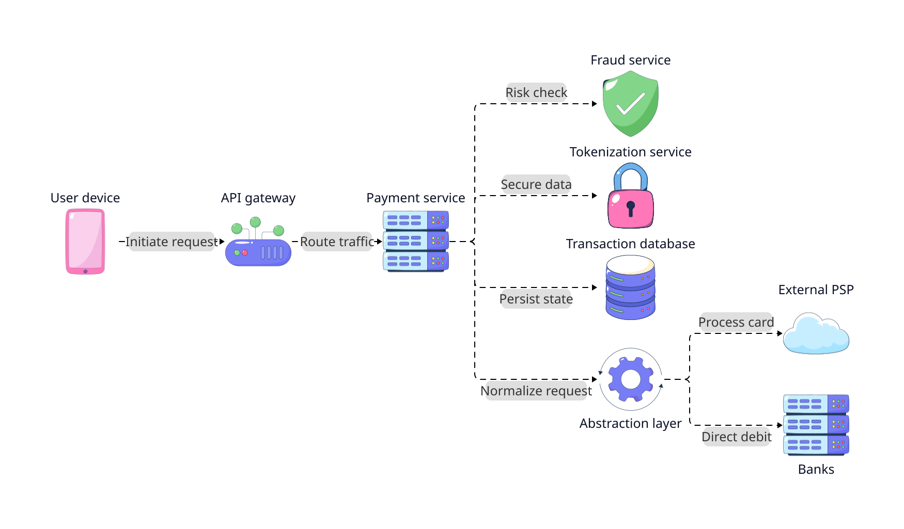
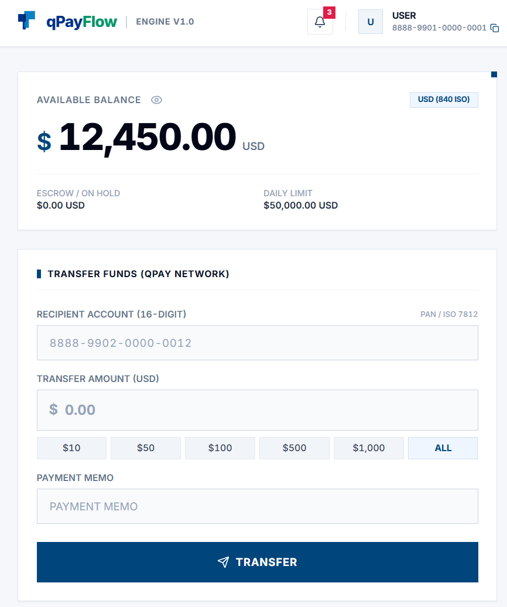

# qPayFlow
### Distributed Payment Processing Platform

**qPayFlow** is a hands-on project focused on **learning and applying core Distributed System concepts in Go**. The project is not designed as a typical CRUD app, but as a **Payment Processing Platform** capable of horizontal scaling, fault tolerance, idempotency, consistency, ordering, and eventual consistency.

Primary tech stack: **Golang + gRPC + Kafka + Redis + PostgreSQL**.

---

## Project Goals
This project serves as a **playground** to research, implement, and observe how distributed system patterns solve tough real-world problems, especially in payment environments demanding strict data consistency.

The highlight of the project is not just basic "Microservices + Kafka + Redis + Docker", but rather:
> **"A distributed, fault-tolerant payment system to experiment with trade-offs in consistency, concurrency, ordering, and failure recovery."**

## Target Architecture

### User Web Interface

  

### 1. Overall Problem
The system processes a basic yet distributed payment flow:
`Receive Payment (REST) -> Validate (Idempotency) -> Inter-Service (gRPC) -> Fraud Pre-Check -> Hold/Reserve Balance -> Process Payment (Kafka Saga) -> Capture/Settlement -> Notification`

**Tech Stack & Infrastructure:**
- **Language:** Go (Golang) — High-performance API Gateway, microservices, and background workers
- **Inter-Service Communication:** 
  - **Synchronous (S2S):** gRPC (HTTP/2 + Protocol Buffers) — Low-latency, type-safe RPC contracts for internal service-to-service calls and traceparent context propagation
  - **External Ingress:** REST API (JSON over HTTPS) — Client/Merchant-facing endpoints on API Gateway
- **Message Broker:** Apache Kafka — Event-driven messaging, Saga choreography, DLQ, and partition ordering
- **Cache & Distributed Lock:** Redis — Rate limiting, fast-path idempotency key storage, and distributed locking
- **Database:** PostgreSQL — Transactional persistence, Outbox pattern, and financial ledger balance control
- **Containerization:** Docker & Docker Compose

### 2. Core Microservices
Instead of creating too many services, the architecture focuses on **6 core services**:
1. **API Gateway (Go):** Authentication, rate limiting, request validation, routing, idempotency, API logging.
2. **Payment Service:** Core payment creation and management, validation, database persistence (`payments`, `transactions`, `outbox_events`).
3. **Account Service:** User, Account, Balance, and Ledger management. Handles the most critical **consistency** challenges.
4. **Fraud Service:** Rule engine to detect fraud (e.g., large amounts, high frequency, new devices). Can store sliding-window state using Redis.
5. **Settlement Service:** Reconciliation and settlement between Customer and Merchant (Background distributed job).
6. **Notification Service:** Consumes Kafka events (Completed, Failed, Refunded) to send notifications.

---

## Distributed System & Fintech Concepts to Learn and Apply

### Foundational Concepts
1. **Double Spending Problem & Concurrency Control**
   - Handle race conditions when receiving multiple concurrent payment requests.
   - Experiment with and compare **PostgreSQL Transaction (Pessimistic Locking)**, **Optimistic Locking (Version-based)**, and **Redis Distributed Lock**.
2. **Inter-Service Communication (gRPC & Protocol Buffers)**
   - Standardize type-safe internal RPC contracts with `.proto` definitions across microservices. Leverage HTTP/2 multiplexing, low-overhead binary serialization, and W3C `traceparent` metadata propagation.
3. **Go Concurrency Primitives & Lifecycle Management**
   - Leverage `context.Context` for cancellation and timeout propagation across services. Use `sync/errgroup` and `WaitGroup` for graceful worker shutdown and `sync/atomic` for lock-free metrics.
4. **Idempotency**
   - Store Idempotency Key (fast-path via Redis, unique constraint via PostgreSQL) to guarantee network failures or retries do not charge accounts twice.
5. **Transactional Outbox Pattern**
   - Guarantee atomicity between Database write and Kafka event publishing. Worker reads from `outbox_events` to publish, resolving distributed system failures.
6. **Saga Pattern & Eventual Consistency**
   - Implement **Saga choreography** via Kafka. Workflow steps through: Payment Initiated -> Fraud Check -> Hold Balance -> Process -> Capture/Settle. Failures trigger **Compensation** flows (Release hold).
7. **Kafka Architecture & Partitioning**
   - Maintain **Ordering** by using `account_id` as partition key. Explore Consumer Groups, backpressure, and consumer lag.
8. **Retry Architecture & Dead Letter Queue (DLQ)**
   - External gateway failures retried with **Exponential Backoff + Jitter**. Exceeded retries pushed to DLQ for manual admin replay.
9. **Circuit Breaker**
   - Temporarily interrupt connections to 3rd-party services during high error rates (Open/Closed/Half-Open state) using Go.
10. **Leader Election & Background Jobs**
    - Use Redis Lease for services like Reconciliation Jobs. Explore heartbeats and failure detection.
11. **Ledger & Reconciliation**
    - Use **Ledger** instead of only storing Balance (preparing for Event Sourcing). Run reconciliation jobs to ensure `SUM(ledger) == account.balance`.

### Advanced Concepts & Real-World Fintech
12. **Double-Entry Bookkeeping**
    - Ensure financial balance: every transaction always consists of 2 corresponding records, **Debit (+)** and **Credit (-)** where `Sum(Debit) == Sum(Credit)`. Money is neither created nor lost. Compare with traditional Single-Entry models.
13. **Change Data Capture (CDC) with Debezium vs Outbox Polling**
    - Compare manual Polling Worker on `outbox_events` table against **CDC reading directly from PostgreSQL WAL (Write-Ahead Log)** via Debezium streamed to Kafka.
14. **Event Sourcing & CQRS (Command Query Responsibility Segregation)**
    - Store state as sequence of immutable Events (Append-only). Separate Write Model (Postgres) and Read Model (Elasticsearch/Redis) for high-speed queries and transaction auditing.
15. **Field-Level Encryption & Tokenization (PCI-DSS & Security)**
    - **Envelope Encryption (KMS)** to encrypt sensitive data before DB storage. Use **Tokenization** to convert PII/account numbers to UUID tokens. Sign **HMAC Signatures** for Webhooks to prevent payload tampering.
16. **Distributed Rate Limiting & Load Shedding**
    - **Sliding Window Counter / Token Bucket** algorithm on Redis Cluster. Implement automated **Load Shedding** to reject non-essential requests (Analytics, Notifications) when CPU/Memory exceeds 85% to protect core payment flows.
17. **Distributed Context Propagation over Asynchronous Boundaries**
    - Propagate `traceparent` (Trace ID, Span ID) via **Kafka Record Headers** combined with HTTP Headers to maintain Distributed Tracing (OpenTelemetry) across asynchronous boundaries.
18. **Three-Way Reconciliation**
    - Periodic reconciliation algorithm comparing data across **Internal Ledger**, **Payment Gateway** (Stripe/Bank), and **Merchant Account** to automatically detect discrepancies (`Missing In Partner`, `Missing In Internal`, `Amount Mismatch`).
19. **Site Reliability Engineering (SRE) Principles**
    - Define SLIs/SLOs (e.g., Latency p99 < 500ms, Success Rate > 99.9%) and Error Budgets. Instrument the **4 Golden Signals** (Latency, Traffic, Errors, Saturation) and configure Alertmanager for critical failures.
20. **ISO 20022 Financial Messaging & Data Standardisation**
    - Model rich structured financial data (`pacs.008`, `camt.053`, `UltimateDebtor`, `RemittanceInformation`) to achieve >89% Straight-Through Processing (STP) and automated multi-party reconciliation.
21. **Verification of Payee (VoP / Confirmation of Payee)**
    - Implement pre-validation protocols before fund commitment to verify beneficiary identity and account validity, preventing Authorized Push Payment (APP) fraud and misdirected transfers.

---

## 5 Core Experiments
The project will be benchmarked and validated through real-world tests:

1. **Optimistic vs Pessimistic Lock vs Redis Lock**
   - Blast 100 to 1,000 concurrent payments into a single account to test race conditions and measure throughput/latency.
2. **Kafka Partitioning & Scaling Benchmark**
   - Experiment scaling from 1 -> 5 -> 10 -> 20 workers and measure consumer lag as well as throughput.
3. **At-Least-Once Delivery + Idempotency Verification**
   - Intentionally send duplicate events, simulate network timeouts, and trigger consumer crashes to verify the Idempotency layer.
4. **Failure Recovery & Chaos Engineering**
   - Proactively "kill" Worker, Redis, Kafka broker, PostgreSQL to test responses of Circuit Breaker, Retries, and data integrity.
5. **Outbox Polling vs CDC (Debezium) Benchmark**
   - Compare CPU/Memory overhead and event latency between polling Outbox table vs CDC streaming via Postgres WAL.

---

## Implementation Roadmap

* **Phase 0 — Foundation (1-2 days):** Go project structure, Protobuf schemas & gRPC toolchain, Docker, PostgreSQL, Redis, Kafka, config, logging.
* **Phase 1 — Payment MVP (3-5 days):** Setup DB, build core domain, expose internal gRPC endpoints & Gateway REST proxy without Kafka first (correct business logic).
* **Phase 2 — Kafka Event Driven (3-5 days):** Integrate Kafka, producer, consumer, partitioning.
* **Phase 3 — Reliability (4-7 days):** Add Idempotency, Retry, DLQ, Outbox.
* **Phase 4 — Distributed Consistency (5-7 days):** Code and benchmark Pessimistic Lock vs Optimistic Lock vs Redis Lock. Ensure duplicate payments = 0.
* **Phase 5 — Saga + Fraud + Settlement (5-7 days):** Complete distributed flow with compensation.
* **Phase 6 — Observability (2-4 days):** Add Prometheus, Grafana, OpenTelemetry, Jaeger (Distributed tracing via HTTP & Kafka headers).
* **Phase 7 — Advanced Fintech Engineering (5-7 days):** Double-Entry Bookkeeping, CDC Debezium, Field-Level Encryption, Three-Way Reconciliation.
* **Phase 8 — Scale & Benchmark (3-5 days):** Load testing with k6, measure throughput, latency, CPU, memory.
* **Phase 9 — Polyglot Microservices & Core Java Domain (4-6 days):** Implement/Migrate core domain services (e.g., Core Ledger Service, Accounting) using Java 17 + Spring Boot 3 applying Domain-Driven Design (DDD), integrated seamlessly with Go services via gRPC & Kafka.
* **Phase 10 — Chaos Engineering (3-5 days):** Test crash scenarios, network partitions. Document recovery.
* **Phase 11 — Kubernetes (3-5 days):** Containerize and deploy to k8s, experiment with auto-scaling.
* **Phase 12 — Site Reliability Engineering (SRE) (3-5 days):** Define SLIs/SLOs/Error Budgets, set up Prometheus Alertmanager, and track burn rates during chaos tests.
* **Phase 13 — Next-Gen Global Payments & Standards (4-6 days):** Adopt ISO 20022 data models (`pacs.008`/`camt.053` structured remittance), build Verification of Payee (VoP) pre-validation workflows, and support intelligent multi-rail routing.

---

## License

This project is licensed under the **MIT License** - see the [LICENSE](LICENSE) file for details.

