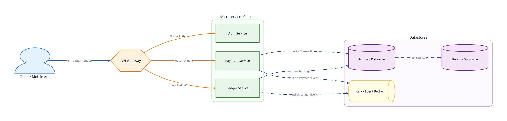
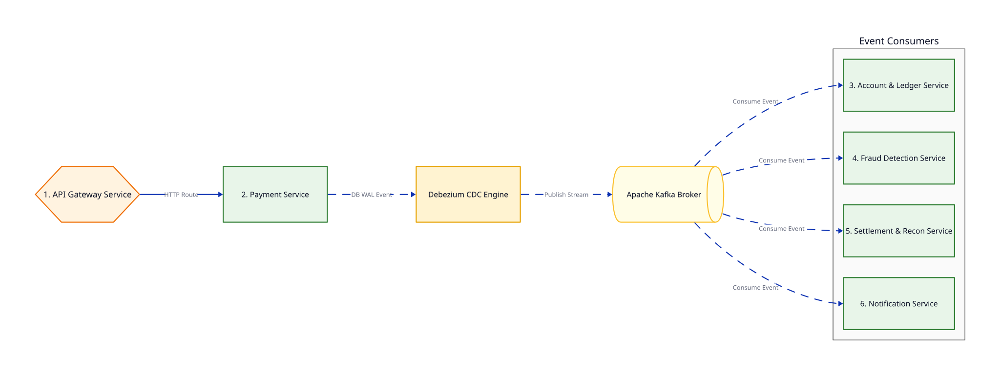
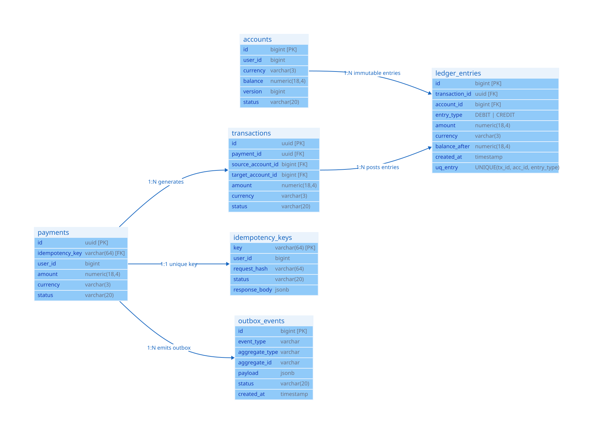
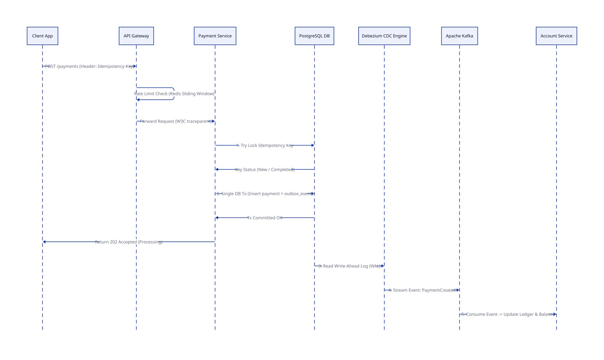

# Đặc Tả Kiến Trúc, Dịch Vụ & Dữ Liệu Nền Tảng Thanh Toán (qPayFlow System Architecture Specification)

> **Tóm tắt tài liệu**: Tài liệu này đóng vai trò là **Đặc tả Kỹ thuật Hệ thống (System Architecture Specification)** chính thức của dự án **qPayFlow**. Tài liệu mô tả chi tiết Tổng quan Kiến trúc phân tán, Ranh giới & Chức năng của các Microservices, Mô hình Dữ liệu (Database Schema DDL & ERD), và Quy trình xử lý Luồng giao dịch tài chính an toàn.

---

## 1. Tổng Quan Kiến Trúc Hệ Thống (System Architecture Overview)

**qPayFlow** là nền tảng xử lý thanh toán phân tán (Distributed Payment Processing Platform) được thiết kế theo kiến trúc **Cloud-Native Event-Driven Microservices**. Hệ thống đặt mục tiêu đạt độ khả dụng cao (High Availability), tính mở rộng theo chiều ngang (Horizontal Scalability), bảo vệ số dư tài khoản theo chuẩn ngân hàng (Zero Financial Data Loss & Double-Entry Bookkeeping), và xử lý giao dịch với độ trễ thấp ($p99 < 500\text{ms}$).

### 1.1. Sơ Đồ Tổng Quan Kiến Trúc (Architecture Topology Diagram)



### 1.2. Các Nguyên Tắc Kiến Trúc Cốt Lõi (Architectural Guiding Principles)

1. **Zero Financial Loss (Không mất tiền)**: Mọi biến động số dư phải được thực thi trong môi trường giao dịch an toàn (ACID Transaction) và tuân thủ **Nguyên tắc Sổ kép (Double-Entry Bookkeeping)**: $\sum \text{DEBIT} = \sum \text{CREDIT}$.
2. **Strict Idempotency (Tính vô hiệu tuyệt đối)**: Mọi request ghi (Write/Transfer) bắt buộc phải truyền `Idempotency-Key` để triệt tiêu hoàn toàn nguy cơ trừ tiền 2 lần (Double Charging) khi gặp sự cố rớt mạng.
3. **Decoupled Asynchronous Processing (Phân tách bất đồng bộ)**: Phân tách luồng xử lý đồng bộ API Gateway với luồng xử lý bất đồng bộ thông qua **Apache Kafka Event Bus** và **Debezium CDC (Change Data Capture)**.
4. **Resilience & Fault Tolerance (Khả năng chịu lỗi)**: Áp dụng các mẫu thiết kế Circuit Breaker, Exponential Backoff + Jitter Retry, Dead Letter Queue (DLQ) và Priority Load Shedding để bảo vệ hệ thống khi bị quá tải.

---

## 2. Đặc Tả Chi Tiết Các Microservices (Microservices Specification)

Hệ thống được tổ chức thành **6 Core Microservices** với ranh giới nghiệp vụ (Bounded Contexts) rõ ràng:



---

### 2.1. API Gateway Service
- **Ngôn ngữ & Tech Stack**: Go (Golang) + Fiber / Gin Framework + Redis Cluster.
- **Ranh giới Chức năng (Responsibilities)**:
  - Tiếp nhận và giải mã TLS/HTTPS Traffic từ Client (Mobile / Web).
  - Xác thực Token (JWT Auth / OAuth2) & Định danh Client.
  - **Distributed Rate Limiting**: Sử dụng thuật toán Sliding Window Counter bằng Lua Script trên Redis Cluster.
  - **Idempotency Fast-Path Check**: Kiểm tra sự tồn tại của `Idempotency-Key` trong Redis Cache trước khi chuyển request vào bên trong.
  - **Distributed Tracing Header Injection**: Tạo và truyền header `traceparent` (W3C Trace Context) cho tất cả các request downstream.
  - **Load Shedding**: Chủ động ngắt kết nối các request thứ yếu (Analytics, Notification) khi CPU/RAM vượt $85\%$.

---

### 2.2. Payment Service
- **Ngôn ngữ & Tech Stack**: Go (Golang) + GORM / pgx + PostgreSQL.
- **Ranh giới Chức năng (Responsibilities)**:
  - Quản lý Vòng đời Giao dịch Thanh toán (Payment Lifecycle).
  - Điều phối **Payment State Machine**: `PENDING` $\rightarrow$ `PROCESSING` $\rightarrow$ `SUCCESS` / `FAILED` / `REFUNDED`.
  - **Transactional Outbox Pattern**: Thực hiện DB Transaction ghi đồng thời vào bảng `payments`, `transactions` và `outbox_events`.
  - **Outbox Worker Latency Measurement**: Cột `created_at` trong `outbox_events` đóng vai trò là mốc thời gian bắt buộc để đo đạc lag/latency khi so sánh luồng Polling Worker vs Debezium CDC (Experiment #5).
  - **Strict Idempotency Key Consistency**: Đồng bộ kiểu dữ liệu `VARCHAR(64)` giữa `payments.idempotency_key` (Foreign Key) và `idempotency_keys.key` (Primary Key).
  - Khởi tạo Event `PaymentInitiated` phát lên Kafka để kích hoạt pipeline Pre-Fraud Check và Two-Phase Balance Hold.

---

### 2.3. Account & Core Ledger Service
- **Ngôn ngữ & Tech Stack**: Go (Golang) hoặc Java 17 / Spring Boot 3 + PostgreSQL RDBMS.
- **Ranh giới Chức năng (Responsibilities)**:
  - Quản lý Tài khoản (Accounts), Ví điện tử (Wallets) và Sổ cái Kế toán (Core Ledger).
  - **Two-Phase Balance Management**: Quản lý đa tầng số dư gồm `available_balance` (khả dụng) và `held_balance` (phong tỏa giao dịch in-flight).
  - **Double-Entry Bookkeeping Engine**: Đảm bảo mọi giao dịch đều sinh ra các bản ghi bút toán bất biến trong bảng `ledger_entries` với nguyên tắc cân bằng $\sum \text{DEBIT} + \sum \text{CREDIT} = 0$.
  - **At-Least-Once Ledger Idempotency**: Áp dụng Ràng buộc Duy nhất `UNIQUE(transaction_id, account_id, entry_type)` trực tiếp tại tầng Database cho bảng `ledger_entries` để ngăn ngừa tuyệt đối trùng bút toán khi Kafka Consumer retry event.
  - **Concurrency Control & Deadlock Prevention**: Áp dụng **Pessimistic Locking (`SELECT FOR UPDATE`)** với cơ chế sắp xếp ID tài khoản tăng dần (`Lock Ordering`) để triệt tiêu circular wait khi xử lý giao dịch song song.

---

### 2.4. Fraud Detection Service
- **Ngôn ngữ & Tech Stack**: Go (Golang) + Redis Cluster (Data Structure: ZSET & Hashes).
- **Ranh giới Chức năng (Responsibilities)**:
  - Đánh giá rủi ro giao dịch theo thời gian thực (Pre-Authorization Guard).
  - **Pre-Debit Velocity Rules**: Kiểm tra tần suất giao dịch (Sliding Window Counter trên Redis ZSET) TRƯỚC khi tài khoản bị phong tỏa hoặc trừ tiền, ngăn ngừa lãng phí I/O ghi sổ cái.
  - **Amount Thresholds & Risk Scoring**: Tự động từ chối giao dịch bất thường (> $10,000) hoặc IP rủi ro cao.
  - Phát Event `FraudChecked` (Passed/Rejected) điều phối bước tiếp theo trong Saga.

---

### 2.5. Settlement & Reconciliation Service
- **Ngôn ngữ & Tech Stack**: Go (Golang) / Java 17 + PostgreSQL.
- **Ranh giới Chức năng (Responsibilities)**:
  - Quản lý luồng Quyết toán (Settlement) giữa Khách hàng, Ngân hàng đối tác và Merchant.
  - **Three-Way Reconciliation Engine**: Chạy Batch Job định kỳ (00:30 AM) đọc file EOD (CSV / MT940 từ SFTP Ngân hàng) để so sánh 3 chiều: *Internal Ledger* vs *Bank Statement* vs *Merchant Account*.
  - Tự động phân loại sai lệch (`MATCHED`, `MISSING_IN_PARTNER`, `MISSING_IN_INTERNAL`, `AMOUNT_MISMATCH`) và trigger lệnh đền bù (Auto-Credit Compensation).

---

### 2.6. Notification Service
- **Ngôn ngữ & Tech Stack**: Go (Golang) + Worker Pools + RabbitMQ / Kafka Consumer.
- **Ranh giới Chức năng (Responsibilities)**:
  - Tiêu thụ các sự kiện `PaymentCompleted`, `PaymentFailed`, `PaymentRefunded` từ Kafka.
  - Gửi Push Notification (Firebase FCM), SMS (Twilio/Kính Ngân hàng), Email (SendGrid) tới người dùng.
  - Bắn Webhooks sự kiện đến Merchant (kèm chữ ký số **HMAC-SHA256** bảo mật).

---

## 3. Đặc Tả Mô Hình Dữ Liệu & Schemas (Data Architecture & Database Schemas)

### 3.1. Sơ Đồ Quan Hệ Thực Thể (Entity-Relationship Diagram - ERD)



---

### 3.2. Chi Tiết Bảng Dữ Liệu SQL DDL (Database Table Definitions)

#### Bảng `accounts` (Tài khoản & Số dư đa tầng)
```sql
CREATE TABLE accounts (
    id BIGSERIAL PRIMARY KEY,
    user_id BIGINT NOT NULL,
    currency VARCHAR(3) NOT NULL DEFAULT 'USD',
    available_balance NUMERIC(18, 4) NOT NULL DEFAULT 0.0000 CHECK (available_balance >= 0),
    held_balance NUMERIC(18, 4) NOT NULL DEFAULT 0.0000 CHECK (held_balance >= 0),
    balance NUMERIC(18, 4) GENERATED ALWAYS AS (available_balance + held_balance) STORED,
    version BIGINT NOT NULL DEFAULT 1, -- Version column for Optimistic Concurrency benchmarks
    status VARCHAR(20) NOT NULL DEFAULT 'ACTIVE', -- 'ACTIVE', 'FROZEN', 'CLOSED'
    created_at TIMESTAMP WITH TIME ZONE DEFAULT CURRENT_TIMESTAMP,
    updated_at TIMESTAMP WITH TIME ZONE DEFAULT CURRENT_TIMESTAMP
);

CREATE INDEX idx_accounts_user_id ON accounts(user_id);
```

#### Bảng `ledger_entries` (Sổ cái Hạch toán Bất biến)
```sql
CREATE TABLE ledger_entries (
    id BIGSERIAL PRIMARY KEY,
    transaction_id UUID NOT NULL,
    account_id BIGINT NOT NULL REFERENCES accounts(id),
    entry_type VARCHAR(20) NOT NULL CHECK (entry_type IN ('DEBIT', 'CREDIT', 'HOLD', 'RELEASE_HOLD')),
    amount NUMERIC(18, 4) NOT NULL CHECK (amount > 0),
    currency VARCHAR(3) NOT NULL DEFAULT 'USD',
    balance_after NUMERIC(18, 4) NOT NULL,
    description TEXT,
    created_at TIMESTAMP WITH TIME ZONE DEFAULT CURRENT_TIMESTAMP,
    CONSTRAINT uq_ledger_entries UNIQUE (transaction_id, account_id, entry_type)
);

CREATE INDEX idx_ledger_entries_account_id ON ledger_entries(account_id);
CREATE INDEX idx_ledger_entries_tx_id ON ledger_entries(transaction_id);
CREATE INDEX idx_ledger_entries_created_at ON ledger_entries(created_at);
```

#### Bảng `payments` (Giao dịch Thanh toán)
```sql
CREATE TABLE payments (
    id UUID PRIMARY KEY DEFAULT gen_random_uuid(),
    idempotency_key VARCHAR(64) NOT NULL UNIQUE, -- business-level ref only; NOT a FK to idempotency_keys
    user_id BIGINT NOT NULL,
    amount NUMERIC(18, 4) NOT NULL CHECK (amount > 0),
    currency VARCHAR(3) NOT NULL DEFAULT 'USD',
    status VARCHAR(20) NOT NULL DEFAULT 'PENDING', -- 'PENDING', 'PROCESSING', 'SUCCESS', 'FAILED', 'REFUNDED'
    payment_method VARCHAR(50) NOT NULL,
    created_at TIMESTAMP WITH TIME ZONE DEFAULT CURRENT_TIMESTAMP,
    updated_at TIMESTAMP WITH TIME ZONE DEFAULT CURRENT_TIMESTAMP
);

CREATE INDEX idx_payments_user_status ON payments(user_id, status);
```

#### Bảng `transactions` (Giao dịch Chuyển khoản)
```sql
CREATE TABLE transactions (
    id UUID PRIMARY KEY DEFAULT gen_random_uuid(),
    payment_id UUID REFERENCES payments(id),
    source_account_id BIGINT REFERENCES accounts(id),
    target_account_id BIGINT REFERENCES accounts(id),
    amount NUMERIC(18, 4) NOT NULL CHECK (amount > 0),
    currency VARCHAR(3) NOT NULL DEFAULT 'USD',
    status VARCHAR(20) NOT NULL DEFAULT 'PENDING',
    created_at TIMESTAMP WITH TIME ZONE DEFAULT CURRENT_TIMESTAMP
);

CREATE INDEX idx_transactions_payment_id ON transactions(payment_id);
```

#### Bảng `idempotency_keys` (Quản lý Khóa Vô hiệu)
```sql
CREATE TABLE idempotency_keys (
    key             VARCHAR(64) PRIMARY KEY,
    user_id         BIGINT NOT NULL,
    endpoint        VARCHAR(100) NOT NULL,             -- e.g. 'POST /payments', 'POST /refunds'
    request_hash    VARCHAR(64) NOT NULL,              -- SHA256(method + path + body) — detects same key, different body
    status          VARCHAR(20) NOT NULL DEFAULT 'PROCESSING', -- 'PROCESSING', 'COMPLETED'
    response_code   INT,
    response_body   JSONB,
    locked_until    TIMESTAMP WITH TIME ZONE NOT NULL, -- prevents concurrent in-flight reuse
    expires_at      TIMESTAMP WITH TIME ZONE NOT NULL, -- TTL for purge job (e.g. NOW() + INTERVAL '24 hours')
    created_at      TIMESTAMP WITH TIME ZONE DEFAULT CURRENT_TIMESTAMP
);

-- Index for background purge job
CREATE INDEX idx_idempotency_keys_expires_at ON idempotency_keys(expires_at);
```

> **Design decision**: `idempotency_keys` is the **sole guard** against duplicate write requests. Idempotency is enforced via a single atomic `INSERT ... ON CONFLICT (key) DO NOTHING` — if `rows_affected == 0` the stored response is returned directly. This eliminates the TOCTOU race condition of a `SELECT`-then-`INSERT` pattern. This table is decoupled from `payments` and can be purged independently after `expires_at` without affecting business records.


#### Bảng `outbox_events` (Transactional Outbox Events)
```sql
CREATE TABLE outbox_events (
    id BIGSERIAL PRIMARY KEY,
    event_type VARCHAR(100) NOT NULL,
    aggregate_type VARCHAR(50) NOT NULL,
    aggregate_id VARCHAR(100) NOT NULL,
    payload JSONB NOT NULL,
    status VARCHAR(20) NOT NULL DEFAULT 'PENDING', -- 'PENDING', 'PROCESSED'
    created_at TIMESTAMP WITH TIME ZONE DEFAULT CURRENT_TIMESTAMP
);

CREATE INDEX idx_outbox_events_status ON outbox_events(status, id);
CREATE INDEX idx_outbox_events_created_at ON outbox_events(created_at);
```

#### Bảng `reconciliations` (Kết quả Đối soát)
```sql
CREATE TABLE reconciliations (
    id BIGSERIAL PRIMARY KEY,
    batch_id VARCHAR(100) NOT NULL,
    transaction_id VARCHAR(100) NOT NULL,
    discrepancy_type VARCHAR(30) NOT NULL, -- 'MATCHED', 'MISSING_IN_PARTNER', 'MISSING_IN_INTERNAL', 'AMOUNT_MISMATCH'
    internal_amount NUMERIC(18, 4),
    partner_amount NUMERIC(18, 4),
    status VARCHAR(20) NOT NULL DEFAULT 'UNRESOLVED', -- 'UNRESOLVED', 'AUTO_HEALED', 'MANUAL_REVIEW'
    created_at TIMESTAMP WITH TIME ZONE DEFAULT CURRENT_TIMESTAMP
);
```

---

## 4. Quy Trình Xử Lý Giao Dịch Tài Chính (Financial Processing Workflows)

### 4.1. Luồng Thanh Toán & Kiểm Tra Idempotency (End-to-End Payment Flow)



---

## 5. Tài Liệu Tham Khảo (Reputable References)

1. **Stripe Architecture**: [Designing Payment Systems & Financial Invariants](https://stripe.com/blog/engineering)
2. **Uber Engineering**: [Building Zero-Sum Double-Entry Ledger at Scale](https://www.uber.com/en-VN/blog/payment-processing/)
3. **Debezium Project**: [Transactional Outbox & Change Data Capture Guide](https://debezium.io/documentation/)
4. **Martin Kleppmann**: *Designing Data-Intensive Applications* (O'Reilly).
5. **System Design Interview Vol 2 (Alex Xu & Gergely Orosz)**: Chapter 4 — *Payment System Architecture*.

