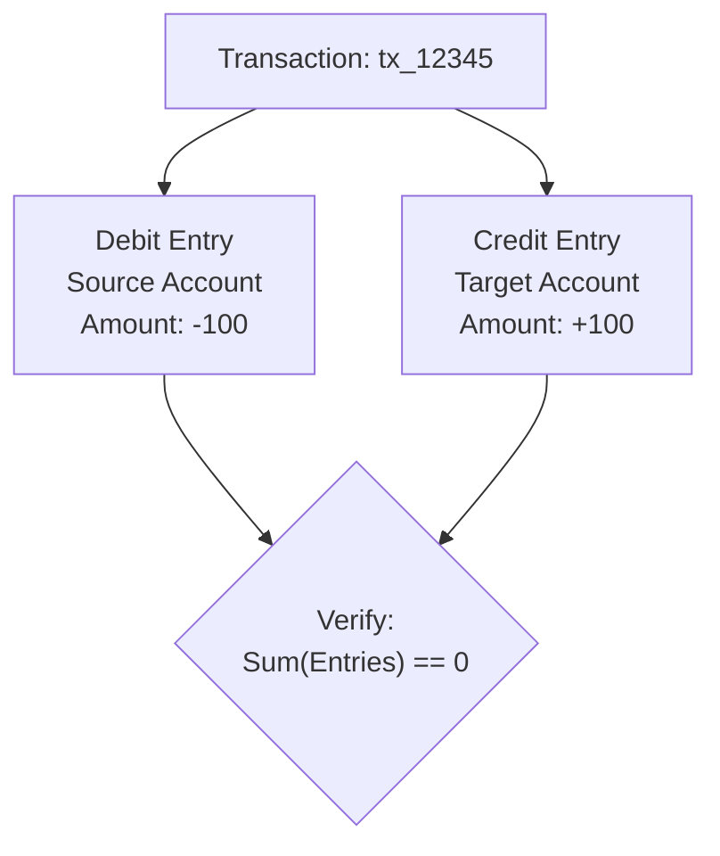

# qPayFlow Account & Core Ledger Service Architecture Specification

This document details the design of the **Account & Core Ledger Service** in the **qPayFlow** platform. This service acts as the single source of truth (SoT) for account balances, wallet management, and double-entry financial ledgering.

---

## 1. Double-Entry Bookkeeping Engine

Naively executing database updates like `UPDATE accounts SET balance = balance - amount` is prohibited. All balance adjustments are processed using strict **Double-Entry Bookkeeping** rules.



### Key Invariants:
1. **Immutable Log**: Bút toán (ledger entries) are stored in the `ledger_entries` table and are strictly immutable. Updates or deletions are forbidden.
2. **Balance Equation**: Every ledger event requires at least one `DEBIT` entry (deduction) and one matching `CREDIT` entry (addition). The mathematical sum of all entries for a given transaction ID must equal zero:
   $$\sum \text{DEBIT} + \sum \text{CREDIT} = 0$$
3. **Multi-tier Account Balances**:
   - `available_balance`: Funds available for withdrawal or new transfers.
   - `held_balance`: Funds temporarily locked for in-flight authorizations.
   - Invariant: $\text{Total Account Value} = \text{available\_balance} + \text{held\_balance} = \sum \text{Ledger Entries}$.

---

## 2. Concurrency Control & Database Locking

High-concurrency scenarios (e.g., flash sales or rapid transfers) present risks of race conditions, double-spending, and deadlocks. The service provides two benchmarked concurrency strategies:

### 2.1. Pessimistic Locking with Strict Lock Ordering (Production Default)
To update a balance, the service opens a PostgreSQL transaction and acquires row-level locks using `SELECT ... FOR UPDATE`.

- **Deadlock Prevention Rule**: When moving funds between accounts ($A \rightarrow B$), deadlocks are eliminated by sorting the account IDs numerically and always locking the smaller ID first:
```go
firstLockID, secondLockID := fromAccID, toAccID
if fromAccID > toAccID {
    firstLockID, secondLockID = toAccID, fromAccID
}
// Execute SELECT ... FOR UPDATE on firstLockID, then secondLockID
```
All parallel transactions acquire locks in identical sequential order, completely eliminating circular wait conditions.

### 2.2. Optimistic Concurrency Control (Benchmark & Alternate Strategy)
Used for read-heavy or low-contention account models where lock contention overhead is undesirable:
```sql
UPDATE accounts 
SET available_balance = available_balance - $1, version = version + 1 
WHERE id = $2 AND version = $3 AND available_balance >= $1;
```
If a concurrent transaction modifies the balance first, the row count is 0, prompting an immediate retry with exponential backoff.

---

## 3. Kafka Event Consumer Flow & Two-Phase Balance Lifecycle

The service runs an asynchronous consumer listening to payment events:

1. **Consume `FraudChecked (Passed)` -> Reserve Balance (Phase 1)**:
   - Acquires lock on sender account (`SELECT FOR UPDATE`).
   - Verifies `available_balance >= amount`.
   - Executes: `available_balance -= amount`, `held_balance += amount`.
   - Inserts `HOLD` entry into `ledger_entries`.
   - Commits and publishes `BalanceReserved` event.
2. **Consume `PaymentCompleted` -> Settle Balance (Phase 2)**:
   - Acquires locks on sender and receiver accounts in numerical order.
   - Executes:
     - Sender: `held_balance -= amount`.
     - Receiver: `available_balance += amount`.
   - Inserts final `DEBIT` and `CREDIT` records into `ledger_entries`.
   - Commits transaction.
3. **Consume `PaymentFailed` -> Release Balance (Compensation)**:
   - If downstream fails, releases hold: `held_balance -= amount`, `available_balance += amount`.
   - Inserts `RELEASE_HOLD` entry into `ledger_entries`.