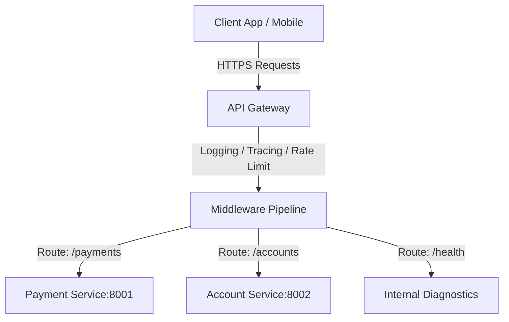

# qPayFlow API Gateway Architecture Specification

This document details the technical implementation and design of the **API Gateway** in the **qPayFlow** platform. Acting as the single entry point for all client requests, the API Gateway manages routing, edge resilience, rate limiting, and distributed tracing.

---

## 1. Gateway Routing Architecture

The gateway parses incoming HTTP requests and proxies them downstream using Go's `httputil.NewSingleHostReverseProxy` standard library, modifying headers dynamically to propagate routing context.

---

## 2. Middleware Pipeline Specifications

All incoming client traffic is routed through a series of sequential middlewares to guarantee edge protection and tracing compliance.

### 2.1. Trace Context Propagation (Traceparent Injection)
- **Standard**: Follows the W3C Trace Context recommendation.
- **Action**: Reads the `traceparent` header. If absent, it generates a new trace ID (e.g. `00-4bf92f3577b34da6a3ce929d0e0e4736-00f067aa0ba902b7-01`) and injects it into both the request and response headers. This trace context is propagated downstream via HTTP headers and subsequently via Kafka Record Headers.

### 2.2. Distributed Rate Limiting (Redis)
- **Algorithm**: Sliding Window Counter.
- **Implementation**: Executes a Lua script against the Redis Cluster to evaluate the request count for a given Client IP / Auth Token within a sliding window.
- **Action**: Returns HTTP `429 Too Many Requests` if the client exceeds the configured request thresholds, preventing Denial of Service (DoS) and API abuse.

### 2.3. Load Shedding & Self-Defense
- **Goal**: Protects core payment services from cascading failures during resource exhaustion.
- **Metric**: Monitors gateway node CPU and RAM.
- **Action**: If CPU or Memory utilization exceeds **85%**, the gateway actively sheds load by dropping non-critical requests (e.g., analytics, transaction history, profile checks) with HTTP `503 Service Unavailable`, prioritizing core payment processing requests.

---

## 3. Configuration & Ports
- **Default Port**: `8000` (configurable via `PORT` environment variable).
- **Dependencies**: Redis (for Rate Limiting and Session checking).
- **Environment variables**:
  - `REDIS_HOST`: Redis connection address.
  - `PORT`: Port on which the API Gateway HTTP server listens.