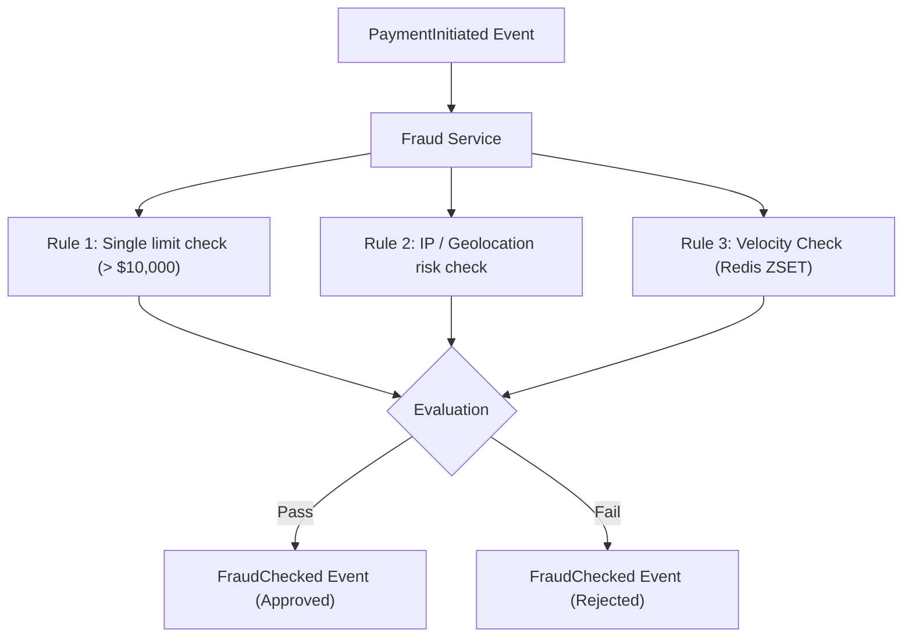

# qPayFlow Fraud Detection Service Architecture Specification

This document details the design of the **Fraud Detection Service** in the **qPayFlow** platform. The service evaluates transactions in real-time, enforcing velocity checks and risk limits to detect and prevent fraudulent activities.

---

## 1. Real-Time Risk & Velocity Engine

The service implements a rule-based engine to evaluate payment risks asynchronously as transactions are streamed through Kafka.

### 1.1. Single Transaction Threshold
- **Rule**: Any transaction with an amount greater than **$10,000** is immediately flagged as high risk and auto-rejected.

### 1.2. Velocity checks (Sliding Window on Redis)
- **Rule**: A user cannot perform more than **5 transactions per minute**.
- **Implementation**: Utilizes Redis Sorted Sets (ZSETs) where the key is the user's ID, the member is the unique transaction timestamp (epoch), and the score is the timestamp.
- **Lua Pipeline execution**:
  1. Remove ZSET members older than 60 seconds (`ZREMRANGEBYSCORE`).
  2. Add the current transaction timestamp (`ZADD`).
  3. Query the total size of the ZSET (`ZCARD`).
  4. Set key expiration (`EXPIRE`).
  5. If `ZCARD` > 5, flag transaction as fraud.

---

## 2. Pre-Authorization Guard & Saga Coordination
The Fraud Service acts as the primary gatekeeper prior to ledger balance mutations:
- **Pre-Debit Risk Guard**: Fraud check executes before `Account Service` reserves balance, minimizing database contention and eliminating unnecessary rollback compensations.
- **Passed**: Publishes a `FraudChecked` event with `Approved = true` to trigger `Account Service` balance reservation.
- **Rejected**: Publishes a `FraudChecked` event with `Approved = false` and rejection reason. `Payment Service` updates status to `FAILED` immediately without touching account ledgers.