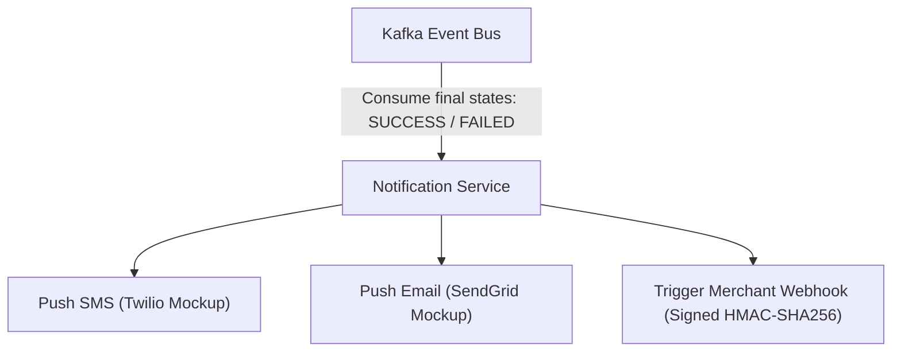

# qPayFlow Notification Service Architecture Specification

This document details the design of the **Notification Service** in the **qPayFlow** platform. Operating as an event consumer, this service handles alerting channels (SMS, Email) and manages merchant integrations.

---

## 1. Architecture Overview



The service runs a background Kafka consumer group subscribing to final transaction states, ensuring decoupled, asynchronous processing that does not block core transaction paths.

---

## 2. Secure Merchant Webhook Integration

When a transaction reaches a final state, the service pushes a webhook alert to the merchant's configured callback endpoint.

### 2.1. Cryptographic HMAC Signature
To prevent payload tampering and man-in-the-middle attacks, the service signs all webhook request payloads:
- **Algorithm**: HMAC-SHA256.
- **Key**: Pre-shared secret key shared between the merchant and qPayFlow.
- **Signature header**: The hex-encoded signature is attached to the request header as `X-Signature-SHA256`.

```go
h := hmac.New(sha256.New, []byte(secretKey))
h.Write(payloadBytes)
signature := hex.EncodeToString(h.Sum(nil))
```

### 2.2. Verification at Merchant Side
Upon receiving the webhook, the merchant performs the identical calculation using their pre-shared key and verifies that the computed signature matches the `X-Signature-SHA256` header before processing the alert.