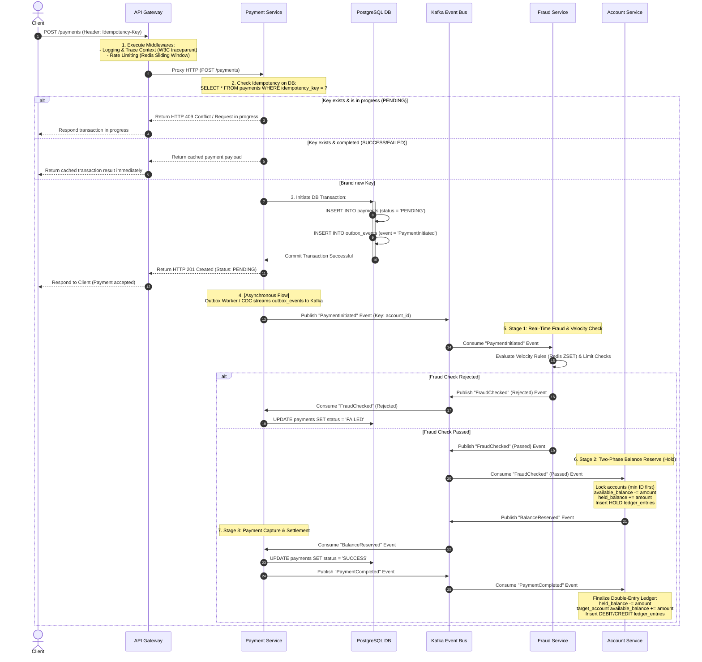

# qPayFlow Payment Flow Architecture Specification

This document details the technical implementation and execution flow of the Payment Processing Engine in the **qPayFlow** platform. The architecture is engineered to guarantee bank-grade ACID transaction consistency, strict idempotency, deadlock prevention, and asynchronous event-driven coordination.

---

## 1. End-to-End Payment Flow (Sequence Diagram)

The following sequence diagram illustrates how components interact to process a payment request initiated by a client:

---

## 2. Core Architectural Components & Patterns

### 2.1. API Gateway
- **Trace Context Propagation**: Generates a unique W3C-compliant `traceparent` header at the edge and injects it into downstream service requests. This maintains tracing context across asynchronous boundaries (REST/gRPC/Kafka).
- **Reverse Proxying**: Downstream REST requests are dynamically routed to the respective services (e.g. `payment-service` at port `8001`) utilizing Go's `httputil.NewSingleHostReverseProxy` standard library.

### 2.2. Payment Service (Idempotency & Transaction Boundary)
- **Idempotency Guard via `idempotency_keys` Table**: Idempotency is enforced using a dedicated `idempotency_keys` table — not by querying the `payments` table directly. On every write request, the service executes an atomic `INSERT ... ON CONFLICT (key) DO NOTHING` against `idempotency_keys`. If `rows_affected == 0`, the key already exists and the stored response is returned immediately — eliminating the TOCTOU (Time-Of-Check-To-Time-Of-Use) race condition that a `SELECT`-then-`INSERT` pattern would introduce.
  - **Request Hash Validation**: The `request_hash` column stores `SHA256(method + path + body)`. If the same `Idempotency-Key` arrives with a different request body (client bug), the service returns `HTTP 422 Unprocessable Entity` instead of silently reprocessing.
  - **Response Caching**: Once a request completes (success or failure), the response code and body are persisted into `idempotency_keys.response_body`, enabling exact replay without re-executing business logic.
  - **Separation of Concerns**: `idempotency_keys` guards duplicate requests. `payments` records business state. The two are intentionally decoupled — `payments.idempotency_key` carries a `UNIQUE` constraint as a business-level reference only, **not** a Foreign Key to `idempotency_keys`. This allows `idempotency_keys` to be purged after its TTL (`expires_at`) without orphaning payment records.
- **Transactional Outbox Pattern**: Creates the payment record and inserts a corresponding `PaymentInitiated` message into the `outbox_events` table inside a single PostgreSQL database transaction. This guarantees that events are never lost even if the microservice node crashes immediately after committing.

### 2.3. Fraud Detection Service (Pre-Authorization Guard)
- **Pre-Debit Risk Evaluation**: Fraud evaluation executes prior to balance reservation to avoid unnecessary ledger writes and rollbacks.
- **Sliding Window Counter**: Utilizes Redis Sorted Sets (ZSET) to record transaction epochs. If a user triggers more than 5 payments in a sliding 60-second window, or if a single transaction exceeds $10,000, the system rejects the transaction before accounts are touched.

### 2.4. Account Service (Ledger Consistency & Concurrency Control)
- **Double-Entry Bookkeeping**: Modifying balances via naive SQL `UPDATE` queries is strictly prohibited. Every balance adjustment is represented as immutable records in `ledger_entries`:
  - `DEBIT` entry (deducting the sender's balance).
  - `CREDIT` entry (incrementing the receiver's balance).
  - Mathematical invariant: $\sum \text{DEBIT} + \sum \text{CREDIT} = 0$.
- **Two-Phase Balance Lifecycle (Hold -> Capture)**:
  - **Phase 1 (Reserve/Hold)**: Sender's `available_balance` is decremented and moved to `held_balance`.
  - **Phase 2 (Capture/Commit)**: Sender's `held_balance` is settled, and receiver's `available_balance` is credited along with matching double-entry ledger records.
- **Pessimistic Lock Ordering (Deadlock Prevention)**: Parallel transfers (e.g., $A \rightarrow B$ and $B \rightarrow A$) prevent database deadlocks during `SELECT FOR UPDATE` by sorting the account IDs numerically and always acquiring the lock on the smaller ID first.

### 2.5. Notification Service (Event Consuming & Integrations)
- **Merchant Webhooks**: Consumes final payment status events (`PaymentCompleted`, `PaymentFailed`) to notify clients. Webhook JSON payloads are signed using HMAC-SHA256 with a pre-shared secret key, allowing merchants to verify origin and payload integrity.

---

## 3. Database Schema Mapping

The database schema definitions in [`000001_init_schema.up.sql`](/scripts/migrations/000001_init_schema.up.sql) define the following tables:

- **`idempotency_keys`**: Guards against duplicate write requests via atomic `INSERT ... ON CONFLICT`. Stores `request_hash`, status, and cached `response_body`. Has a TTL (`expires_at`) and is purged independently of business tables.
- **`accounts`**: Stores account balances partitioned into `available_balance` and `held_balance`, protected via pessimistic locking (`SELECT FOR UPDATE`).
- **`ledger_entries`**: Stores immutable debit and credit bookkeeping entries.
- **`payments`**: Manages the payment lifecycle states. The `idempotency_key` column carries a `UNIQUE` constraint as a business-level reference — it is **not** a Foreign Key to `idempotency_keys`, keeping the two concerns decoupled.
- **`outbox_events`**: Holds outbox events published to Kafka, ensuring At-Least-Once Delivery.

