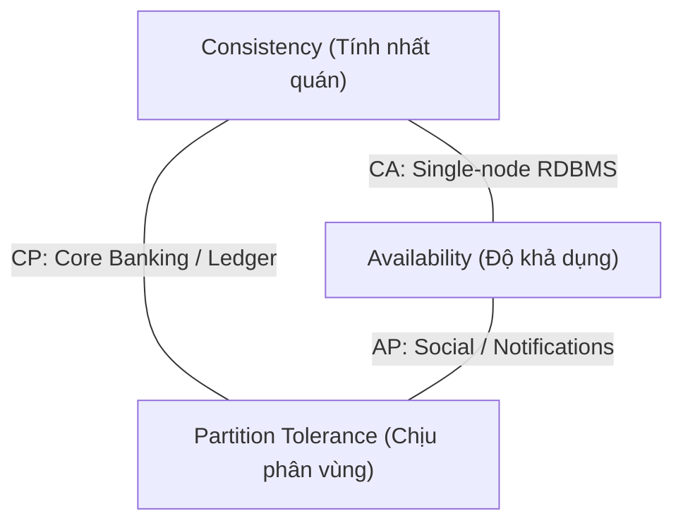
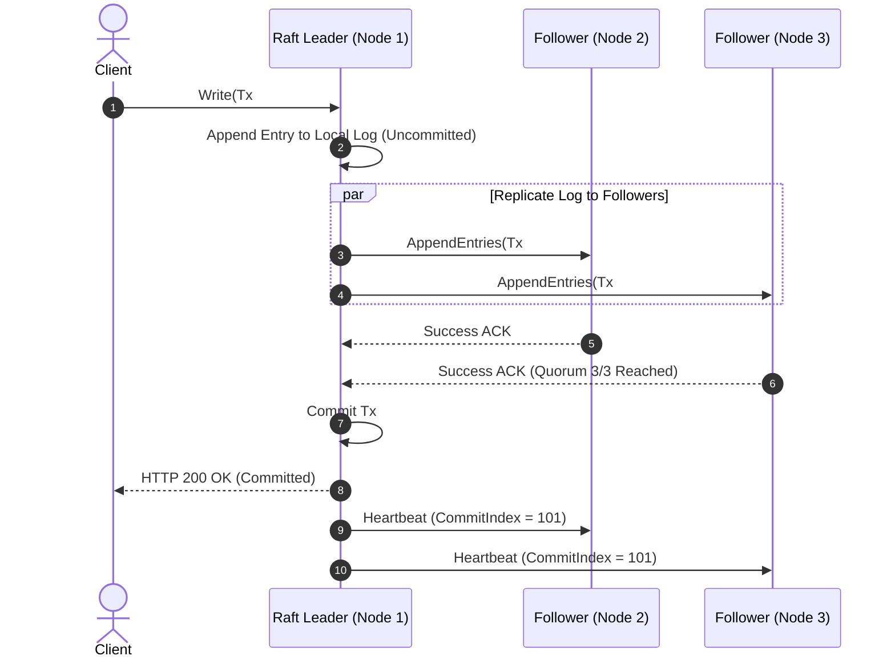
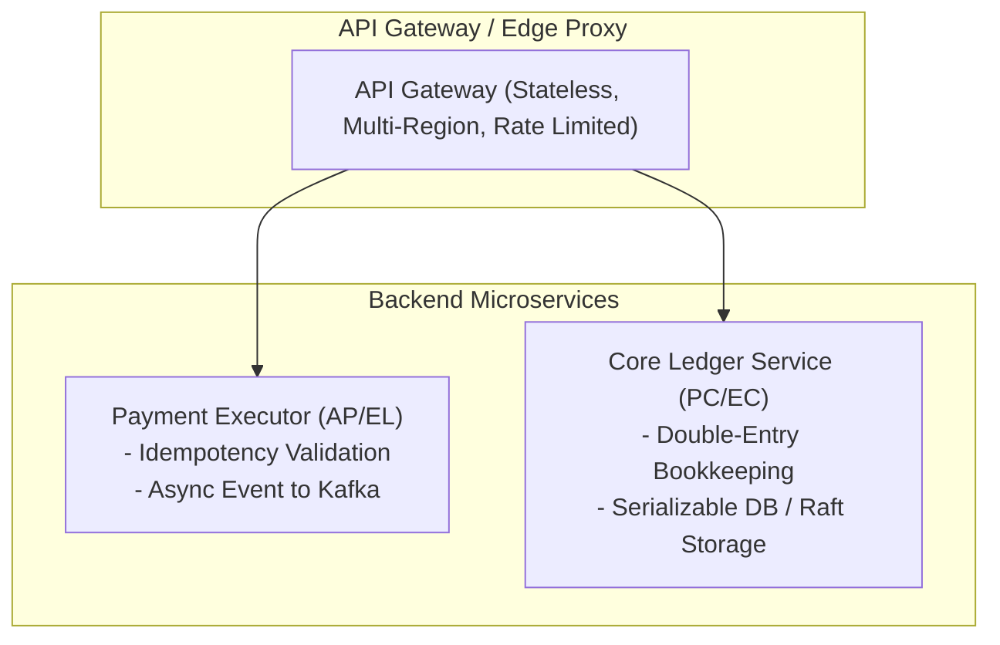

# Bài 00: Tổng Quan Về Hệ Thống Phân Tán (Distributed Systems)

> **Tóm tắt bài viết**: Khám phá bản chất của hệ thống phân tán từ góc nhìn kỹ thuật chuyên sâu: các nghịch lý cố hữu (Fallacies of Distributed Computing), đồng hồ vật lý vs logic (Clock Drift & Lamport Timestamps), định lý CAP & PACELC trong môi trường thanh toán, và cơ chế đồng thuận Raft trong quản lý trạng thái phân tán.

---

## 1. Hệ Thống Phân Tán Là Gì?

Theo **Leslie Lamport** (Turing Award 2013):
> *"Hệ thống phân tán là hệ thống mà trong đó sự cố của một máy tính mà bạn thậm chí còn không biết tới sự tồn tại của nó có thể làm cho máy tính của bạn không thể sử dụng được."*

Về mặt kiến trúc, **Hệ thống Phân tán (Distributed System)** là một tập hợp các máy tính độc lập (Nodes), kết nối qua mạng máy tính, phối hợp với nhau thông qua việc trao đổi thông điệp (Message Passing) nhưng xuất hiện đối với người dùng cuối như một hệ thống đơn nhất (Single Cohesive System).

### Động lực chuyển dịch từ Monolith sang Distributed trong Fintech:
1. **Khả năng mở rộng theo chiều ngang (Horizontal Scalability / Scale-out)**: Thêm các node giá rẻ thay vì nâng cấp CPU/RAM của một máy chủ vật lý duy nhất với chi phí tăng theo hàm mũ.
2. **Khả năng chịu lỗi & độ khả dụng cao (Fault Tolerance & High Availability)**: Khi một Availability Zone (AZ) của cloud provider bị mất điện hoặc hỏa hoạn, các AZ còn lại vẫn tiếp tục phục vụ giao dịch tài chính.
3. **Phân vùng địa lý & tuân thủ pháp lý (Data Residency & Latency)**: Đặt dữ liệu người dùng tại các trung tâm dữ liệu nội địa theo quy định pháp lý (ví dụ: Nghị định 53/2022/NĐ-CP tại Việt Nam) và giảm độ trễ RTT (Round-Trip Time) mạng cho người dùng cuối.

---

## 2. Các Thách Thức Cố Hữu (The Reality of Distributed Systems)

Trong một hệ thống đơn node (Monolith trên cùng một OS), các tiến trình giao tiếp qua shared memory hoặc Unix domain sockets với tính tin cậy tuyệt đối và thời gian phản hồi ở mức nanosecond. Ngược lại, môi trường phân tán đối mặt với **8 giả định sai lầm kinh điển (The 8 Fallacies of Distributed Computing)** của Peter Deutsch:

| STT | 8 Giả Định Sai Lầm (The 8 Fallacies of Distributed Computing) | Tác Động Trong Fintech |
| :---: | :--- | :--- |
| **1** | Mạng luôn tin cậy (Network is reliable) | Gói tin thanh toán bị rớt, connection timeout |
| **2** | Độ trễ bằng 0 (Latency is zero) | Chậm trễ p99 khi gọi liên dịch vụ |
| **3** | Băng thông là vô hạn (Bandwidth is infinite) | Nghẽn đường truyền khi stream file đối soát lớn |
| **4** | Mạng luôn an toàn (Network is secure) | Nguy cơ nghe lén/giả mạo nếu không có mTLS |
| **5** | Topology mạng không bao giờ đổi | IP của Pods thay đổi liên tục trong K8s |
| **6** | Chỉ có một người quản trị hệ thống | Xung đột cấu hình giữa các đội Cloud/SRE/Dev |
| **7** | Chi phí vận chuyển byte bằng 0 | Chi phí egress traffic qua các Cloud Region |
| **8** | Mạng là đồng nhất (Homogeneous) | Đa dạng giao thức HTTP/1.1, HTTP/2, gRPC, TCP |

### Các hệ quả kỹ thuật trực tiếp trong xử lý thanh toán:

### 2.1. Network Partition & The Two Generals' Problem
Khi Node A (Payment Gateway) gửi HTTP POST sang Node B (Core Ledger) để trừ tiền và nhận về lỗi `Connection Timeout`:
- **Trạng thái mơ hồ (Uncertainty of Failure)**: Node A hoàn toàn không biết:
  1. Request bị rớt trước khi tới Node B (chưa trừ tiền).
  2. Node B đã nhận, đã trừ tiền thành công, nhưng response ACK bị rớt trên đường về.
  3. Node B đang xử lý chậm do GC Pause hoặc disk I/O nghẽn.
- Việc mù mờ này dẫn đến nghịch lý *Two Generals' Problem*: Không thể đạt được sự đồng thuận 100% qua một kênh truyền tin không tin cậy nếu không có cơ chế timeout và xác nhận bù trừ.

### 2.2. Clock Drift & Sự sụp đổ của Timestamp vật lý
Đồng hồ thạch anh trên các máy chủ vật lý luôn bị trôi dạt (Drift) từ vài mili-giây đến hàng giây mỗi ngày do nhiệt độ và phần cứng. Ngay cả khi đồng bộ NTP (Network Time Protocol), độ lệch vẫn dao động từ vài mili-giây đến hàng trăm mili-giây.
- **Hệ quả trong Banking**: Không thể dùng `time.Now()` trên 2 server khác nhau để so sánh giao dịch nào xảy ra trước! Nếu Transaction A (ở Server 1) có timestamp `10:00:00.005` và Transaction B (ở Server 2) có timestamp `10:00:00.002`, thực tế Transaction A có thể đã xảy ra trước Transaction B do Server 2 bị lệch đồng hồ về tương lai.
- **Giải pháp**: Sử dụng **Lamport Timestamps**, **Vector Clocks**, hoặc hạ tầng phần cứng chuyên dụng với đồng hồ nguyên tử và GPS như **Google TrueTime API** trong Spanner.

---

## 3. Lý Thuyết CAP Theorem & PACELC Theorem

### 3.1. CAP Theorem (Eric Brewer)
Trong bất kỳ hệ thống phân tán lưu trữ dữ liệu nào, bạn chỉ có thể đồng thời thỏa mãn tối đa **2 trong 3** thuộc tính:

- **C (Consistency - Linearizable Consistency)**: Mọi thao tác đọc đều nhận được dữ liệu được ghi mới nhất hoặc trả về lỗi.
- **A (Availability)**: Mọi node không bị sự cố (non-failing node) đều phải trả về phản hồi hợp lệ (không timeout hay trả về lỗi hệ thống).
- **P (Partition Tolerance)**: Hệ thống tiếp tục vận hành dù mạng giữa các node bị mất kết nối hoặc trễ vô hạn.

> **Thực tế kỹ thuật**: Mạng máy tính vật lý không bao giờ hoàn hảo, do đó **Partition (P) là điều tất yếu**. Do đó, sự lựa chọn kiến trúc thực tế luôn là **CP vs AP**:
> - **Hệ thống CP (Core Banking / Ledger)**: Khi xảy ra phân vùng mạng, hệ thống chấp nhận từ chối giao dịch hoặc trả về lỗi (hy sinh Availability) để ngăn chặn việc ghi dữ liệu sai lệch hoặc tạo ra số dư ma.
> - **Hệ thống AP (Feed / Notification / Analytics)**: Khi xảy ra phân vùng mạng, hệ thống chấp nhận trả về dữ liệu cũ (Stale Data) để giữ cho giao diện người dùng luôn phản hồi mượt mà.

### 3.2. PACELC Theorem (Daniel Abadi)
CAP Theorem chỉ mô tả hành vi của hệ thống **khi có sự cố mạng (Partition)**. Trong điều kiện **bình thường (Else)**, hệ thống vẫn phải đánh đổi giữa **Latency (L)** và **Consistency (C)**.

$$\text{If } \mathbf{P} \text{ (Partition): } [\mathbf{A} \text{ vs } \mathbf{C}] \quad \mathbf{E} \text{lse: } [\mathbf{L} \text{atency} \text{ vs } \mathbf{C} \text{onsistency}]$$

| Phân Loại | Ví Dụ Đại Diện | Hành Vi Khi Partition (P) | Hành Vi Khi Bình Thường (E) | Phù Hợp Nghiệp Vụ |
| :--- | :--- | :--- | :--- | :--- |
| **PC/EC** | Google Spanner, CockroachDB | Chọn Consistency (từ chối ghi nếu mất quorum) | Chọn Consistency (chờ đồng bộ ghi đa node, latency cao hơn) | Core Ledger, Giao dịch tài chính |
| **PA/EL** | DynamoDB (mặc định), Cassandra | Chọn Availability (cho phép ghi cục bộ) | Chọn Latency (ghi 1 node ACK ngay, bất đồng bộ sang node khác) | Tracking hành vi người dùng, Giỏ hàng tạm |
| **PC/EL** | MongoDB (Primary-Secondary) | Chọn Consistency khi mất Leader | Chọn Latency (đọc từ Secondary) | Danh mục sản phẩm, Catalog |

---

## 4. Thuật Toán Đồng Thuận (Consensus Algorithms)

Trong một cụm phân tán không có node chủ cố định, làm thế nào để $N$ node cùng thống nhất một trạng thái duy nhất của sổ cái? Đó là nhiệm vụ của **Thuật toán Đồng thuận (Consensus Algorithm)**.

### 4.1. Raft Consensus Protocol
Raft phân tách bài toán đồng thuận thành 3 module độc lập:
1. **Leader Election**: Các node sử dụng Randomized Election Timeout để bầu một Leader duy nhất. Hệ thống cần đạt **Quorum** ($Q = \lfloor N/2 \rfloor + 1$) số phiếu để bầu Leader thành công.
2. **Log Replication**: Mọi write command đều gửi tới Leader. Leader ghi vào log cục bộ, phát `AppendEntries` RPC tới tất cả Followers. Khi đa số ($> 50\%$) node đã ghi log thành công, Leader commit transaction và phản hồi Client.
3. **Safety Guarantee**: Nếu một Follower bị mất kết nối trong quá trình ghi, khi tái kết nối, Leader sẽ ép Follower ghi đè lại log để đồng nhất tuyệt đối với Leader.

---

## 5. Kiến Trúc Ứng Dụng Trong qPayFlow

Trong nền tảng thanh toán `qPayFlow`, chúng ta phân tầng kiến trúc để áp dụng triệt để các nguyên lý trên:

1. **Core Ledger (PC/EC)**: Lưu trữ số dư và sổ cái kế toán. Sử dụng PostgreSQL với Serializable Transaction Isolation hoặc CockroachDB (Raft-based) để đảm bảo không bao giờ xảy ra tình trạng âm tiền hoặc double-spending.
2. **Payment Event Bus (AP/EL)**: Sử dụng Apache Kafka với partition key theo `account_id` để phân tán tải các luồng xử lý thông báo, audit log, và phân tích gian lận sau giao dịch mà không làm chậm luồng thanh toán chính.

---

## 6. Góc Chuyên Sâu: Phân Tích Kỹ Thuật & Tình Huống Thực Tế

### Case 1: Xử lý Split-Brain trong cụm 5 Nodes khi bị đứt cáp quang chia làm 2 cụm (2 Nodes vs 3 Nodes)

**Bối cảnh sự cố:** Một cụm thanh toán gồm 5 node chạy thuật toán đồng thuận Raft phân bố ở 2 Datacenter: DC1 (2 nodes) và DC2 (3 nodes). Đột nhiên đường truyền liên kết giữa 2 DC bị đứt hoàn toàn.

**Cơ chế giải quyết:**
- Tại phân vùng DC1 (2 nodes): Tổng số node là $2 < \text{Quorum} (5/2 + 1 = 3)$. Dù các node tại DC1 có cố gắng bầu Leader, không có node nào nhận đủ 3 phiếu bầu. DC1 tự động rơi vào trạng thái Read-Only hoặc từ chối mọi yêu cầu ghi giao dịch mới.
- Tại phân vùng DC2 (3 nodes): Tổng số node là $3 \ge \text{Quorum} (3)$. Các node tại DC2 bầu ra Leader hợp lệ và tiếp tục tiếp nhận, commit các giao dịch thanh toán bình thường.
- Khi cáp mạng phục hồi (Healed Partition): Leader của DC2 gửi `AppendEntries` có term cao hơn tới 2 node ở DC1. Hai node DC1 nhận diện term mới, tự động hạ cấp xuống Follower và đồng bộ lại toàn bộ log bị thiếu. Hiện tượng **Split-Brain (2 Leader cùng ghi độc lập)** bị triệt tiêu hoàn toàn nhờ quy tắc quá bán ($N/2 + 1$).

---

### Case 2: Tại sao không thể sử dụng Timestamp vật lý của máy chủ để sắp xếp thứ tự giao dịch tài chính?

**Bối cảnh:** Hai khách hàng A và B cùng chuyển tiền vào cùng một tài khoản lúc gần như đồng thời trên hai máy chủ Web khác nhau. Hệ thống cần xác định chính xác giao dịch nào diễn ra trước để tính lãi suất và hạn mức.

**Phân tích nguyên nhân gốc rễ:**
- Độ lệch đồng hồ vật lý (Clock Skew): Hai máy chủ dù chạy NTP daemon vẫn có độ lệch từ $5\text{ms} - 50\text{ms}$.
- Nếu Server 1 bị chậm $20\text{ms}$ so với giờ chuẩn UTC và Server 2 chạy đúng giờ:
  - Giao dịch 1 diễn ra tại Server 1 lúc `10:00:00.010` thực tế nhưng server ghi log là `09:59:59.990`.
  - Giao dịch 2 diễn ra tại Server 2 lúc `10:00:00.005` thực tế và server ghi log là `10:00:00.005`.
  - Nếu sắp xếp theo timestamp vật lý, hệ thống sẽ kết luận sai lầm rằng Giao dịch 1 xảy ra trước Giao dịch 2 tận 15ms.

**Giải pháp trong qPayFlow:**
- Sử dụng **Database Sequence / Auto-incrementing Global Version** hoặc **Kafka Partition Offset** làm nguồn trật tự duy nhất (Single Source of Ordering Truth).
- Sử dụng **UUIDv7** (chứa 48-bit timestamp kết hợp với monotonic sequence bits) để vừa có thể sắp xếp tương đối theo thời gian vừa đảm bảo tính duy nhất trên môi trường phân tán.

---

### Case 3: Byzantine Fault Tolerance (BFT) vs Crash Fault Tolerance (CFT) trong Banking

**Bối cảnh:** Nhiều kỹ sư thắc mắc: *"Tại sao các hệ thống Core Banking hay qPayFlow không dùng thuật toán đồng thuận Proof-of-Work hay PBFT như Blockchain mà chỉ dùng Raft/Paxos?"*

**Phân tích kỹ thuật:**
- **Crash Fault Tolerance (CFT - Raft, Paxos)**: Giả định các node trong hệ thống là **đáng tin cậy** (thuộc sở hữu của cùng một tổ chức, nằm trong private VPC). Các node có thể bị crash, khởi động lại, mạng bị chậm hoặc rớt gói tin, nhưng **không có node nào cố tình nói dối (bị hack, giả mạo dữ liệu)**. CFT chỉ cần $2F + 1$ node để chịu được $F$ node bị lỗi crash.
- **Byzantine Fault Tolerance (BFT - PBFT, Raft-BFT)**: Giả định trong mạng có các node **độc hại (Malicious Nodes)** cố tình gửi dữ liệu sai lệch khác nhau cho các bên để phá hoại. BFT yêu cầu thuật toán phức tạp với chữ ký mã hóa đa bên và cần tới $3F + 1$ node để chịu được $F$ node độc hại, với độ trễ (latency) cao hơn từ $10 - 100$ lần so với CFT.

**Kết luận kiến trúc**:
Trong hạ tầng Banking nội bộ (Private Network), các microservice đều chạy dưới hạ tầng do ngân hàng kiểm soát với mTLS và Zero-Trust Network. Do đó, sử dụng các thuật toán **CFT (Raft/Paxos)** mang lại throughput hàng chục nghìn TPS với độ trễ sub-millisecond, hoàn toàn tối ưu và phù hợp hơn so với BFT.

---

## 7. Tài Liệu Tham Khảo (Reputable References)

1. **Martin Fowler**: [Distributed Systems Patterns](https://martinfowler.com/articles/patterns-of-distributed-systems/)
2. **Martin Kleppmann**: *Designing Data-Intensive Applications (DDIA)* — Chapter 8: The Trouble with Distributed Systems & Chapter 9: Consistency and Consensus.
3. **AWS Builders' Library**: [Challenges with Distributed Systems](https://aws.amazon.com/builders-library/challenges-with-distributed-systems/)
4. **Werner Vogels (Amazon CTO)**: [Eventually Consistent - Building Reliable Distributed Systems](https://www.allthingsdistributed.com/2008/12/eventually_consistent.html)
5. **Diego Ongaro & John Ousterhout (Stanford)**: [In Search of an Understandable Consensus Algorithm (Raft Paper)](https://raft.github.io/raft.pdf)
