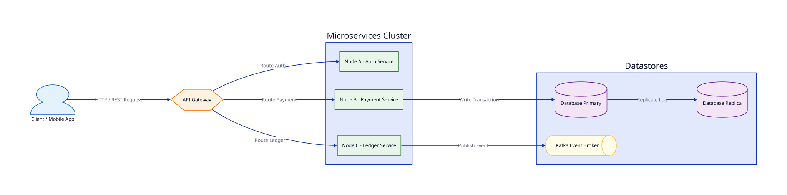
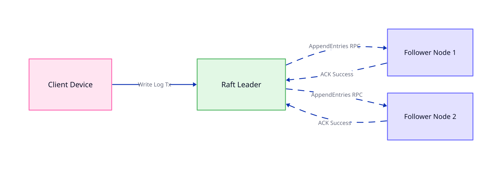

# Bài 00: Tổng Quan Về Hệ Thống Phân Tán (Distributed Systems)

> **Tóm tắt bài viết**: Bài viết giải thích bản chất hệ thống phân tán, các thách thức cố hữu (Network Partitions, Clock Drift), mô hình lý thuyết CAP & PACELC Theorem, và các thuật toán đồng thuận (Consensus) phổ biến trong kiến trúc Fintech hiện đại.

---

## 1. Hệ Thống Phân Tán Là Gì?

Theo **Leslie Lamport** (người đoạt giải Turing):
> *"Hệ thống phân tán là hệ thống mà trong đó sự cố của một máy tính mà bạn thậm chí còn không biết tới sự tồn tại của nó có thể làm cho máy tính của bạn không thể sử dụng được."*

Nói một cách kỹ thuật, **Hệ thống Phân tán (Distributed System)** là một tập hợp các máy tính độc lập (Nodes), kết nối qua mạng máy tính, nhưng xuất hiện đối với người dùng cuối như một hệ thống đơn nhất (Single Cohesive System).

### Động lực chính khi chuyển từ Monolith sang Distributed:
1. **Khả năng Mở rộng (Scalability)**: Mở rộng theo chiều ngang (Horizontal Scaling / Scale-out) thay vì chiều dọc (Vertical Scaling / Scale-up).
2. **Khả năng Chịu lỗi (Fault Tolerance & Availability)**: Nếu một Node bị crash, hệ thống vẫn duy trì hoạt động nhờ các Nodes còn lại.
3. **Phân vùng Địa lý (Geographical Redundancy)**: Giảm độ trễ (Latency) cho người dùng cuối bằng cách đặt server gần vị trí địa lý của họ.

---

## 2. Các Thách Thức Cố Hữu (Distributed Systems Reality)

Không giống như môi trường Single-node nơi bộ nhớ và CPU chạy trên cùng một bus phần cứng, môi trường phân tán đối mặt với **8 giả định sai lầm (The 8 Fallacies of Distributed Computing)**:

1. Mạng luôn tin cậy (Network is reliable).
2. Độ trễ bằng 0 (Latency is zero).
3. Băng thông là vô hạn (Bandwidth is infinite).
4. Mạng là an toàn (Network is secure).
5. Topology không bao giờ thay đổi (Topology doesn't change).
6. Chỉ có một quản trị viên (There is one administrator).
7. Chi phí vận chuyển bằng 0 (Transport cost is zero).
8. Mạng là đồng nhất (Network is homogeneous).

### Thách thức chính:
- **Network Partition (Phân vùng Mạng)**: Thông điệp giữa các Node bị mất, chậm hoặc chia cắt hoàn toàn.
- **Clock Drift & True Time**: Đồng hồ vật lý giữa các máy chủ không bao giờ đồng bộ tuyệt đối 100%. Không thể dựa vào timestamp địa phương để sắp xếp thứ tự giao dịch tài chính.
- **Uncertainty of Failure**: Khi Node A gọi Node B và bị Timeout, Node A **không thể biết** Node B đã nhận và xử lý request chưa, hay request bị rớt trên đường truyền.

---

## 3. Lý Thuyết CAP Theorem & PACELC Theorem

### 3.1. CAP Theorem (Eric Brewer)
Trong một hệ thống phân tán lưu trữ dữ liệu, bạn chỉ có thể chọn tối đa **2 trong 3** yếu tố sau:

- **C (Consistency - Strong Consistency)**: Mọi thao tác đọc đều trả về dữ liệu mới nhất được ghi.
- **A (Availability)**: Mọi Node không bị ngắt kết nối đều phải trả về phản hồi thành công (không bị lỗi hoặc timeout).
- **P (Partition Tolerance)**: Hệ thống tiếp tục hoạt động dù mạng giữa các Node bị gián đoạn.

> **Thực tế phũ phàng**: Trong môi trường thực tế, **Network Partition (P) luôn có thể xảy ra**. Do đó, sự lựa chọn thực sự của bạn luôn là giữa **CP** hoặc **AP**:
> - **CP System**: Ưu tiên tính chính xác dữ liệu. Khi có Partition, hệ thống từ chối Request (giảm Availability) để tránh ghi dữ liệu sai. *(Phù hợp cho Core Ledger / Wallet Balance)*.
> - **AP System**: Ưu tiên phản hồi người dùng. Khi có Partition, chấp nhận trả dữ liệu cũ hoặc chấp nhận Eventual Consistency. *(Phù hợp cho Notification / Feed)*.

### 3.2. Mở Rộng Với PACELC Theorem (Daniel Abadi)
CAP Theorem chỉ mô tả hệ thống khi có **Partition (P)**. **PACELC Theorem** bổ sung trạng thái bình thường khi **bình thường (Else - E)**:

$$\text{If } \mathbf{P} \text{ (Partition): } [\mathbf{A} \text{ vs } \mathbf{C}] \quad \mathbf{E} \text{lse: } [\mathbf{L} \text{atency} \text{ vs } \mathbf{C} \text{onsistency}]$$

- **PC/EC (ví dụ: Spanner, CockroachDB)**: Luôn ưu tiên Consistency dù có Partition hay không (chấp nhận độ trễ Latency cao hơn).
- **PA/EL (ví dụ: DynamoDB, Cassandra)**: Ưu tiên Availability khi Partition, và ưu tiên Latency thấp khi hệ thống chạy bình thường.

---

## 4. Thuận Toán Đồng Thuận (Consensus Algorithms)

Để nhiều Node cùng đồng ý với một giá trị duy nhất (hoặc một dãy log giao dịch), hệ thống cần **Thuật toán Đồng thuận (Consensus Algorithm)**.

### So sánh Raft & Paxos:
- **Paxos**: Thuật toán đặt nền móng lý thuyết. Cực kỳ phức tạp trong việc triển khai thực tế (Multi-Paxos).
- **Raft**: Được thiết kế để dễ hiểu và dễ triển khai hơn. Phân chia rõ ràng các phase: *Leader Election*, *Log Replication*, và *Safety*. Sử dụng mô hình **Quorum** ($N/2 + 1$).

---

## 5. Ứng Dụng Trong qPayFlow & Banking

Trong hệ thống thanh toán `qPayFlow`:
1. **Ví điện tử & Số dư (Wallet Balance)**: Bắt buộc chọn mô hình **CP (Consistency / Partition Tolerance)**. Sử dụng PostgreSQL RDBMS với Serializable Isolation / Optimistic Locking, hoặc Raft-based distributed datastore.
2. **Lịch sử giao dịch & Log (Audit Log)**: Áp dụng mô hình **Eventual Consistency** qua Apache Kafka log replication.

---

## 6. Tài Liệu Tham Khảo (Reputable References)

1. **Martin Fowler**: [Distributed Systems Patterns](https://martinfowler.com/articles/patterns-of-distributed-systems/)
2. **Martin Kleppmann**: *Designing Data-Intensive Applications (DDIA)* — Chapter 8 & 9 (Trouble with Distributed Systems, Consistency & Consensus).
3. **AWS Builders' Library**: [Challenges with Distributed Systems](https://aws.amazon.com/builders-library/challenges-with-distributed-systems/)
4. **Werner Vogels (Amazon CTO)**: [Eventually Consistent - Building Reliable Distributed Systems](https://www.allthingsdistributed.com/2008/12/eventually_consistent.html)
5. **Raft Consensus Algorithm**: [In Search of an Understandable Consensus Algorithm (Ongaro & Ousterhout)](https://raft.github.io/raft.pdf)

