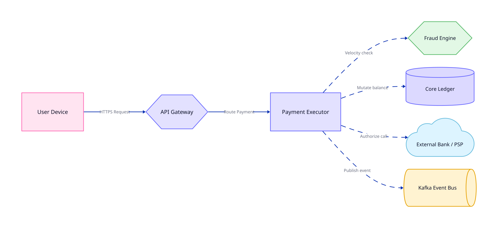
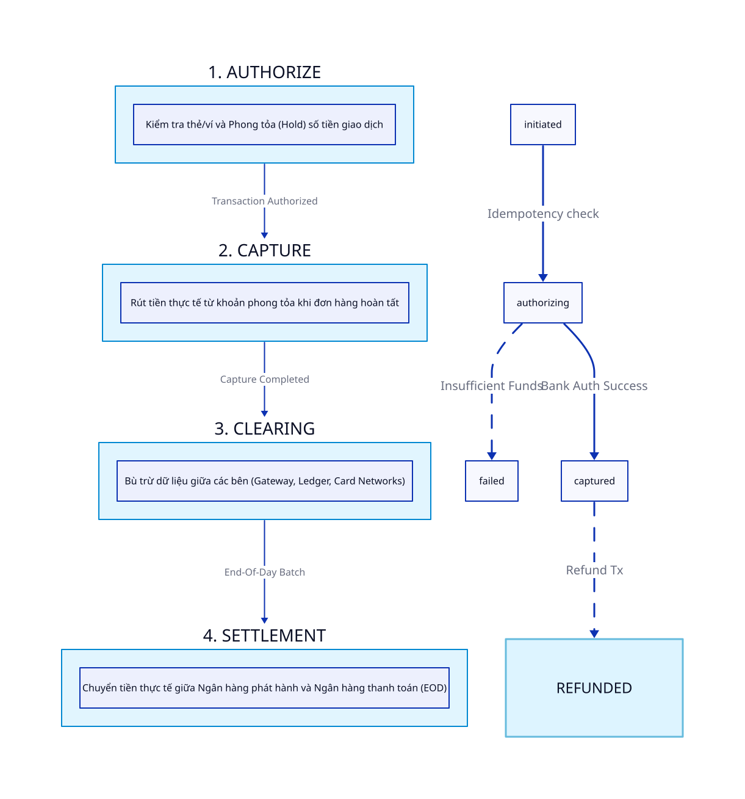
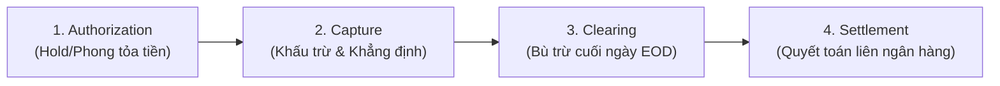

# Bài 01: Kiến Trúc Nền Tảng Thanh Toán (Payment Platform Architecture)

> **Tóm tắt bài viết**: Khám phá kiến trúc toàn diện của một nền tảng thanh toán (Payment Gateway & Core Ledger), phân tích chi tiết 4 giai đoạn trong vòng đời giao dịch (Authorization, Capture, Clearing, Settlement), và đi sâu vào nguyên tắc hạch toán Sổ kép (Double-Entry Bookkeeping) cùng code Go thực tế trong dự án `qPayFlow`.

---

## 1. Vì Sao Hệ Thống Thanh Toán Lại Cực Kỳ Phức Tạp?

Hệ thống thanh toán nhìn bề ngoài có vẻ đơn giản: *"Khách hàng nhấn nút Thanh toán, và số dư tài khoản thay đổi"*. Tuy nhiên, ẩn sau giao diện đó là những đòi hỏi khắt khe hàng đầu trong ngành kỹ thuật phần mềm:

1. **Reliability & Exactly-Once Semantics (Độ tin cậy tuyệt đối)**: Giao dịch phải thành công hoặc thất bại một cách dứt khoát. Không bao giờ được tồn tại trạng thái lấp lửng (tiền đã trừ khỏi tài khoản ngân hàng nhưng đơn hàng chưa được tạo).
2. **Strict Financial Consistency (Nhất quán tài chính nghiêm ngặt)**: Bản ghi số dư và dòng tiền phải chính xác đến từng xu. Tuyệt đối không chấp nhận Eventual Consistency cho số dư tài khoản thanh toán.
3. **High Availability & Low Latency**: Phải chịu được lưu lượng tăng đột biến gấp hàng chục lần trong các đợt Flash Sale hoặc đêm giao thừa với độ trễ $p99 < 100\text{ms}$.
4. **Security & PCI-DSS Compliance**: Bảo mật tuyệt đối thông tin chủ thẻ, mã hóa đầu-cuối (E2EE), mã danh hóa (Tokenization), và phòng chống gian lận thời gian thực.
5. **Multi-Party Reconciliation (Đối soát đa bên)**: Đối soát hàng triệu giao dịch mỗi đêm giữa sổ cái nội bộ, cổng trung gian (NAPAS, Visa/Mastercard) và các ngân hàng liên kết.

---

## 2. Các Thành Phần Cốt Lõi (Core Platform Components)

Một nền tảng thanh toán chuẩn công nghiệp (như Stripe, Adyen hay `qPayFlow`) được chia thành 5 phân hệ dịch vụ độc lập:



### 2.1. API Gateway / Edge Routing
- Tiếp nhận HTTP/REST và gRPC requests từ Client (Mobile App, Web, Merchant Backend).
- Thực thi xác thực danh tính (OAuth2/JWT), kiểm tra chữ ký số (HMAC Signature), áp dụng Rate Limiting chống DDoS, và kiểm tra tính duy nhất của `Idempotency-Key`.

### 2.2. Risk & Fraud Engine
- Chạy các quy tắc kiểm tra gian lận theo thời gian thực (Real-time Rule Engine): Device Fingerprinting, Geolocation Anomaly (IP ở Việt Nam nhưng thẻ phát hành tại châu Âu), Velocity Rules (1 thẻ quẹt quá 5 lần trong 1 phút).

### 2.3. Payment Orchestrator / State Machine
- Quản lý vòng đời và chuyển đổi trạng thái của giao dịch theo mô hình State Machine hữu hạn nghiêm ngặt:
  $$\text{INITIATED} \longrightarrow \text{PENDING} \longrightarrow \text{AUTHORIZED} \longrightarrow \text{CAPTURED} \longrightarrow \text{SETTLED}$$
- Điều phối các bước thanh toán phân tán và kích hoạt cơ chế bù trừ (Compensations) khi có sự cố.

### 2.4. Processor Connector (Payment Acquirers / Gateways)
- Đóng vai trò adapter chuẩn hóa giao thức kết nối với các đối tác tài chính bên ngoài (Ngân hàng VCB, BIDV, cổng thanh toán NAPAS, Card Networks Visa/Mastercard qua chuẩn ISO 8583 / ISO 20022).

### 2.5. Core Ledger Service (Sổ Cái Trung Tâm)
- Nguồn sự thật duy nhất (Single Source of Truth) quản lý tài khoản, biểu đồ tài khoản kế toán (Chart of Accounts), và mọi biến động ghi Nợ/Có bất biến (Immutable Ledger Entries).

---

## 3. Vòng Đời Giao Dịch Thanh Toán (Payment Lifecycle)

Trong mô hình thanh toán thẻ (Credit/Debit Card) và ví điện tử, một giao dịch tài chính chuẩn quốc tế trải qua 4 giai đoạn tách biệt:





### Chi tiết từng giai đoạn:
1. **Authorization (Ủy quyền / Giữ tiền)**:
   - Hệ thống kiểm tra thẻ còn hiệu lực và có đủ hạn mức/số dư hay không.
   - Ngân hàng phát hành (Issuing Bank) tiến hành **phong tỏa (Hold/Reserve)** số tiền giao dịch. Tiền chưa thực sự chuyển đi, người dùng không thể chi tiêu số tiền này cho giao dịch khác.
2. **Capture (Thâu thu / Khấu trừ)**:
   - Merchant xác nhận đơn hàng đã sẵn sàng giao hoặc dịch vụ đã hoàn thành.
   - Hệ thống gửi lệnh Capture tới ngân hàng để chính thức khấu trừ số tiền đã Hold và chuyển trạng thái giao dịch sang `SUCCESS`.
3. **Clearing (Bù trừ giao dịch)**:
   - Diễn ra vào cuối ngày làm việc (End of Day). Các bên (Merchant, Gateway, Card Network, Bank) trao đổi dữ liệu chi tiết giao dịch theo lô (Batch Files) để tính toán tổng nghĩa vụ tài chính ròng giữa các bên.
4. **Settlement (Quyết toán tiền tệ)**:
   - Tiền thực tế được chuyển từ tài khoản của Ngân hàng phát hành sang tài khoản ngân hàng của Merchant (thường sau $T+1$ hoặc $T+2$ ngày làm việc) sau khi đã khấu trừ phí giao dịch (MDR - Merchant Discount Rate).

---

## 4. Nguyên Tắc Hạch Toán Sổ Kép (Double-Entry Bookkeeping)

Trong kỹ thuật phần mềm tài chính ngân hàng, **tuyệt đối không bao giờ được thiết kế hệ thống theo kiểu chạy lệnh `UPDATE accounts SET balance = balance - 100` đơn lẻ**. Mọi biến động tiền tệ phải được ghi lại dưới dạng bản ghi bất biến (Immutable Ledger Entries) tuân theo **Nguyên lý Sổ kép (Double-Entry)**.

### Phương trình kế toán nền tảng:
$$\text{Assets (Tài sản)} = \text{Liabilities (Nợ phải trả)} + \text{Equity (Vốn chủ sở hữu)}$$

### Quy tắc bất di bất dịch của Sổ Kép:
1. Mỗi giao dịch phải bao gồm ít nhất **2 bút toán đối ứng**: Một dòng ghi **NỢ (DEBIT)** và một dòng ghi **CÓ (CREDIT)**.
2. Tổng số tiền ghi Nợ luôn luôn **bằng tuyệt đối** tổng số tiền ghi Có:
   $$\sum \text{DEBIT} = \sum \text{CREDIT}$$
3. **Số dư hiện tại của tài khoản** không phải là một giá trị tùy ý, mà là tổng tích lũy toán học của toàn bộ các bút toán từ khi tài khoản được mở:
   $$\text{Balance}_{\text{current}} = \text{Balance}_{\text{initial}} + \sum \text{Credits} - \sum \text{Debits}$$

#### Bảng ví dụ: Khách hàng A nạp 100 USD từ Thẻ Ngân hàng vào Ví qPayFlow:

| Số Hiệu Tài Khoản | Tên Tài Khoản | Loại Tài Khoản | Loại Bút Toán | Số Tiền (USD) | Ý Nghĩa Kế Toán |
| :--- | :--- | :--- | :--- | :--- | :--- |
| `1010-BANK-SETTLE` | Tài khoản Ngân hàng Thanh toán | Asset (Tài sản) | **DEBIT (Nợ)** | $100.00$ | qPayFlow tăng tiền gửi tại ngân hàng đối tác |
| `2010-USER-WALLET-A` | Ví điện tử Khách hàng A | Liability (Nợ phải trả) | **CREDIT (Có)** | $100.00$ | qPayFlow tăng nghĩa vụ nợ phải trả cho Khách A |

---

## 5. Triển Khai Thực Tế Trong qPayFlow (`account-service`)

Dưới đây là đoạn mã nguồn thực thi ghi sổ kép trong một Database Transaction nguyên tử của `account-service` tại `cmd/account-service/internal/account/service.go`:

```go
package account

import (
	"context"
	"errors"
	"fmt"
	"time"
)

// Transfer thực hiện hạch toán sổ kép (Double-Entry) giữa 2 tài khoản với khóa bi quan
func (s *accountService) Transfer(ctx context.Context, txID string, fromAccID string, toAccID string, amount float64, currency string, description string) error {
	if amount <= 0 {
		return errors.New("transfer amount must be strictly positive")
	}
	if fromAccID == toAccID {
		return errors.New("source and destination accounts must be distinct")
	}

	// 1. Mở một Database Transaction nguyên tử
	tx, err := s.repo.BeginTx(ctx)
	if err != nil {
		return fmt.Errorf("failed to begin database transaction: %w", err)
	}
	defer tx.Rollback()

	// 2. Khóa tài khoản gửi và nhận theo thứ tự ID tăng dần để chống Deadlock
	firstID, secondID := fromAccID, toAccID
	if firstID > secondID {
		firstID, secondID = secondID, firstID
	}

	accMap := make(map[string]*Account)
	for _, accID := range []string{firstID, secondID} {
		acc, err := s.repo.GetAccountByIDWithLock(ctx, tx, accID)
		if err != nil {
			return fmt.Errorf("failed to lock account %s: %w", accID, err)
		}
		if acc == nil {
			return fmt.Errorf("account not found: %s", accID)
		}
		accMap[accID] = acc
	}

	srcAcc := accMap[fromAccID]
	destAcc := accMap[toAccID]

	// 3. Kiểm tra tính hợp lệ về số dư
	if srcAcc.Balance < amount {
		return errors.New("insufficient funds in source account")
	}

	// 4. Tính toán số dư mới
	newSrcBalance := srcAcc.Balance - amount
	newDestBalance := destAcc.Balance + amount

	// 5. Cập nhật snapshot số dư (kèm kiểm tra version lạc quan nếu cần)
	if err := s.repo.UpdateAccountBalance(ctx, tx, srcAcc.ID, newSrcBalance, srcAcc.Version); err != nil {
		return fmt.Errorf("failed to update source balance: %w", err)
	}
	if err := s.repo.UpdateAccountBalance(ctx, tx, destAcc.ID, newDestBalance, destAcc.Version); err != nil {
		return fmt.Errorf("failed to update destination balance: %w", err)
	}

	// 6. Ghi hai bút toán Sổ kép đối xứng (DEBIT & CREDIT)
	debitEntry := &BalanceLedger{
		ID:          "ldg_deb_" + generateUUID(),
		AccountID:   srcAcc.ID,
		Amount:      amount,
		Type:        "DEBIT",
		ReferenceID: txID,
		Description: description,
		CreatedAt:   time.Now().UTC(),
	}

	creditEntry := &BalanceLedger{
		ID:          "ldg_crd_" + generateUUID(),
		AccountID:   destAcc.ID,
		Amount:      amount,
		Type:        "CREDIT",
		ReferenceID: txID,
		Description: description,
		CreatedAt:   time.Now().UTC(),
	}

	if err := s.repo.CreateLedgerEntry(ctx, tx, debitEntry); err != nil {
		return fmt.Errorf("failed to write debit entry: %w", err)
	}
	if err := s.repo.CreateLedgerEntry(ctx, tx, creditEntry); err != nil {
		return fmt.Errorf("failed to write credit entry: %w", err)
	}

	// 7. Commit Transaction: Cả 2 tài khoản và 2 bút toán cùng thành công
	return tx.Commit()
}
```

---

## 6. Góc Chuyên Sâu: Phân Tích Kỹ Thuật & Tình Huống Thực Tế

### Case 1: Xử lý sự cố "Auth Expired" khi Merchant gọi lệnh Capture muộn

**Bối cảnh thực tế:** Một khách hàng đặt phòng khách sạn qua nền tảng. Hệ thống tiến hành **Authorization (Hold 200 USD)** vào ngày 1/8. Theo quy định của tổ chức thẻ (Visa/Mastercard), lệnh Hold chỉ có hiệu lực tối đa 7 ngày. Đến ngày 10/8, khi khách trả phòng, hệ thống khách sạn mới gửi lệnh **Capture 200 USD**. Lúc này lệnh Authorization tại ngân hàng đã bị hết hạn (Expired) và tiền tự động nhả về tài khoản khách hàng.

**Giải pháp kỹ thuật:**
1. **Fallback sang Direct Purchase**: Khi lệnh `Capture` nhận về mã lỗi `AUTH_EXPIRED` (hoặc mã ISO `51/54`), Payment Orchestrator tự động chuyển đổi sang lệnh thanh toán trực tiếp (Direct Debit/Sale) sử dụng **Saved Card Token** (nếu khách hàng đã đồng ý lưu phương thức thanh toán).
2. **Asynchronous Notification**: Nếu tài khoản thẻ của khách không còn đủ tiền, giao dịch chuyển sang trạng thái `PAYMENT_ACTION_REQUIRED`, gửi thông báo đẩy (Push Notification) và email yêu cầu khách cập nhật phương thức thanh toán trong vòng 24 giờ.
3. **Ledger Adjustment**: Core Ledger không được tự động ghi nhận doanh thu cho tới khi nhận được xác nhận thanh toán thành công mới.

---

### Case 2: Phân bổ phí giao dịch (Fee Splitting) và Hoàn tiền một phần (Partial Refund) trong Sổ kép

**Bối cảnh:** Khách hàng mua đơn hàng 100 USD trên sàn thương mại điện tử. Phí sàn là 5%, Merchant nhận 95 USD. Sau đó khách hàng yêu cầu hoàn trả 1 món hàng trị giá 40 USD trong đơn.

#### Bút toán 1: Khi thanh toán đơn hàng 100 USD

| Số Hiệu Tài Khoản | Tên Tài Khoản | Loại Bút Toán | Số Tiền (USD) | Ý Nghĩa Nghiệp Vụ |
| :--- | :--- | :--- | :--- | :--- |
| `1010-BANK-SETTLE` | Tiền gửi thanh toán ngân hàng | **DEBIT (Nợ)** | $100.00 | Tiền thực nhận về từ ngân hàng |
| `2020-MERCHANT-PAYABLE` | Phải trả người bán (Merchant) | **CREDIT (Có)** | $95.00 | Nghĩa vụ thanh toán cho Merchant |
| `4010-PLATFORM-FEE-REVENUE` | Doanh thu phí nền tảng (5%) | **CREDIT (Có)** | $5.00 | Doanh thu phí dịch vụ sàn |

*(Tổng Debit = $100.00 = Tổng Credit = $100.00)*

#### Bút toán 2: Khi hoàn tiền một phần $40.00 (Hoàn phí sàn 5% = $2.00)

| Số Hiệu Tài Khoản | Tên Tài Khoản | Loại Bút Toán | Số Tiền (USD) | Ý Nghĩa Nghiệp Vụ |
| :--- | :--- | :--- | :--- | :--- |
| `2020-MERCHANT-PAYABLE` | Phải trả người bán (Merchant) | **DEBIT (Nợ)** | $38.00 | Giảm nghĩa vụ phải trả cho Merchant |
| `4010-PLATFORM-FEE-REVENUE` | Doanh thu phí nền tảng | **DEBIT (Nợ)** | $2.00 | Giảm doanh thu phí dịch vụ của sàn |
| `1010-BANK-SETTLE` | Tiền gửi thanh toán ngân hàng | **CREDIT (Có)** | $40.00 | Tiền thực chuyển hoàn về ngân hàng |

*(Tổng Debit = $40.00 = Tổng Credit = $40.00)*

**Nguyên tắc kỹ thuật**: Không bao giờ sửa đổi bản ghi giao dịch gốc. Mọi thao tác hoàn tiền (Refund) đều được hạch toán bằng các bút toán ghi sổ mới (Reversal Ledger Entries) liên kết với `parent_transaction_id` gốc để đảm bảo chuỗi vết kiểm toán toàn vẹn 100%.

---

### Case 3: Giải quyết tranh chấp số dư (Chargeback / Dispute) mà không làm âm sổ cái

**Bối cảnh:** Khách hàng khiếu nại lên ngân hàng rằng họ không thực hiện giao dịch 50 USD đã hoàn tất 2 tuần trước. Ngân hàng lập tức trừ 50 USD khỏi tài khoản ký quỹ của cổng thanh toán và áp thêm 15 USD phí phạt tranh chấp (Chargeback Fee).

**Quy trình xử lý trên hệ thống:**
1. Tạo tài khoản chuyên dụng trong Chart of Accounts: `2090-DISPUTED-FUNDS-RESERVE` (Quỹ dự phòng tranh chấp) và `5020-CHARGEBACK-PENALTY-EXPENSE` (Chi phí phạt tranh chấp).
2. Hạch toán cô lập số tiền tranh chấp từ ví của Merchant sang tài khoản ký quỹ tranh chấp.
3. Nếu Merchant thắng kiện (cung cấp bằng chứng giao hàng thành công), hệ thống giải phóng tiền từ quỹ dự phòng trả lại Merchant.
4. Nếu Merchant thua kiện, hệ thống tất toán quỹ dự phòng và ghi nhận phí phạt vào chi phí vận hành. Toàn bộ quy trình không bao giờ làm gián đoạn số dư khả dụng thực của các khách hàng khác.

---

## 7. Tài Liệu Tham Khảo (Reputable References)

1. **Stripe Architecture**: [The Evolution of a Payment System - Stripe Resources](https://stripe.com/en-gb/resources/architecture/the-evolution-of-a-payment-system)
2. **Gergely Orosz (The Pragmatic Engineer)**: [Designing a Payment System](https://newsletter.pragmaticengineer.com/p/designing-a-payment-system)
3. **RedHat Architecture**: [Integrating a Modern Payments Architecture](https://www.redhat.com/architect/portfolio/detail/12-integrating-a-modern-payments-architecture)
4. **Martin Fowler**: [Accounting Patterns: Double-Entry Bookkeeping](https://martinfowler.com/eaaDev/AccountingTransaction.html)
5. **ByteByteGo System Design**: [Payment System Architecture Deep Dive](https://bytebytego.com/)
