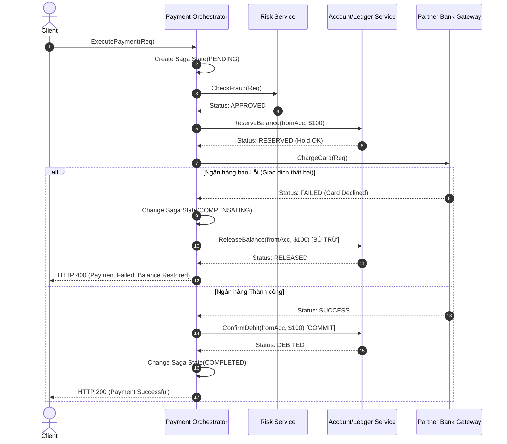

# Bài 02: Kiến Trúc Microservices Trong Banking & Fintech (Microservices Architecture)

> **Tóm tắt bài viết**: Phân tích việc ứng dụng kiến trúc Microservices trong môi trường Tài chính - Ngân hàng, cách phân chia ranh giới dịch vụ theo Domain-Driven Design (DDD), so sánh giao thức đồng bộ (gRPC) và bất đồng bộ (Kafka Events), cùng kiến trúc điều phối giao dịch phân tán **Saga Pattern**.

---

## 1. Từ Monolith Đến Microservices Trong Fintech

Trong giai đoạn đầu phát triển, kiến trúc **Monolithic** mang lại nhiều lợi thế: tốc độ ra mắt sản phẩm nhanh, triển khai đơn giản trên một codebase, và đặc biệt là khả năng thực thi giao dịch ACID hoàn hảo chỉ bằng một Database Local Transaction.

Tuy nhiên, khi quy mô người dùng tăng lên hàng triệu tài khoản và hàng nghìn giao dịch mỗi giây:

| Rủi Ro Khi Duy Trì Monolith | Tác Động Tiêu Cực Trong Hệ Thống Fintech |
| :--- | :--- |
| **Lan truyền sự cố (Uncontained Blast Radius)** | Một lỗi tràn bộ nhớ (OOM) ở module thống kê xuất báo cáo Excel có thể kéo sập toàn bộ tiến trình Java/Go, làm nghẽn luôn luồng thanh toán Core Banking. |
| **Chênh lệch tỷ lệ đọc/ghi (Asymmetric Scaling)** | Luồng xem số dư / quét QR Code có lưu lượng gấp 100 lần luồng Đối soát cuối ngày, nhưng Monolith bắt buộc phải scale toàn bộ khối ứng dụng cồng kềnh. |
| **Xung đột triển khai (Deployment Bottlenecks)** | Hàng chục kỹ sư cùng commit vào một monolithic repo, quy trình CI chạy mất hàng giờ và nguy cơ hồi quy (regression) cực cao. |

---

## 2. Phân Chia Ranh Giới Dịch Vụ (Domain-Driven Design & Bounded Contexts)

Theo phương pháp luận **Domain-Driven Design (DDD)** của Eric Evans, nền tảng `qPayFlow` được phân rã thành các **Bounded Contexts** độc lập, mỗi ngữ cảnh sở hữu một cơ sở dữ liệu riêng biệt (*Database-per-Service*):

| Service | Datastore | Trách Nhiệm Nghiệp Vụ Chính |
| :--- | :--- | :--- |
| **Identity Service** | PostgreSQL (Auth) | Quản lý User, KYC, định danh, OAuth2 / JWT |
| **Payment Service** | PostgreSQL + Kafka | Nhận lệnh thanh toán, Idempotency, Transactional Outbox |
| **Account Service** | PostgreSQL (Core) | Core Ledger, Double-Entry, phong tỏa và khấu trừ số dư |
| **Risk Engine** | Redis + Kafka | Velocity check, tính điểm gian lận thời gian thực |
| **Recon Service** | S3/MinIO + PostgreSQL | Batch matching file sao kê EOD cuối ngày từ ngân hàng |

> **Nguyên tắc vàng Database-per-Service**: Không một service nào được phép truy vấn trực tiếp (Direct SQL Query) vào database của service khác. Mọi trao đổi dữ liệu bắt buộc phải thông qua Public API Contract (gRPC hoặc Events).

---

## 3. Giao Tiếp Giữa Các Microservices (Inter-Service Communication)

Trong hệ thống thanh toán phân tán, chúng ta kết hợp đồng thời cả hai mô hình giao tiếp để đạt hiệu năng tối ưu:

| Tiêu Chí Kỹ Thuật | Giao Tiếp Đồng Bộ (gRPC / HTTP/2) | Giao Tiếp Bất Đồng Bộ (Kafka Event-Driven) |
| :--- | :--- | :--- |
| **Giao thức truyền tải** | **gRPC (Protobuf Binary over HTTP/2)** | **Apache Kafka (Distributed Commit Log)** |
| **Độ trễ trung bình** | Siêu thấp ($1 - 5\text{ms}$ nội bộ mạng VPC) | Phụ thuộc vào tốc độ tiêu thụ của Consumer ($10 - 100\text{ms}$) |
| **Mức độ phụ thuộc** | Tight Coupling (Caller bị block chờ Callee phản hồi) | Loose Coupling (Producer bắn event xong tiếp tục phục vụ) |
| **Khả năng chịu lỗi** | Dễ bị hiệu ứng Domino nếu Callee bị nghẽn | Buffer an toàn trên đĩa cứng; Consumer tự khôi phục sau crash |
| **Use Case trong qPayFlow** | Kiểm tra số dư tức thời, Verify Token, Lock tài khoản | Thông báo giao dịch, Audit logging, Cập nhật điểm thưởng |

---

## 4. Quản Lý Giao Dịch Phân Tán: Saga Pattern

Vì mỗi microservice sở hữu một database riêng biệt, chúng ta không thể sử dụng cơ chế Distributed Transaction truyền thống (**Two-Phase Commit - 2PC**). 

> **Tại sao 2PC bị loại bỏ trong kiến trúc Cloud-Native?**
> 2PC yêu cầu Transaction Coordinator phải khóa (Pessimistic Lock) các bản ghi trên tất cả các database tham gia trong suốt 2 giai đoạn (Prepare & Commit). Nếu một node mạng bị chậm hoặc rớt kết nối, toàn bộ tài nguyên trên các node khác bị khóa cứng, làm sập chỉ số Khả dụng (Availability) của hệ thống.

Giải pháp chuẩn công nghiệp là **Saga Pattern**: Phân rã một giao dịch lớn thành một chuỗi các **Local Transactions**. Mỗi local transaction cập nhật dữ liệu trong database của một service và phát ra event để kích hoạt bước tiếp theo. Nếu có một bước thất bại, Saga sẽ thực thi các **Giao dịch Bù trừ (Compensating Transactions)** theo chiều ngược lại.

### Hai trường phái triển khai Saga:

1. **Saga Choreography (Tự phối hợp qua Events)**:
   - Các service tự lắng nghe event của nhau qua Kafka và tự kích hoạt bước tiếp theo.
   - *Ưu điểm*: Đơn giản cho các luồng ngắn (2-3 bước), hoàn toàn phi tập trung.
   - *Nhược điểm*: Khi luồng nghiệp vụ lên tới 7-10 bước, mã nguồn bị rối rắm (Spaghetti Event Graph), rất khó theo dõi trạng thái tổng thể.
2. **Saga Orchestration (Điều phối tập trung)**:
   - Một service trung tâm tên là **Saga Orchestrator** đóng vai trò nhạc trưởng, lưu trữ State Machine và ra lệnh cho các service con qua gRPC hoặc Kafka Commands.
   - *Ưu điểm*: Kiểm soát trạng thái tập trung, dễ quản lý timeout và rollback phức tạp, dễ debug.

---

## 5. Phân Tích Thực Tế Luồng Saga Trong qPayFlow

---

## 6. Góc Chuyên Sâu: Phân Tích Kỹ Thuật & Tình Huống Thực Tế

### Case 1: Xử lý sự cố "Lỗi trong chính Giao dịch Bù trừ" (Compensating Transaction Failure)

**Bối cảnh sự cố:** Trong quy trình Saga thanh toán, bước gọi Ngân hàng bị lỗi, Orchestrator kích hoạt lệnh bù trừ `ReleaseBalance` gửi sang Account Service để nhả tiền đã hold. Nhưng lúc này Account Service bị crash hoặc Database của nó bị đầy ổ đĩa (Disk Full), khiến lệnh bù trừ thất bại liên tục!

**Giải pháp kỹ thuật 4 tầng bảo vệ:**
1. **Exponential Backoff & Idempotent Retries**: Orchestrator tiếp tục thử lại lệnh bù trừ với cơ chế Exponential Backoff kèm Jitter. Vì `ReleaseBalance` là API Idempotent, việc retry nhiều lần là tuyệt đối an toàn.
2. **Transactional Outbox / Persistent Queue**: Lệnh bù trừ được lưu vào bảng cơ sở dữ liệu `saga_compensations` của Orchestrator. Dù Orchestrator có bị restart, worker nền vẫn đọc lại và thực thi tiếp.
3. **Dead Letter Queue (DLQ) & Critical Alert**: Nếu retry quá $N$ lần (ví dụ: 10 lần) vẫn thất bại, event được đẩy vào `compensations-dlq` và kích hoạt ngay cảnh báo khẩn cấp cấp độ P1 tới PagerDuty của đội trực vận hành (On-call Engineer).
4. **End-Of-Day Reconciliation Catch-up**: Hệ thống Đối soát cuối ngày quét và phát hiện số tiền đang bị Hold quá thời hạn quy định (thường là 30 phút) và tự động thực hiện nhả tiền cưỡng chế bằng batch job.

---

### Case 2: Truyền vết phân tán (Distributed Context Propagation) với OpenTelemetry và W3C TraceContext

**Bối cảnh:** Một yêu cầu thanh toán bị chậm mất $2.5\text{s}$ ở percentile $p99$. Làm thế nào để xác định chính xác $2.5\text{s}$ đó bị nghẽn ở đâu trong chuỗi 6 microservices giao tiếp qua cả gRPC lẫn Kafka?

**Cơ chế triển khai:**
- **W3C TraceContext Standard**: Ngay tại API Gateway, một mã định danh duy nhất `TraceID` (128-bit hex) được sinh ra cùng `SpanID` (64-bit hex).
- **HTTP/gRPC Header Injection**: Gateway gắn header `traceparent: 00-4bf92f3577b34da6a3ce929d0e0e4736-00f067aa0ba902b7-01`.
- **Kafka Record Header Carrier**: Khi Payment Service bắn event ra Kafka, OpenTelemetry Go SDK tự động trích xuất context từ Go `context.Context` và inject `traceparent` vào `kafka.Message.Headers`.
- **Consumer Context Extraction**: Worker tiêu thụ message từ Kafka trích xuất header này ra và tái tạo lại `Span` cha.
- **Kết quả trên Jaeger UI**: Hiển thị một biểu đồ Gantt trực quan từ lúc Client gửi request, qua Gateway, gRPC sang Account Service, đẩy vào Kafka, cho tới khi Worker xử lý xong, chỉ rõ chính xác hàm nào hoặc câu lệnh SQL nào tốn bao nhiêu mili-giây.

---

### Case 3: Chiến lược lựa chọn Choreography vs Orchestration theo độ phức tạp của luồng nghiệp vụ

**Bối cảnh:** Khi nào nên dùng Choreography (các service tự giao tiếp qua event Kafka) và khi nào bắt buộc phải dùng Orchestration (service nhạc trưởng điều phối tập trung)?

**Quy tắc đưa ra quyết định kiến trúc (Architectural Decision Matrix):**

| Đặc Điểm Luồng Nghiệp Vụ | Choreography (Bắn event tự do) | Orchestration (Nhạc trưởng tập trung) | Lựa Chọn Đề Xuất |
| :--- | :--- | :--- | :--- |
| Số lượng bước giao dịch | Ngắn ($2 - 3$ bước) | Dài ($4 - 10+$ bước) | $\le 3$ bước: Choreography; $> 3$ bước: Orchestration |
| Khả năng xảy ra lỗi & bù trừ | Ít lỗi, chỉ đơn giản là ghi log | Xác suất lỗi cao (thẻ lỗi, hết tiền, timeout) | Có nhiều bước bù trừ $\rightarrow$ Bắt buộc dùng Orchestration |
| Yêu cầu hiển thị tiến trình | Không cần thiết (Background Task) | Cần hiển thị tiến trình cho User trên App | Cần Real-time UI Tracking $\rightarrow$ Orchestration |
| Ví dụ trong qPayFlow | Gửi Email thông báo khi đăng ký User mới | Quy trình Thanh toán & Mua hàng qua Thẻ | Auth: Choreography; Payment: Orchestration |

---

## 7. Tài Liệu Tham Khảo (Reputable References)

1. **Martin Fowler**: [Microservice Trade-Offs & Bounded Contexts](https://martinfowler.com/articles/microservice-trade-offs.html)
2. **Chris Richardson**: *Microservices Patterns: With examples in Java* — Chapter 4: Managing transactions with sagas.
3. **Uber Engineering**: [Domain-Oriented Microservice Architecture (DOMA)](https://www.uber.com/en-VN/blog/doma/)
4. **OpenTelemetry Documentation**: [W3C TraceContext Specification & Go SDK](https://opentelemetry.io/docs/concepts/signals/traces/)
5. **Temporal.io**: [Orchestration vs Choreography in Distributed Sagas](https://temporal.io/blog/workflow-engine-principles)
