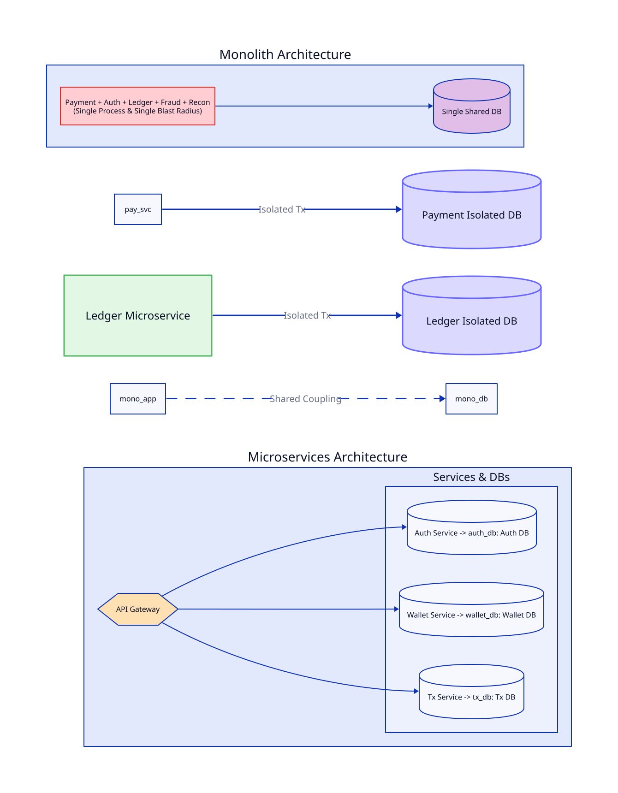
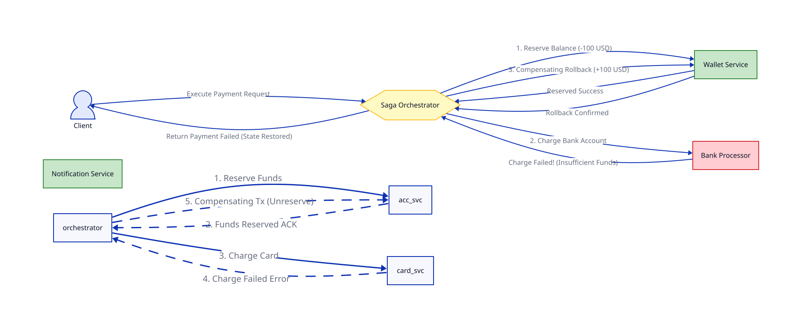

# Bài 02: Kiến Trúc Microservices Trong Banking & Fintech (Microservices Architecture)

> **Tóm tắt bài viết**: Phân tích việc áp dụng kiến trúc Microservices trong môi trường Tài chính - Ngân hàng, cách phân chia ranh giới dịch vụ (Bounded Contexts), giao tiếp giữa các dịch vụ (gRPC/REST vs Async Events), và mô hình quản lý giao dịch phân tán **Saga Pattern**.

---

## 1. Từ Monolith Đến Microservices Trong Fintech

Trong giai đoạn đầu, kiến trúc **Monolith** mang lại tốc độ phát triển nhanh và quản lý giao dịch ACID dễ dàng trên một cơ sở dữ liệu duy nhất. Tuy nhiên, khi hệ thống quy mô lớn:

- **Rủi ro lây lan sự cố (Blast Radius)**: Một bug nhỏ ở tính năng khuyến mãi/chăm sóc khách hàng có thể làm nghẽn CPU và nghẽn luôn luồng Chuyển tiền Core.
- **Khó Scale độc lập**: Luồng đọc số dư / quét QR Code có lưu lượng gấp 100 lần luồng Đối soát cuối ngày (Reconciliation), nhưng Monolith bắt buộc phải scale toàn bộ ứng dụng.

---

## 2. Phân Chia Ranh Giới Dịch Vụ (Domain-Driven Design & Bounded Contexts)

Theo **Domain-Driven Design (DDD)** của Eric Evans, hệ thống Microservices trong `qPayFlow` được chia thành các **Bounded Contexts** rõ ràng:

1. **Identity & Auth Service**: Quản lý tài khoản, định danh KYC, JWT Tokens, OAuth2.
2. **Wallet & Ledger Service**: Quản lý số dư, tài khoản kế toán, hạch toán Nợ/Có (Double-entry).
3. **Payment Processor Service**: Tích hợp với cổng ngân hàng đối tác, chuyển đổi định dạng message (ISO 8583, ISO 20022).
4. **Risk & Fraud Detection Service**: Đánh giá rủi ro giao dịch real-time.
5. **Reconciliation Service**: Chạy batch job đối soát file EOD từ ngân hàng.

---

## 3. Giao Tiếp Giữa Các Microservices (Inter-Service Communication)

| Tiêu chí | Đồng bộ (Synchronous) | Bất đồng bộ (Asynchronous) |
| :--- | :--- | :--- |
| **Giao thức** | **gRPC (HTTP/2 + Protobuf)** hoặc **REST (HTTP/1.1 + JSON)** | **Message Broker (Apache Kafka, RabbitMQ)** |
| **Độ trễ (Latency)** | Rất thấp (gRPC binary format) | Phụ thuộc vào Queue processing |
| **Tính Phụ thuộc** | High Coupling (Caller phải chờ Callee) | Loose Coupling (Event Producer không cần biết Consumer) |
| **Use Case** | Luồng cần phản hồi tức thì (Check Balance, Auth) | Luồng xử lý sau (Audit Log, Push Notification, Recon) |

> **Best Practice trong Fintech**: Dùng **gRPC** cho giao tiếp nội bộ giữa các microservices cần đáp ứng nhanh (Internal RPC) và **Kafka Events** cho luồng phát sinh sự kiện hệ thống.

---

## 4. Quản Lý Giao Dịch Phân Tán: Saga Pattern

Trong Microservices, mỗi service sở hữu một Database riêng biệt (*Database-per-service*). Do đó, **không thể dùng DB Local Transaction 2PC truyền thống** vì rủi ro khóa tài nguyên (Locking) làm sụp đổ Availability. Giải pháp tiêu chuẩn là **Saga Pattern**.

Saga là một chuỗi các giao dịch cục bộ (Local Transactions). Mỗi bước cập nhật DB của một service và phát ra Event để kích hoạt bước tiếp theo. Nếu một bước thất bại, Saga sẽ thực thi các **Giao dịch Bù trừ (Compensating Transactions)** để khôi phục trạng thái cũ.

### 4.1. Saga Orchestration (Có Trọng Tài Điều Phối)
Một service tên là **Saga Orchestrator** sẽ điều phối luồng chạy từng bước.

---

## 5. Observability & Distributed Tracing

Khi một request đi qua 5-10 microservices, việc debug lỗi bằng log đơn lẻ là bất khả thi.
Hệ thống cần áp dụng:

1. **Trace ID & Span ID (OpenTelemetry / Jaeger)**: Gán một `X-Trace-ID` duy nhất ngay từ API Gateway và truyền qua HTTP Header / gRPC Metadata tới tất cả các service con.
2. **Centralized Logging (ELK / Grafana Loki)**: Thu gom log toàn hệ thống theo `Trace ID`.
3. **Metrics (Prometheus & Grafana)**: Theo dõi RED metrics (Rate, Errors, Duration).

---

## 6. Tài Liệu Tham Khảo (Reputable References)

1. **Martin Fowler**: [Microservice Prerequisites & Trade-offs](https://martinfowler.com/articles/microservice-trade-offs.html)
2. **Microservices.io (Chris Richardson)**: [Pattern: Saga Architecture](https://microservices.io/patterns/data/saga.html)
3. **Uber Engineering**: [Domain-Oriented Microservice Architecture (DOMA)](https://www.uber.com/en-VN/blog/doma/)
4. **Netflix TechBlog**: [Building Microservices at Scale](https://netflixtechblog.com/)
5. **gRPC Official Guides**: [gRPC Motivation and Design Principles](https://grpc.io/blog/grpc-stacks/)

