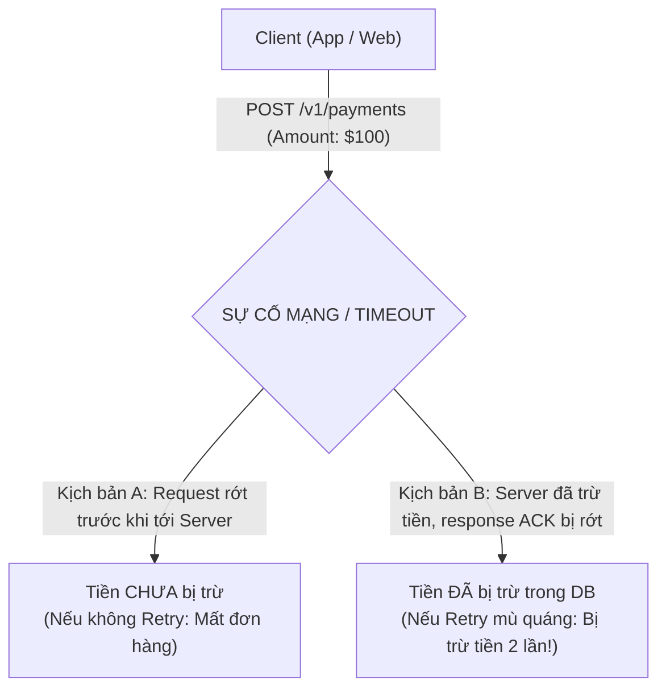
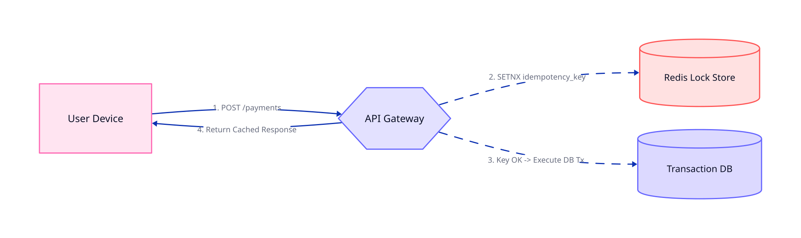
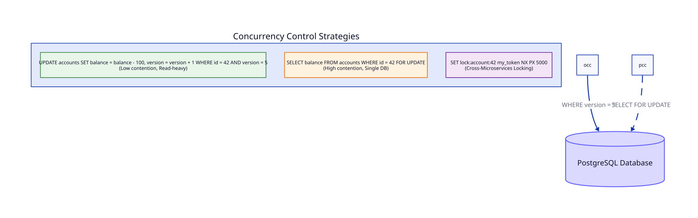
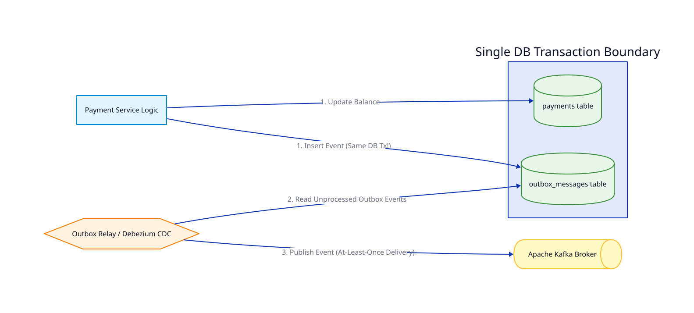
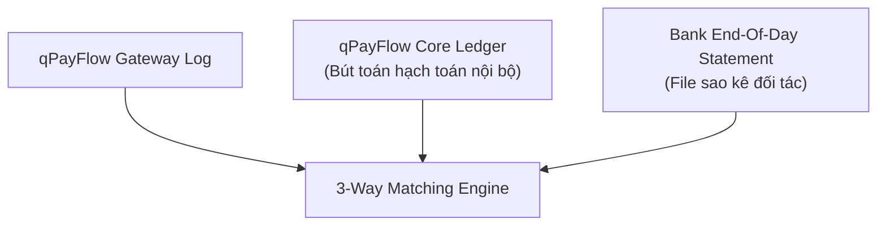

# Bài 03: Các Thách Thức Hệ Thống Phân Tán Trong Nền Tảng Thanh Toán

> **Tóm tắt bài viết**: Đi sâu vào 4 mẫu thiết kế sống còn (Mission-Critical Design Patterns) bắt buộc phải có để triệt tiêu các rủi ro mất tiền, double-spending, race condition và nghẽn mạng trong hệ thống thanh toán phân tán: **Idempotency Key Pattern**, **Distributed Concurrency Control**, **Transactional Outbox Pattern**, và **Reconciliation Engine**.

---

## 1. Bài Toán Tiến Thoái Lưỡng Nan Khi Gặp Network Timeout (The Timeout Dilemma)

Trong môi trường phân tán, khi Client gửi lệnh thanh toán 100 USD và gặp sự cố **HTTP 504 Gateway Timeout** hoặc **TCP Socket Timeout**, hệ thống rơi vào trạng thái bất định:





---

## 2. Pattern 1: Idempotency Key Pattern (Xử Lý Trùng Lặp Giao Dịch)

**Idempotency (Tính vô hiệu / Bất biến theo số lần gọi)**: Là thuộc tính mà một thao tác có thể thực thi $1$ lần hay $1,000$ lần thì trạng thái tài nguyên trên hệ thống và kết quả trả về cho Client đều đồng nhất.

### 2.1. Thiết kế bảng `idempotency_keys` chuẩn công nghiệp:

```sql
CREATE TABLE idempotency_keys (
    key VARCHAR(255) PRIMARY KEY,
    user_id VARCHAR(64) NOT NULL,
    request_hash VARCHAR(64) NOT NULL,    -- SHA-256(Body + Params)
    status VARCHAR(20) NOT NULL,          -- 'PROCESSING', 'SUCCESS', 'FAILED'
    response_code INT,
    response_body JSONB,
    resource_id VARCHAR(64),              -- ID của Payment được tạo
    created_at TIMESTAMP WITH TIME ZONE DEFAULT CURRENT_TIMESTAMP,
    locked_until TIMESTAMP WITH TIME ZONE NOT NULL
);

CREATE INDEX idx_idempotency_user ON idempotency_keys(user_id, created_at);
```

### 2.2. Luồng xử lý chi tiết tại API Gateway:
1. **Kiểm tra khóa**: Tìm kiếm `key` trong database/cache.
2. **Trường hợp 1 (Key chưa tồn tại)**:
   - Tạo bản ghi với trạng thái `status = 'PROCESSING'` và khóa `locked_until = NOW() + INTERVAL '30 seconds'`.
   - Tiến hành luồng thanh toán nghiệp vụ.
   - Khi hoàn thành, cập nhật `status = 'SUCCESS'`, lưu lại `response_code` và `response_body` (Snapshot payload).
3. **Trường hợp 2 (Key đang tồn tại với `status = 'PROCESSING'`)**:
   - Nếu `locked_until > NOW()`: Trả về mã lỗi `409 Conflict` (Giao dịch đang được xử lý đồng thời).
   - Nếu `locked_until < NOW()`: Request trước đã bị treo/crash, cho phép lấy quyền xử lý (Re-acquire Lock).
4. **Trường hợp 3 (Key đã tồn tại với `status = 'SUCCESS'` hoặc `'FAILED'`)**:
   - Kiểm tra `request_hash` gửi lên có khớp với hash đã lưu hay không (Chống tấn công thay đổi tham số giao dịch với cùng 1 Key).
   - Trả về ngay lập tức `response_body` đã lưu mà không chạy lại bất kỳ logic trừ tiền nào.

### Code Go thực tế trong `payment-service` (`cmd/payment-service/internal/payment/service.go`):

```go
func (s *paymentService) CreatePayment(ctx context.Context, req *CreatePaymentRequest) (*Payment, error) {
	if req.IdempotencyKey == "" {
		return nil, errors.New("idempotency key is mandatory for financial write APIs")
	}

	// 1. Kiểm tra Idempotency Key trong DB
	existingPayment, err := s.repo.GetPaymentByIdempotencyKey(ctx, req.IdempotencyKey)
	if err != nil {
		return nil, fmt.Errorf("failed to verify idempotency: %w", err)
	}

	if existingPayment != nil {
		// Ngăn chặn request trùng lặp đang chạy
		if existingPayment.Status == StatusPending {
			return nil, errors.New("payment request is currently being processed")
		}

		// Kiểm tra tính toàn vẹn tham số (Payload Tampering Check)
		if existingPayment.SourceAccountID != req.SourceAccountID ||
			existingPayment.TargetAccountID != req.TargetAccountID ||
			existingPayment.Amount != req.Amount ||
			existingPayment.Currency != req.Currency {
			return nil, errors.New("idempotency key reuse with mismatched parameters")
		}

		// Trả về bản ghi thanh toán đã được xử lý trước đó
		return existingPayment, nil
	}

	// 2. Tiếp tục luồng xử lý Payment mới...
	return s.processNewPayment(ctx, req)
}
```

---

## 3. Pattern 2: Kiểm Soát Đồng Thời & Chống Double-Spending (Concurrency Control)

Khi hai yêu cầu thanh toán diễn ra **đồng thời (Concurrent)** trên cùng một tài khoản có số dư 100 USD (ví dụ: Khách hàng vừa quét mã QR tại quầy 80 USD, vừa bị trừ tiền tự động phí Netflix 50 USD):



### So sánh 3 phương pháp khóa tài nguyên:

| Tiêu Chí | Optimistic Locking (Khóa Lạc Quan) | Pessimistic Locking (Khóa Bi Quan) | Distributed Lock (Redis Redlock) |
| :--- | :--- | :--- | :--- |
| **Cơ chế** | Sử dụng cột `version` hoặc `updated_at` trong SQL | Dùng `SELECT ... FOR UPDATE` khóa trực tiếp dòng trong DB | Dùng Redis `SET key val NX PX 5000` |
| **Throughput** | Rất cao khi ít tranh chấp (Low Contention) | Ổn định, ép tuần tự hóa (Serialization) | Cực cao trên tầng RAM, giảm tải cho DB |
| **Hành vi khi xung đột** | Một bên thành công, bên kia bị lỗi version $\rightarrow$ Cần Retry | Giao dịch đến sau phải chờ giao dịch trước giải phóng khóa | Request đến sau bị từ chối hoặc chờ lock |
| **Use Case trong qPayFlow** | Cập nhật thông tin Profile, Hạn mức tháng | **Core Ledger Transfer, Trừ số dư ví** | Giữ chỗ vé máy bay, Chặn spam click trên Gateway |

### Code SQL Pessimistic Locking chống Deadlock trong `account-service`:

```sql
-- Khóa dòng dữ liệu tài khoản để ngăn mọi giao dịch khác đọc/sửa số dư
SELECT id, balance, currency, version 
FROM accounts 
WHERE id = $1 
FOR UPDATE;
```

---

## 4. Pattern 3: Transactional Outbox Pattern

Một trong những lỗi nghiêm trọng nhất trong lập trình hệ thống phân tán là thực hiện hành vi **Dual-Write (Vừa cập nhật DB vừa bắn Message sang Kafka)** một cách ngây thơ:

```go
// ❌ ĐOẠN MÃ NGUY HIỂM: RỦI RO MẤT ĐỒNG BỘ DỮ LIỆU NGHIÊM TRỌNG
func (s *paymentService) DangerousProcess(ctx context.Context, p *Payment) error {
    tx, _ := s.db.BeginTx(ctx, nil)
    s.repo.UpdateBalance(ctx, tx, p)
    tx.Commit() // (1) Database đã Commit thành công tiền của khách hàng!

    // (2) Bắn event sang Kafka
    // ⚠️ NẾU MẠNG BỊ RỚT HOẶC PROCESS BỊ CRASH / OOM TẠI ĐÂY:
    // Event biến mất hoàn toàn! Kafka không nhận được tin nhắn!
    // Các hệ thống Notification, Merchant Webhook, và Data Analytics vĩnh viễn không biết đơn hàng đã thanh toán!
    return s.kafkaProducer.Send("payment-events", p)
}
```

### Kiến trúc Transactional Outbox:



**Giải pháp**: Mọi Event cần gửi ra ngoài được `INSERT` trực tiếp vào bảng `outbox_events` trong **CÙNG MỘT Local DB Transaction** với lệnh ghi thanh toán. Nhờ tính chất ACID của Database, hoặc cả hai cùng thành công, hoặc cả hai cùng rollback.

```go
// ✅ ĐOẠN MÃ ĐẠT CHUẨN: TRANSACTIONAL OUTBOX PATTERN TRONG QPAYFLOW
tx, err := s.repo.BeginTx(ctx)
if err != nil {
    return nil, fmt.Errorf("failed to begin transaction: %w", err)
}
defer tx.Rollback()

// 1. Tạo bản ghi Payment
if err := s.repo.CreatePayment(ctx, tx, payment); err != nil {
    return nil, err
}

// 2. Tạo bản ghi Outbox Event trong cùng DB Transaction
outboxEvent := &OutboxEvent{
    ID:            "evt_" + generateUUID(),
    EventType:     "PaymentCreated",
    AggregateType: "Payment",
    AggregateID:   payment.ID,
    Payload:       jsonPayload,
    Status:        "PENDING",
    CreatedAt:     time.Now().UTC(),
}
if err := s.repo.CreateOutboxEvent(ctx, tx, outboxEvent); err != nil {
    return nil, err
}

// 3. Commit: Cả Payment và Outbox Event được đảm bảo lưu trữ nguyên tử 100%
if err := tx.Commit(); err != nil {
    return nil, err
}
```

Một tiến trình nền (**Debezium CDC** hoặc **Outbox Poller**) sẽ đọc các bản ghi từ bảng `outbox_events` để publish sang Apache Kafka với đảm bảo **At-Least-Once Delivery**.

---

## 5. Pattern 4: Đối Soát 3 Chiều (3-Way Reconciliation)

Dù code có hoàn hảo đến đâu, sự cố mạng giữa qPayFlow và các ngân hàng đối tác vẫn có thể tạo ra sai lệch dữ liệu. **Reconciliation (Đối soát)** là chốt chặn an toàn cuối cùng của mọi hệ thống Fintech:



1. **Thu thập file EOD**: Mỗi đêm lúc 01:00 AM, hệ thống tự động tải file sao kê (CSV/MT940) qua SFTP từ ngân hàng đối tác.
2. **Khớp lệnh tự động (Automated Matching)**: So sánh 3 tập dữ liệu dựa trên `BankReferenceID`, `Amount`, và `Timestamp`.
3. **Phát hiện & Xử lý sai lệch (Discrepancy Resolution)**:
   - *Giao dịch thành công ở Bank nhưng thiếu ở qPayFlow*: Kích hoạt bù tiền cho khách hàng.
   - *Giao dịch ghi thành công ở qPayFlow nhưng không có ở Bank*: Gửi thông báo cho bộ phận Kế toán vận hành (Operations) để xử lý hoàn tiền hoặc khiếu nại.

---

## 6. Góc Chuyên Sâu: Phân Tích Kỹ Thuật & Tình Huống Thực Tế

### Case 1: Xử lý Race Condition khi Client nhấn nút Thanh toán 5 lần trong vòng 10ms

**Bối cảnh:** Người dùng thao tác trên điện thoại mạng yếu, sốt ruột bấm liên tiếp 5 lần vào nút *"Xác nhận Thanh toán"*. 5 HTTP Requests cùng bay tới API Gateway gần như cùng một mili-giây với cùng một `Idempotency-Key`.

**Cơ chế bảo vệ đa tầng trong qPayFlow:**
1. **Tầng 1 - Database Unique Constraint**: Bảng `payments` hoặc `idempotency_keys` có ràng buộc `UNIQUE(idempotency_key)`.
2. **Tầng 2 - Database Transaction Race**:
   - Request 1 nhanh hơn 1 nanosecond, thực thi `INSERT INTO idempotency_keys ...` thành công và chiếm giữ quyền xử lý.
   - Các Requests 2, 3, 4, 5 thực thi lệnh `INSERT` sẽ lập tức bị Database chặn lại và trả về lỗi vi phạm ràng buộc khóa chính: `ERROR: duplicate key value violates unique constraint "idempotency_keys_pkey" (SQLSTATE 23505)`.
3. **Tầng 3 - Application Error Handling**: Service bắt lỗi `SQLSTATE 23505`, không coi đây là lỗi hệ thống 500, mà chuyển thành HTTP `409 Conflict` kèm thông báo: *"Giao dịch đang được xử lý, vui lòng không gửi lại"*. Kết quả: Chỉ có duy nhất 1 giao dịch được thực thi, tiền khách hàng an toàn 100%.

---

### Case 2: Phân tích sự cố Distributed Lock bị mất an toàn do Garbage Collection (GC) Pause

**Bối cảnh:** Sử dụng Redis Lock (`SET lock:account:42 my_token NX PX 5000` với TTL 5 giây) để bảo vệ tài khoản 42.

**Kịch bản xảy ra lỗi dữ liệu (Split-Brain / Overlapping Execution):**
1. Node A lấy được lock của tài khoản 42 (TTL 5 giây).
2. Node A bắt đầu chạy logic nhưng bất ngờ gặp hiện tượng **Full GC Pause (Stop-The-World)** kéo dài 6 giây (hoặc CPU bị nghẽn 100%).
3. Trong khi Node A bị "đóng băng", TTL 5 giây trên Redis hết hạn. Redis tự động xóa khóa của Node A.
4. Node B gửi yêu cầu lấy lock tài khoản 42 $\rightarrow$ Thành công! Node B bắt đầu ghi dữ liệu vào DB.
5. Node A hết bị đóng băng, tỉnh dậy và tiếp tục thực hiện ghi DB vì nó vẫn nghĩ mình đang nắm giữ lock!
6. **Hậu quả**: Cả Node A và Node B cùng ghi đè dữ liệu số dư của tài khoản 42 $\rightarrow$ Mất tính nhất quán!

**Giải pháp khắc phục:**
- **Fencing Token (Token lũy tiến)**: Mỗi khi cấp lock, Redis/Zookeeper cấp kèm một số nguyên tăng dần `fencing_token` (ví dụ: Node A nhận token 31, Node B nhận token 32).
- Khi ghi vào Database, câu lệnh SQL bắt buộc kiểm tra:
  ```sql
  UPDATE accounts 
  SET balance = balance - 100, last_fencing_token = 32
  WHERE id = 42 AND last_fencing_token < 32;
  ```
- Khi Node A tỉnh dậy và gửi token 31, Database sẽ từ chối cập nhật vì token 31 nhỏ hơn token 32 hiện tại.

---

### Case 3: So sánh hiệu năng Optimistic Locking vs Pessimistic Locking trong kịch bản Flash Sale

**Bối cảnh:** Trong sự kiện Flash Sale bán 100 chiếc iPhone giá sốc, 50,000 người dùng cùng nhấn mua đồng thời trong 1 giây vào cùng một bản ghi kho hàng / tài khoản tổng.

**So sánh thực tế:**
- **Nếu dùng Optimistic Locking (`version = version + 1`)**:
  - 1 người dùng may mắn cập nhật thành công version từ $1 \rightarrow 2$.
  - 49,999 người dùng còn lại bị lỗi `version mismatch` và phải Rollback $\rightarrow$ Hệ thống tốn 99.9% CPU để xử lý thất bại và retry vô vọng.
- **Nếu dùng Pessimistic Locking (`SELECT FOR UPDATE`)**:
  - Các giao dịch xếp hàng chờ nhau trong hàng đợi của Postgres. Mặc dù an toàn nhưng làm cạn kiệt Connection Pool và khiến Latency tăng vọt lên hàng chục giây.
- **Giải pháp tối ưu của qPayFlow**:
  - Đưa tồn kho/hạn mức lên **Redis Memory Counter** với lệnh nguyên tử `DECRBY inventory:iphone15 1`.
  - Nếu kết quả $\ge 0 \rightarrow$ Cho phép đi tiếp vào DB để ghi nhận đơn hàng bất đồng bộ qua Kafka.
  - Nếu kết quả $< 0 \rightarrow$ Trả về ngay lập tức *"Hết hàng"* trong $1\text{ms}$ mà không cần chạm vào Database Postgres!

---

## 7. Tài Liệu Tham Khảo (Reputable References)

1. **Stripe Engineering**: [How We Build Idempotent APIs for Payment Processing](https://stripe.com/blog/idempotency)
2. **Martin Kleppmann**: *Designing Data-Intensive Applications* — Chapter 8: The Trouble with Distributed Locks.
3. **Uber Engineering**: [Reliable Processing of Financial Transactions at Scale](https://www.uber.com/en-VN/blog/payment-processing/)
4. **Chris Richardson**: [Transactional Outbox Pattern](https://microservices.io/patterns/data/transactional-outbox.html)
5. **Brandur Leach (Stripe Core Engineer)**: [Implementing Stripe-like Idempotency Keys in Postgres](https://brandur.org/idempotency-keys)
