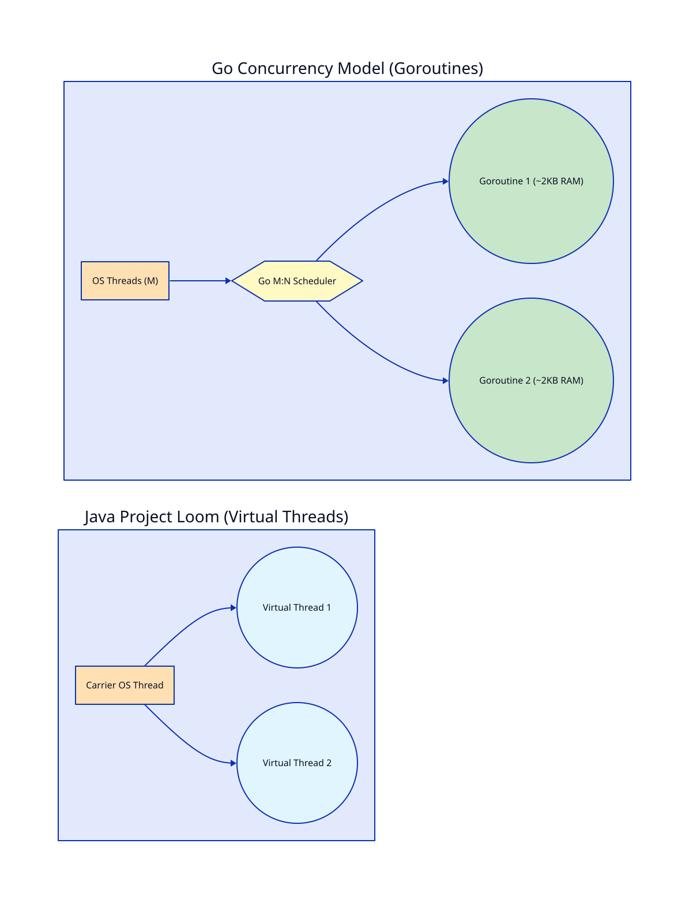

# Bài 04: Lựa Chọn Ngôn Ngữ & Framework Trong Hệ Thống Thanh Toán (Go vs Java/Spring Boot)

> **Tóm tắt bài viết**: So sánh kiến trúc kỹ thuật, mô hình Concurrency giữa **Go (Golang)** và **Java (Spring Boot 3 / Virtual Threads)** trong bài toán xây dựng Payment Gateway & Core Ledger, cùng các mẫu thiết kế chịu lỗi (Resilience Patterns) như Circuit Breaker, Rate Limiting và Backoff Jitter.

---

## 1. Bài Toán Chọn Tech Stack Trong Fintech

Khi thiết kế một hệ thống thanh toán như `qPayFlow`, lựa chọn ngôn ngữ lập trình và framework quyết định trực tiếp tới:
- **Throughput & Latency**: Khả năng phản hồi giao dịch dưới 50ms ở percentile $p99$.
- **Resource Footprint**: Chi phí bộ nhớ RAM và CPU trên K8s cluster.
- **Developer Velocity & Maintainability**: Tốc độ phát triển tính năng và độ an toàn của Type System.

---

## 2. Go (Golang) vs Java / Spring Boot 3



### So sánh chi tiết:

| Tiêu chí | Go (Golang 1.22+) | Java 17+ / Spring Boot 3 |
| :--- | :--- | :--- |
| **Mô hình Concurrency** | **Goroutines (M:N Scheduler)**. Mỗi Goroutine bắt đầu chỉ tốn ~2KB RAM stack. | **Virtual Threads (Project Loom)** hoặc OS Threads truyền thống (1MB stack). |
| **Garbage Collection (GC)** | Low-latency GC (Pause time $< 1\text{ms}$). Tránh hiện tượng Stop-The-World lớn. | ZGC / Shenandoah GC cho phép mảng RAM lớn, nhưng cần tuning JVM khắt khe. |
| **Startup Time & Footprint** | Biển dịch ra Binary nhỏ ($< 30\text{MB}$), Khởi động $< 100\text{ms}$, RAM $< 50\text{MB}$. | JIT Compilation, Warm-up time lâu hơn, RAM khởi điểm từ $300\text{MB} - 1\text{GB}$. |
| **Ecosystem & Banking Compliance** | Tuyệt vời cho Cloud Native, Microservices, API Gateway, Worker. | Thống trị trong Enterprise Core Banking, Complex Ledger, Hibernate/JPA ecosystem. |

### Lựa chọn chiến lược trong qPayFlow:
- **Go (Golang)**: Làm ngôn ngữ chủ đạo cho **API Gateway**, **Payment Executor Service**, và **High-Throughput Workers** nhờ Latency siêu thấp và tài nguyên tối ưu.
- **Java / Spring Boot**: Phù hợp triển khai **Core Ledger Service** và **Batch Settlement Jobs** nơi cần đến sự chặt chẽ của Enterprise Framework và thư viện kế toán ngân hàng truyền thống.

---

## 3. Kiến Trúc Sạch (Clean Architecture / Layered Architecture)

Dù chọn Go hay Java, mã nguồn microservice tài chính phải được tổ chức theo **Clean Architecture** để tách biệt logic nghiệp vụ khỏi hạ tầng (Database, Kafka, HTTP Framework).

```
internal/
├── domain/            # 1. Core Domain Entities & Rules (Zero Dependencies)
│   ├── account.go
│   └── transaction.go
├── usecase/           # 2. Application Business Logic (Interfaces)
│   ├── payment_uc.go
│   └── ledger_uc.go
├── repository/        # 3. DB Persistence Adapters (SQL / Redis)
│   └── postgres_repo.go
└── delivery/          # 4. Transport Adapters (HTTP Gin/Fiber, gRPC, Kafka Consumer)
    ├── http_handler.go
    └── grpc_handler.go
```

> **Nguyên tắc Dependency Inversion**: Tầng `domain` và `usecase` **không bao giờ phụ thuộc** vào framework (Gin/Spring) hay cơ sở dữ liệu (Postgres/Kafka). Mọi tương tác hạ tầng đều thông qua Interface.

---

## 4. Các Mẫu Thiết Kế Chịu Lỗi (Resilience Patterns)

Trong môi trường phân tán, các hệ thống bên ngoài (Ngân hàng đối tác, Card Networks) có thể bị chậm hoặc ngắt kết nối. Microservice cần bảo vệ chính mình bằng 3 mẫu thiết kế:


### 4.1. Circuit Breaker (Cầu Dao An Toàn)
Khi gọi dịch vụ Ngân hàng bị lỗi quá ngưỡng (ví dụ: 50% request thất bại trong 10 giây), **Circuit Breaker mở ra (Open State)** và ngắt kết nối ngay lập tức (*Fast Fail*), tránh việc làm kiệt huệ Connection Pool hay treo Thread của hệ thống nhà.

### 4.2. Retries với Exponential Backoff & Jitter
Khi gọi request thất bại do nghẽn mạng tạm thời (*Transient Error*), **không bao giờ retry liên tục ngay lập tức** (gây hiện tượng Thundering Herd Problem đánh sập server đối tác).

Công thức tính thời gian chờ Retry:
$$t_{\text{wait}} = \min(t_{\text{max}}, \; t_{\text{base}} \times 2^{\text{attempt}}) + \text{Jitter}$$

```go
// Pseudocode Go: Exponential Backoff với Random Jitter
func ExecuteWithRetry(ctx context.Context, fn func() error) error {
    base := 100 * time.Millisecond
    maxDelay := 3 * time.Second
    
    for attempt := 0; attempt < 3; attempt++ {
        err := fn()
        if err == nil {
            return nil
        }
        
        // Calculate exponential delay
        delay := base * time.Duration(1<<attempt)
        if delay > maxDelay {
            delay = maxDelay
        }
        // Add Random Jitter (±20%)
        jitter := time.Duration(rand.Int64n(int64(delay / 5)))
        
        select {
        case <-time.After(delay + jitter):
        case <-ctx.Done():
            return ctx.Err()
        }
    }
    return errors.New("max retries exceeded")
}
```

### 4.3. Rate Limiting (Giới Hạn Tải)
Sử dụng thuật toán **Token Bucket** hoặc **Leaky Bucket** để bảo vệ API khỏi bị quá tải (Overwhelmed) bởi DDoSs hoặc khách hàng gửi request quá mức cho phép.

---

## 5. Tài Liệu Tham Khảo (Reputable References)

1. **Go Memory Model & Architecture**: [Go Official Documentation Specs](https://go.dev/doc/asm)
2. **Uber Engineering**: [Uber Go Style Guide & Best Practices](https://github.com/uber-go/guide/blob/master/style.md)
3. **Netflix Engineering**: [Spring Boot Microservices and Resilience at Scale](https://netflixtechblog.com/)
4. **AppMaster / InfoQ**: [Go vs Java Performance in High-Throughput Microservices](https://infoq.com)
5. **Resilience4j / Go-resilience**: [Circuit Breaking and Retry Design Patterns](https://resilience4j.readme.io/)

