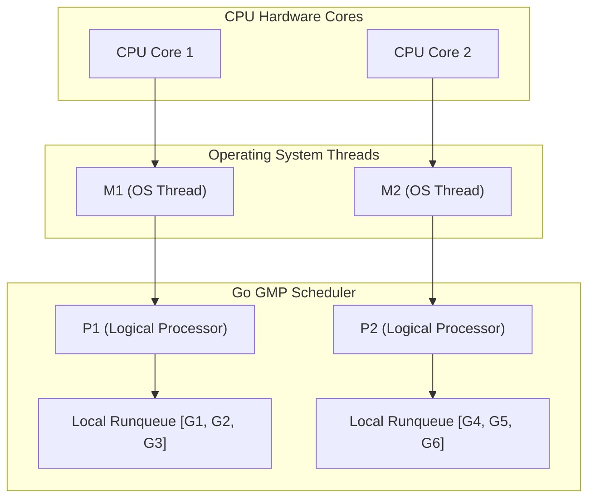

# Bài 04: Lựa Chọn Ngôn Ngữ & Framework Trong Hệ Thống Thanh Toán (Go vs Java/Spring Boot)

> **Tóm tắt bài viết**: So sánh kiến trúc kỹ thuật và mô hình đồng thời (Concurrency Model) giữa **Go (Golang 1.22+)** và **Java (Spring Boot 3 / Virtual Threads)** trong bài toán xây dựng Payment Gateway và Core Ledger, tổ chức mã nguồn theo **Clean Architecture**, và các mẫu thiết kế tăng cường khả năng chịu lỗi (Resilience Patterns).

---

## 1. Bài Toán Chọn Tech Stack Trong Fintech

Khi xây dựng một nền tảng thanh toán tài chính như `qPayFlow`, việc lựa chọn ngôn ngữ lập trình và framework không đơn thuần là sở thích cá nhân, mà quyết định trực tiếp tới 4 chỉ số kinh doanh sống còn:

1. **Throughput & Latency**: Khả năng xử lý hàng chục nghìn TPS với độ trễ $p99 < 50\text{ms}$.
2. **Resource Footprint & Cloud Cost**: Chi phí RAM và CPU khi vận hành hàng trăm microservice trên cụm Kubernetes.
3. **Cold Start & Elastic Scaling**: Thời gian một Pod mới khởi động để kịp thời gánh tải khi lưu lượng tăng vọt đột ngột.
4. **Developer Velocity & Type Safety**: Tính chặt chẽ của hệ thống kiểu dữ liệu tĩnh để loại trừ tối đa lỗi runtime trong logic tính tiền.

---

## 2. Go (Golang) vs Java / Spring Boot 3


### Bảng so sánh kỹ thuật chuyên sâu:

| Tiêu Chí Đánh Giá | Go (Golang 1.22+) | Java 17+ / Spring Boot 3 |
| :--- | :--- | :--- |
| **Mô hình Concurrency** | **Goroutines (M:N GMP Scheduler)**. Mỗi Goroutine khởi tạo chỉ tốn $\sim 2\text{KB}$ stack RAM, co giãn động. | **Virtual Threads (Project Loom)** hoặc OS Threads ($\sim 1\text{MB}$ stack cố định). |
| **Cơ chế Garbage Collection (GC)** | Triết lý Low-Latency GC. Thời gian dừng thế giới (Stop-The-World pause) $< 1\text{ms}$. | GC đa dạng (G1GC, ZGC, Shenandoah). Cần tinh chỉnh (tuning) JVM flags phức tạp cho heap lớn. |
| **Startup Time & Footprint** | Biên dịch ra **Native Binary** ($\sim 15 - 30\text{MB}$). Khởi động $< 50\text{ms}$. RAM baseline $< 30\text{MB}$. | Biên dịch ra Bytecode (JIT). Khởi động $3 - 15\text{s}$. RAM baseline $300\text{MB} - 1\text{GB}$. |
| **Xử lý I/O-Bound Tasks** | Tự động non-blocking I/O ở tầng runtime bằng `netpoller` (epoll/kqueue). | Cần WebFlux (Reactive) hoặc Virtual Threads để tránh nghẽn thread pool. |
| **Hệ sinh thái & Thư viện** | Đơn giản, thư viện chuẩn mạnh mẽ (`net/http`, `database/sql`), ít magic. | Cực kỳ phong phú cho Enterprise Core Banking, Batch ETL, Hibernate/JPA. |

### Chiến lược phân bổ công nghệ trong qPayFlow:
- **Go (Golang)**: Làm ngôn ngữ chủ đạo cho **API Gateway**, **Payment Executor Service**, **High-Throughput Event Workers**, và **Kafka Consumers** nhờ tốc độ phản hồi cực nhanh, tốn rất ít RAM và khởi động tức thì trên Kubernetes.
- **Java 17 / Spring Boot 3**: Thích hợp cho các phân hệ **Core Ledger Kế toán Doanh nghiệp** và **Batch Reconciliation Service** nơi cần đến các thư viện kế toán ngân hàng truyền thống và quy tắc nghiệp vụ phức tạp.

---

## 3. Kiến Trúc Sạch (Clean Architecture) Trong Go

Để đảm bảo mã nguồn không bị phụ thuộc vào bất kỳ framework bên ngoài nào (như Gin, Fiber, GORM) và có thể dễ dàng viết Unit Test với 100% Mocking:

```
internal/
├── domain/            # 1. Thực thể nghiệp vụ cốt lõi & Domain Errors (KHÔNG IMPORT BẤT KỲ GÓI NGOÀI NÀO)
│   ├── account.go
│   └── payment.go
├── usecase/           # 2. Quy tắc nghiệp vụ ứng dụng (Business Logic & Interfaces)
│   ├── payment_usecase.go
│   └── ledger_usecase.go
├── repository/        # 3. Hiện thực hóa lưu trữ dữ liệu (PostgreSQL, Redis Adapter)
│   ├── postgres_account.go
│   └── redis_idempotency.go
└── delivery/          # 4. Tầng giao tiếp ngoại vi (HTTP Gin/Chi, gRPC Server, Kafka Consumer)
    ├── http/
    └── grpc/
```

> **Nguyên tắc Dependency Inversion (DIP)**: Tầng `usecase` định nghĩa các `interface` (như `AccountRepository`), tầng `repository` hiện thực hóa interface đó. Tầng lõi nghiệp vụ **không bao giờ phụ thuộc** vào tầng bên ngoài.

---

## 4. Các Mẫu Thiết Kế Chịu Lỗi (Resilience Patterns)

Khi một microservice gọi sang một dịch vụ ngân hàng đối tác hoặc một service nội bộ khác qua mạng, nó phải tự bảo vệ mình bằng 3 mẫu thiết kế:


### 4.1. Circuit Breaker (Cầu Dao Bảo Vệ)
Theo dõi tỷ lệ lỗi của dịch vụ đối tác. Nếu trong 10 giây có $> 50\%$ request thất bại:
- Cầu dao chuyển từ **CLOSED** sang **OPEN**.
- Mọi request tiếp theo sẽ bị từ chối ngay lập tức (**Fast Fail**) trong $0.1\text{ms}$ mà không cần gửi ra mạng, tránh làm nghẽn thread và cạn kiệt connection pool.
- Sau một khoảng thời gian nghỉ (Cooling-down), cầu dao chuyển sang **HALF-OPEN** để thử nghiệm cho một vài request đi qua.

### 4.2. Retries với Exponential Backoff & Jitter
Khi gặp lỗi mạng tạm thời (*Transient Network Error*), không bao giờ được phép retry liên tục ngay tức khắc. Chúng ta phải tăng dần thời gian chờ theo hàm mũ và thêm một khoảng nhiễu ngẫu nhiên (**Jitter**) để chống hiện tượng Thundering Herd.

$$t_{\text{wait}} = \min\left(t_{\text{max}}, \; t_{\text{base}} \times 2^{\text{attempt}}\right) \pm \text{Random Jitter}$$

```go
// Đoạn mã Go triển khai Retry với Exponential Backoff + Full Jitter
func ExecuteWithRetry(ctx context.Context, maxRetries int, fn func() error) error {
	baseDelay := 100 * time.Millisecond
	maxDelay := 3 * time.Second

	for attempt := 0; attempt < maxRetries; attempt++ {
		err := fn()
		if err == nil {
			return nil
		}

		// Tính thời gian chờ hàm mũ
		delay := baseDelay * time.Duration(1<<attempt)
		if delay > maxDelay {
			delay = maxDelay
		}

		// Thêm Full Jitter ngẫu nhiên từ 0 đến delay
		jitter := time.Duration(rand.Int63n(int64(delay)))

		select {
		case <-time.After(jitter):
		case <-ctx.Done():
			return ctx.Err()
		}
	}
	return errors.New("operation failed: maximum retries exceeded")
}
```

---

## 5. Góc Chuyên Sâu: Phân Tích Kỹ Thuật & Tình Huống Thực Tế

### Case 1: Bản chất mô hình GMP Scheduler của Go và lý do Go thống trị trong IO-Bound Microservices

**Bối cảnh:** Nhiều kỹ sư thắc mắc tại sao Go có thể phục vụ 100,000 kết nối HTTP/gRPC đồng thời mà chỉ tốn vài trăm MB RAM, trong khi mô hình Thread truyền thống của Java/C++ sẽ làm sập máy chủ.

**Cơ chế hoạt động của Go Runtime (GMP Model):**
- **G (Goroutine)**: Đại diện cho một tác vụ thực thi, chỉ chiếm $\sim 2\text{KB}$ bộ nhớ ban đầu (so với $1\text{MB}$ của OS Thread).
- **M (Machine)**: Đại diện cho một OS Thread thực tế của hệ điều hành.
- **P (Processor)**: Đại diện cho tài nguyên lập lịch (số lượng thường bằng số Core CPU vật lý `runtime.GOMAXPROCS`).



**Xử lý Non-blocking I/O với `netpoller`:**
- Khi Goroutine $G_1$ thực hiện lệnh đọc dữ liệu từ Postgres qua Network Socket, Go Runtime không hề block OS Thread $M_1$.
- Thay vào đó, Go tách $G_1$ ra và đưa vào **Network Poller (dựa trên epoll của Linux)**.
- OS Thread $M_1$ lập tức lấy Goroutine $G_2$ từ hàng đợi của $P_1$ để thực thi tiếp mà không bị tốn chi phí Context Switch ở mức nhân OS.
- Khi Postgres trả về dữ liệu, `netpoller` đánh thức $G_1$ và đưa nó trở lại hàng đợi của một $P$ bất kỳ đang rảnh rỗi. Mô hình này giúp tận dụng 100% sức mạnh của CPU.

---

### Case 2: Hiểm họa "Thundering Herd Problem" khi Retry không có Jitter

**Bối cảnh sự cố:** Dịch vụ cổng ngân hàng đối tác bị mất kết nối trong 30 giây và vừa phục hồi lại lúc 10:00:00. Có 5,000 request thanh toán của qPayFlow đang chờ retry.

**Phân tích kịch bản sập nguồn:**
- **Nếu dùng Exponential Backoff thuần túy (Không có Jitter)**:
  - Cả 5,000 request đều áp dụng công thức cố định $t_{\text{wait}} = 100\text{ms} \times 2^3 = 800\text{ms}$.
  - Đúng lúc 10:00:00.800, cả 5,000 request **đồng loạt bắn vào ngân hàng trong cùng một mili-giây**!
  - Cổng ngân hàng vừa mới hồi phục lập tức bị nghẽn mạng và sập tiếp lần 2 (**Thundering Herd Storm**).
- **Khi bổ sung Full Jitter**:
  - Thời gian chờ của 5,000 request được rải đều ngẫu nhiên từ $0\text{ms}$ đến $800\text{ms}$.
  - Lượng request được phân tán mượt mà theo thời gian, giúp hệ thống đối tác hấp thụ tải êm ả và hồi phục hoàn toàn.

---

### Case 3: Đảm bảo Zero-Infrastructure Leaks trong Domain Layer của Clean Architecture

**Bối cảnh:** Lập trình viên thường tiện tay gắn các tag JSON, GORM tag (`gorm:"primaryKey"`), hoặc truyền `*sql.DB` trực tiếp vào struct Domain.

**Hậu quả & Quy tắc khắc phục:**
- Khi sửa đổi cơ sở dữ liệu từ Postgres sang CockroachDB hoặc thay đổi thư viện web từ Gin sang Fiber, lập trình viên buộc phải sửa đổi cả struct nghiệp vụ cốt lõi, vi phạm nghiêm trọng **Nguyên lý Đóng/Mở (Open/Closed Principle)**.
- **Quy tắc trong qPayFlow**:
  1. File `internal/domain/payment.go` là thuần túy Go chuẩn, không import bất kỳ package bên ngoài nào (kể cả thư viện bên thứ ba).
  2. Việc chuyển đổi từ HTTP Request Payload sang Domain Model được thực hiện tại tầng `delivery`.
  3. Việc chuyển đổi từ Domain Model sang Database Columns được thực hiện tại tầng `repository`. Tầng `domain` hoàn toàn bất biến trước mọi biến động công nghệ hạ tầng.

---

## 6. Tài Liệu Tham Khảo (Reputable References)

1. **Go Language Specification**: [Go Memory Model & Runtime Scheduler](https://go.dev/ref/mem)
2. **Uber Engineering**: [Uber Go Style Guide & Best Practices](https://github.com/uber-go/guide/blob/master/style.md)
3. **Netflix TechBlog**: [Fault Tolerance in a High-Volume Distributed Architecture](https://netflixtechblog.com/)
4. **AWS Architecture**: [Exponential Backoff And Jitter (Marc Brooker)](https://aws.amazon.com/blogs/architecture/exponential-backoff-and-jitter/)
5. **Robert C. Martin (Uncle Bob)**: *Clean Architecture: A Craftsman's Guide to Software Structure and Design*.
