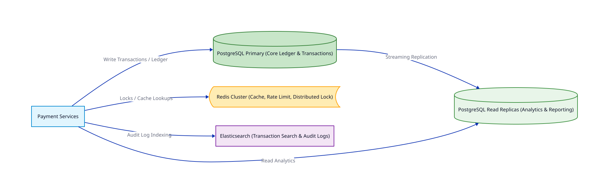
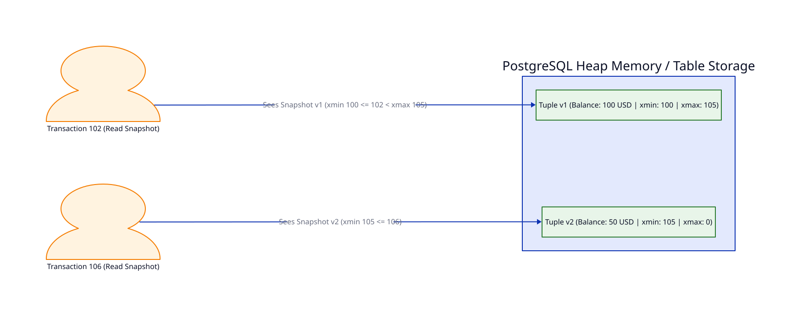

# Bài 05: Cơ Sở Dữ Liệu Trong Hệ Thống Thanh Toán (Databases in Payment Systems)

> **Tóm tắt bài viết**: Phân tích việc lựa chọn cơ sở dữ liệu cho hệ thống thanh toán (PostgreSQL RDBMS vs Distributed SQL CockroachDB/Spanner vs Redis), chi tiết về Transaction Isolation Levels, cơ chế MVCC và bài toán phòng chống Write Skew trong kế toán số dư.

---

## 1. Yêu Cầu Của Datastore Trong Thanh Toán

Không có một cơ sở dữ liệu đơn lẻ nào đáp ứng tốt mọi yêu cầu trong nền tảng Fintech. Hệ thống thường kết hợp các loại datastore theo mô hình **Polyglot Persistence**:

### Tiêu chí lựa chọn:
1. **Core Ledger (Sổ cái)**: Bắt buộc hỗ trợ **ACID Compliant** tuyệt đối (PostgreSQL, CockroachDB).
2. **Session / Rate Limit / Lock**: Cần độ trễ cực thấp sub-millisecond (Redis Cluster).
3. **Tra cứu & Tìm kiếm**: Index linh hoạt theo nhiều tiêu chí (Elasticsearch, TimescaleDB).

---

## 2. Transaction Isolation Levels & Các Hiện Tượng Bất Thường (Anomalies)

Chuẩn ANSI SQL định nghĩa **4 cấp độ cô lập giao dịch (Isolation Levels)** nhằm giải quyết các hiện tượng bất thường khi nhiều transaction chạy đồng thời:

| Isolation Level | Dirty Read | Non-Repeatable Read | Phantom Read | Serialization Anomaly / Write Skew |
| :--- | :---: | :---: | :---: | :---: |
| **Read Uncommitted** | ❌ Có | ❌ Có | ❌ Có | ❌ Có |
| **Read Committed** (Default Postgres) | ✅ Không | ❌ Có | ❌ Có | ❌ Có |
| **Repeatable Read** | ✅ Không | ✅ Không | ✅ Không (trong Postgres) | ❌ Có (Write Skew) |
| **Serializable** | ✅ Không | ✅ Không | ✅ Không | ✅ Không |

### Chi tiết các lỗi dữ liệu nguy hiểm trong Fintech:

1. **Non-Repeatable Read**: Transaction A đọc số dư 100$. Transaction B trừ 50$ và Commit. Transaction A đọc lại cùng dòng đó và thấy số dư đã thành 50$!
2. **Write Skew (Hiện tượng Bất thường do Ghi)**:
   - *Ngữ cảnh*: Quy định hệ thống yêu cầu tổng số dư của 2 tài khoản $A + B \ge 0$. Hiện tại $A = 50$, $B = 50$ (Tổng = 100$).
   - Transaction 1 rút 80$ từ A (kiểm tra thấy $A + B = 100 \ge 80 \rightarrow$ Hợp lệ).
   - Đồng thời Transaction 2 rút 80$ từ B (kiểm tra thấy $A + B = 100 \ge 80 \rightarrow$ Hợp lệ).
   - Cả 2 Transaction cùng Commit! Kết quả $A = -30$, $B = -30$, tổng $= -60 \rightarrow$ **Hệ thống bị âm tiền!**

> **Khuyên dùng**: Đối với các giao dịch chuyển tiền Nợ/Có trong Core Ledger, bắt buộc dùng **Serializable Isolation Level** hoặc áp dụng **Explicit Locking (`SELECT FOR UPDATE`)**.

---

## 3. Cơ Chế MVCC (Multi-Version Concurrency Control) Trong PostgreSQL

PostgreSQL sử dụng **MVCC** để đạt hiệu năng cao: *"Loại bỏ việc Lock khi Đọc (Readers do not block Writers, Writers do not block Readers)"*.

- Khi một dòng được Cập nhật (UPDATE), PostgreSQL không ghi đè trực tiếp mà tạo một **bản sao mới (Tuple Version)** của dòng đó.
- Cột ẩn `xmin` (ID transaction tạo bản ghi) và `xmax` (ID transaction xóa/thay thế bản ghi) giúp mỗi Transaction nhìn thấy một "snapshot" dữ liệu phù hợp với thời điểm nó bắt đầu.

---

## 4. Scalability: Sharding, Partitioning & Distributed SQL

Khi dữ liệu bảng `transactions` đạt hàng trăm triệu dòng:

1. **Table Partitioning (Phân vùng Bảng)**: Chia bảng theo Thời gian (Range Partitioning theo tháng `created_at`). Giúp câu truy vấn tìm kiếm giao dịch tháng hiện tại không phải scan qua dữ liệu các năm trước.
2. **Database Sharding**: Chia dữ liệu theo `user_id % N` sang nhiều Node PostgreSQL vật lý khác nhau.
3. **Distributed SQL (CockroachDB / Google Cloud Spanner)**:
   - Sử dụng kiến trúc Raft Consensus trên tầng lưu trữ KV để tự động Sharding và Replication.
   - Cung cấp khả năng **ACID trên nhiều Node (Distributed ACID Transactions)** mà không cần quản lý Sharding thủ công ở tầng ứng dụng.

---

## 5. Tài Liệu Tham Khảo (Reputable References)

1. **PostgreSQL Documentation**: [Concurrency Control & Transaction Isolation](https://www.postgresql.org/docs/current/mvcc.html)
2. **Stripe Engineering**: [Scaling PostgreSQL at Stripe](https://stripe.com/blog/operating-financial-systems-on-eventual-consistency)
3. **Google Cloud Spanner Paper**: [Spanner: Google’s Globally-Distributed Database](https://research.google/pubs/pub39966/)
4. **CockroachDB Docs**: [Serializable Architecture and Write Skew Prevention](https://www.cockroachlabs.com/docs/stable/demo-serializable.html)
5. **Designing Data-Intensive Applications**: Chapter 7 (Transactions & Isolation Levels).

