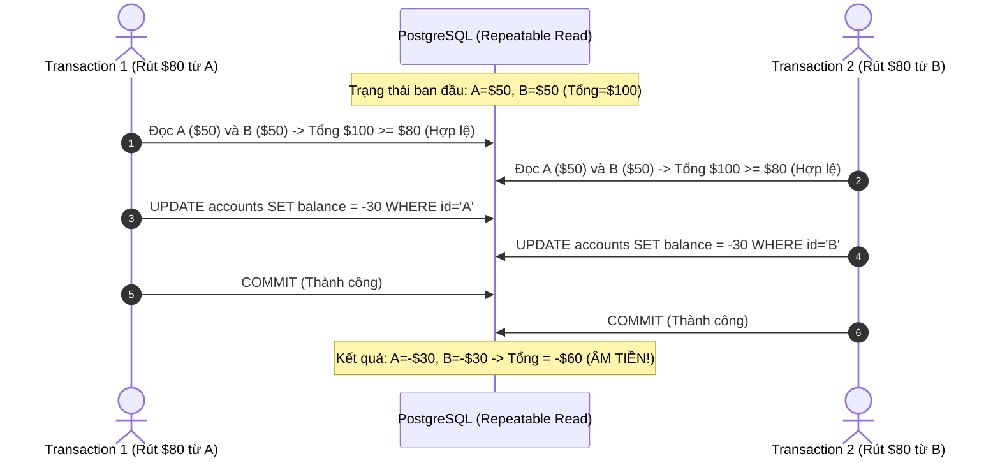

# Bài 05: Cơ Sở Dữ Liệu Trong Hệ Thống Thanh Toán (Databases in Payment Systems)

> **Tóm tắt bài viết**: Phân tích toàn diện chiến lược lưu trữ dữ liệu đa mô hình (**Polyglot Persistence**), giải phẫu các cấp độ cô lập giao dịch ANSI SQL (**Transaction Isolation Levels**), cơ chế **MVCC** trong PostgreSQL, hiện tượng **Write Skew**, và các kỹ thuật mở rộng quy mô dữ liệu tài chính (Partitioning, Sharding & Distributed SQL).

---

## 1. Yêu Cầu Của Datastore Trong Thanh Toán & Polyglot Persistence

Trong một nền tảng Fintech, không có một công nghệ cơ sở dữ liệu đơn lẻ nào có thể giải quyết hoàn hảo mọi bài toán. Thay vào đó, hệ thống áp dụng mô hình **Polyglot Persistence** (sử dụng đúng loại database cho đúng mục đích nghiệp vụ):


| Hệ Thống Lưu Trữ | Công Nghệ Áp Dụng | Tiêu Chí Thiết Kế Sống Còn |
| :--- | :--- | :--- |
| **Core Ledger (Sổ cái)** | PostgreSQL / CockroachDB | Tuân thủ tuyệt đối chuẩn ACID (Serializable / Explicit Row Locking) |
| **Session, Locks & Rate Limit** | Redis Cluster | In-Memory, Sub-millisecond RTT, hỗ trợ lệnh nguyên tử qua Lua |
| **Tra cứu & Báo cáo lịch sử** | Elasticsearch / ClickHouse | Full-text search, Filter đa chiều, Aggregate hàng triệu giao dịch |

---

## 2. Transaction Isolation Levels & Các Hiện Tượng Bất Thường (Anomalies)

Chuẩn ANSI/ISO SQL định nghĩa **4 cấp độ cô lập giao dịch** nhằm kiểm soát sự đánh đổi giữa **Tính nhất quán dữ liệu (Data Consistency)** và **Hiệu năng thực thi đồng thời (Concurrency)**:

| Isolation Level | Dirty Read | Non-Repeatable Read | Phantom Read | Serialization Anomaly / Write Skew |
| :--- | :---: | :---: | :---: | :---: |
| **Read Uncommitted** | ❌ Bị lỗi | ❌ Bị lỗi | ❌ Bị lỗi | ❌ Bị lỗi |
| **Read Committed** (Mặc định Postgres) | ✅ An toàn | ❌ Bị lỗi | ❌ Bị lỗi | ❌ Bị lỗi |
| **Repeatable Read** | ✅ An toàn | ✅ An toàn | ✅ An toàn (trong Postgres) | ❌ Bị lỗi (Write Skew) |
| **Serializable** | ✅ An toàn | ✅ An toàn | ✅ An toàn | ✅ An toàn |

### Phân tích các hiện tượng bất thường đe dọa trực tiếp tài khoản ngân hàng:

| Hiện Tượng Bất Thường | Cơ Chế Phát Sinh Lỗi | Tác Động Trong Fintech |
| :--- | :--- | :--- |
| **Dirty Read** | Transaction A đọc số dư $100 mà Transaction B vừa ghi tạm (nhưng sau đó B Rollback). A lấy giá trị ảo này để tiếp tục xử lý. | Khách hàng chi tiêu dựa trên tiền ảo không tồn tại |
| **Non-Repeatable Read** | Transaction A đọc số dư thấy $100. Transaction B trừ $50 và Commit. A đọc lại cùng dòng đó và thấy số dư tụt xuống $50. | Lệch logic tính toán hạn mức khi chạy report |
| **Phantom Read** | Transaction A đếm số giao dịch hôm nay (ra 10). B chèn thêm 1 giao dịch mới và Commit. A đếm lại thấy 11 bản ghi. | Sai lệch thống kê và phân trang giao dịch |
| **Write Skew** | Hai giao dịch đồng thời đọc cùng một trạng thái hợp lệ, nhưng mỗi bên ghi vào các dòng khác nhau dẫn đến vi phạm ràng buộc tổng thể. | Số dư tài khoản thấu chi bị âm tiền |

---

## 3. Cơ Chế MVCC (Multi-Version Concurrency Control) Trong PostgreSQL

PostgreSQL đạt được throughput cao nhờ triết lý: *"Người đọc không bao giờ chặn người ghi, và người ghi không bao giờ chặn người đọc (Readers never block Writers, Writers never block Readers)"*.


### Cách thức lưu trữ Tuple trong Postgres:
Mỗi dòng (row) trong bảng chứa hai trường siêu dữ liệu ẩn:
- `xmin`: Transaction ID (XID) của giao dịch tạo ra (INSERT) bản ghi này.
- `xmax`: Transaction ID của giao dịch xóa hoặc cập nhật (DELETE / UPDATE) bản ghi này.

Khi thực hiện lệnh `UPDATE accounts SET balance = 50 WHERE id = 42`:
1. Postgres **không ghi đè** lên bản ghi cũ.
2. Nó đánh dấu `xmax = current_xid` vào bản ghi cũ (trở thành Dead Tuple).
3. Nó tạo ra một **bản ghi mới (New Tuple Version)** với `xmin = current_xid` và `xmax = 0`.
4. Một transaction đang chạy ở cấp độ `Repeatable Read` chỉ nhìn thấy các tuple có `xmin <= its_snapshot_xid` và chưa bị xóa trước thời điểm nó bắt đầu.

> **Tác dụng phụ của MVCC**: Việc `UPDATE` liên tục tạo ra hàng loạt Dead Tuples làm phình to dung lượng ổ đĩa (**Table Bloat**). Tiến trình nền **Auto-VACUUM** định kỳ quét dọn và thu hồi không gian trống này.

---

## 4. Mở Rộng Quy Mô Dữ Liệu: Partitioning, Sharding & Distributed SQL

Khi bảng `transactions` và `ledger_entries` đạt đến quy mô hàng trăm triệu bản ghi:

### 4.1. Table Partitioning (Phân Vùng Bảng PostgreSQL)
Chia bảng vật lý thành các bảng con (Partitions) dựa trên phạm vi thời gian (Range Partitioning):

```sql
-- Tạo bảng cha
CREATE TABLE ledger_entries (
    id VARCHAR(64) NOT NULL,
    account_id VARCHAR(64) NOT NULL,
    amount NUMERIC(18, 4) NOT NULL,
    type VARCHAR(10) NOT NULL,
    created_at TIMESTAMP WITH TIME ZONE NOT NULL,
    PRIMARY KEY (id, created_at)
) PARTITION BY RANGE (created_at);

-- Tạo các bảng con theo từng tháng
CREATE TABLE ledger_entries_2026_08 PARTITION OF ledger_entries
    FOR VALUES FROM ('2026-08-01 00:00:00+00') TO ('2026-09-01 00:00:00+00');
```

> **Lợi ích**: Khi chạy câu truy vấn tìm giao dịch tháng 8/2026, Postgres sử dụng kỹ thuật **Partition Pruning** để chỉ quét duy nhất bảng con `ledger_entries_2026_08`, bỏ qua 99% dữ liệu lịch sử các năm trước.

### 4.2. Distributed SQL (CockroachDB / Google Spanner)
Khi một máy chủ PostgreSQL đơn lẻ đạt giới hạn phần cứng (hết dung lượng ổ đĩa SSD hoặc nghẽn Write IOPS):
- **Distributed SQL** phân chia dữ liệu thành các dải (Ranges) và tự động nhân bản (Replication) giữa các node qua giao thức đồng thuận **Raft**.
- Đảm bảo **Distributed ACID Transactions** ở cấp độ **Serializable Isolation** mà không cần lập trình viên phải tự viết code Sharding phức tạp ở tầng ứng dụng.

---

## 5. Góc Chuyên Sâu: Phân Tích Kỹ Thuật & Tình Huống Thực Tế

### Case 1: Hiện tượng Write Skew làm âm tài khoản thấu chi và cách khắc phục

**Bối cảnh:** Ngân hàng cấp hạn mức tín dụng thấu chi liên kết giữa Tài khoản Tiết Kiệm ($A$) và Tài khoản Thanh Toán ($B$). Quy định: *"Tổng số dư $(A + B)$ phải luôn $\ge 0$ USD"*. Hiện tại: $A = 50$ USD, $B = 50$ USD (Tổng khả dụng $= 100$ USD).

**Diễn biến lỗi Write Skew ở Isolation Level `Repeatable Read`:**



**Hậu quả:** Vì Transaction 1 chỉ ghi vào dòng $A$, Transaction 2 chỉ ghi vào dòng $B$, nên ở mức `Repeatable Read` (Snapshot Isolation), cả 2 không hề xung đột khóa dòng của nhau! Kết quả: $A = -30$, $B = -30 \rightarrow$ **Tổng tài khoản bị âm $-60$ USD, hệ thống mất tiền!**

**3 giải pháp xử lý triệt để:**
1. **Dùng `SELECT ... FOR UPDATE`**: Ép khóa cả 2 dòng $A$ và $B$ ngay từ khi bắt đầu kiểm tra điều kiện.
2. **Nâng lên Serializable Isolation Level**: PostgreSQL sử dụng cơ chế SSI (Serializable Snapshot Isolation) để theo dõi các dependency đọc-ghi (rw-antidependency). Khi phát hiện chu kỳ xung đột, Postgres sẽ lập tức hủy Transaction 2 và trả về mã lỗi `ERROR: could not serialize access due to read/write dependencies among transactions (SQLSTATE 40001)`.
3. **Mô hình Khóa phiên bản Lạc quan (Optimistic Lock trên bản ghi cha)**: Cùng cập nhật một cột `version` trên bản ghi chủ sở hữu (Account Holder Record).

---

### Case 2: Hiện tượng Table Bloat và suy giảm hiệu năng do cập nhật số dư liên tục trong PostgreSQL

**Bối cảnh:** Trong các đợt cao điểm với hàng trăm nghìn giao dịch mỗi giờ, bảng `accounts` liên tục bị `UPDATE balance`. Chỉ sau 2 ngày, bảng chỉ có 1 triệu tài khoản nhưng dung lượng phình to từ $200\text{MB}$ lên tận $15\text{GB}$, khiến tốc độ query bị tụt dốc thê thảm.

**Nguyên nhân & Cơ chế khắc phục:**
- **Nguyên nhân**: Do cơ chế MVCC, mỗi lệnh `UPDATE` sinh ra một Dead Tuple. Nếu các truy vấn dài (Long-running Analytical Queries) đang chạy, Auto-VACUUM không thể xóa các Dead Tuple này.
- **Giải pháp tối ưu hóa:**
  1. **Chuyển sang mô hình Append-Only Ledger**: Không update trực tiếp vào bảng `accounts`. Thay vào đó, chỉ `INSERT` các dòng mới vào bảng `ledger_entries` (hoàn toàn không sinh ra Dead Tuple).
  2. **HOT (Heap-Only Tuples) Optimization**: Đảm bảo cột được cập nhật không nằm trong Index và cấu hình bảng với `fillfactor = 85` để dành chỗ trống cho các tuple mới nằm chung Data Page với tuple cũ, tránh phải cập nhật B-Tree Index.
  3. **Tinh chỉnh Auto-VACUUM**:
     ```sql
     ALTER TABLE accounts SET (
         autovacuum_vacuum_scale_factor = 0.05,
         autovacuum_vacuum_cost_limit = 1000
     );
     ```

---

### Case 3: Chiến lược Sharding cho hệ thống thanh toán: Phân chia theo `user_id` hay `account_id`?

**Bối cảnh:** Cơ sở dữ liệu đạt ngưỡng phải Sharding sang 16 cluster vật lý độc lập. Chúng ta nên chọn Shard Key nào?

**Phân tích kỹ thuật:**
- **Nếu Sharding theo `user_id`**:
  - *Ưu điểm*: Toàn bộ tài khoản, thẻ, và lịch sử của một người dùng nằm trên cùng 1 Shard. Các truy vấn xem số dư, xem profile thực hiện siêu nhanh trong nội bộ một database node.
  - *Nhược điểm*: Khi User A (ở Shard 1) chuyển tiền cho User B (ở Shard 2), thao tác này trở thành **Cross-Shard Distributed Transaction**, đòi hỏi Saga hoặc 2PC rất phức tạp.
- **Kiến trúc đề xuất cho qPayFlow**:
  - Dùng **Hash Sharding theo `account_id`** cho Core Ledger để phân bổ đều tải I/O.
  - Các giao dịch chuyển tiền giữa 2 tài khoản khác Shard được xử lý bằng **Saga Orchestrator** phối hợp với Transactional Outbox và Kafka.

---

## 6. Tài Liệu Tham Khảo (Reputable References)

1. **PostgreSQL Documentation**: [Concurrency Control & Transaction Isolation](https://www.postgresql.org/docs/current/mvcc.html)
2. **Martin Kleppmann**: *Designing Data-Intensive Applications* — Chapter 7: Transactions & Weak Isolation Levels.
3. **CockroachDB Engineering**: [How We Built Distributed Serializable Transactions](https://www.cockroachlabs.com/blog/how-we-built-a-distributed-database-on-top-of-raft-part-1/)
4. **Stripe Engineering**: [Scaling PostgreSQL at Stripe](https://stripe.com/blog/operating-financial-systems-on-eventual-consistency)
5. **Dan Ports & Kevin Grittner**: [Serializable Snapshot Isolation in PostgreSQL (VLDB Paper)](https://www.vldb.org/pvldb/vol5/p1850_danrkports_vldb2012.pdf)
