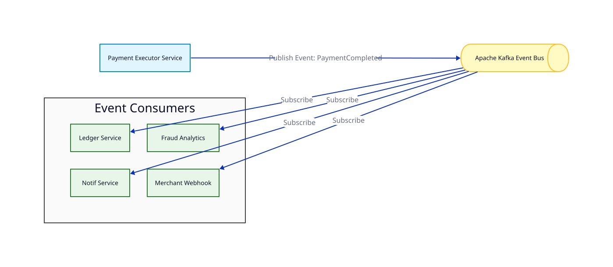
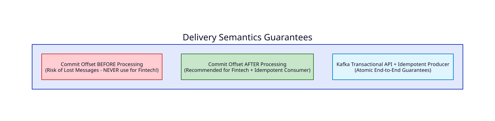
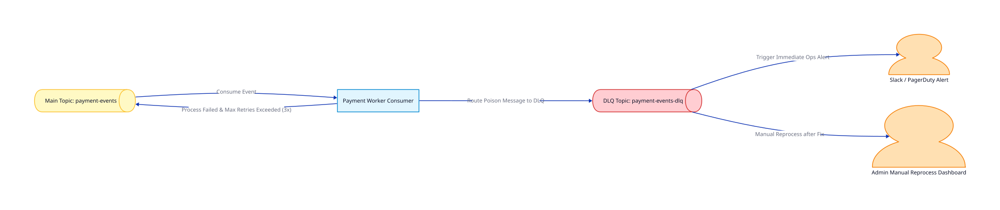

# Bài 06: Event-Driven Architecture & Message Brokers (Apache Kafka & RabbitMQ)

> **Tóm tắt bài viết**: Phân tích kiến trúc hướng sự kiện (**Event-Driven Architecture**) trong hệ thống thanh toán, so sánh chuyên sâu giữa **Apache Kafka** và **RabbitMQ**, các đảm bảo ngữ nghĩa giao vận thông điệp (**Delivery Semantics**), kỹ thuật phân vùng đảm bảo thứ tự (**Partition Ordering**), và cơ chế xử lý lỗi nâng cao với **Dead Letter Queue (DLQ)**.

---

## 1. Vai Trò Của Event-Driven Architecture Trong Thanh Toán

Trong kiến trúc đồng bộ truyền thống, khi một giao dịch thanh toán hoàn tất, service phải thực hiện một chuỗi các lệnh gọi mạng (Synchronous RPC/HTTP calls): gửi SMS thông báo, tích điểm thưởng, cập nhật số liệu báo cáo, và gửi Webhook cho Merchant. Nếu chỉ một trong các dịch vụ này bị chậm hoặc sập, toàn bộ luồng thanh toán cốt lõi sẽ bị nghẽn và phản hồi lỗi cho khách hàng.

Chuyển đổi sang **Event-Driven Architecture (EDA)**:



| Lợi Ích Của Event-Driven Architecture | Tác Động Thực Tế Trong Nền Tảng Thanh Toán |
| :--- | :--- |
| **Triệt tiêu phụ thuộc thời gian (Temporal Decoupling)** | Payment Service chỉ cần ghi Event `PaymentCompleted` vào Message Broker và trả về HTTP 200 cho khách hàng trong $10\text{ms}$. |
| **Đệm tải & Chống nghẽn hạ tầng (Traffic Spikiness Buffering)** | Khi có Flash Sale với 50,000 tx/s, Message Broker đóng vai trò như hồ chứa an toàn. Các worker downstream tiêu thụ dữ liệu từ từ theo năng lực tối đa. |
| **Mở rộng người tiêu thụ mới (Seamless Extensibility)** | Khi thêm tính năng Phân tích Gian lận Real-time (Fraud AI), chỉ cần tạo Consumer mới đọc cùng Topic mà không cần sửa code Payment Service hiện hữu. |

---

## 2. So Sánh Kỹ Thuật: Apache Kafka vs RabbitMQ

| Tiêu Chí Kỹ Thuật | Apache Kafka | RabbitMQ |
| :--- | :--- | :--- |
| **Mô hình kiến trúc** | **Distributed Commit Log** (Ghi tuần tự Append-Only vào đĩa cứng, lưu trữ lâu dài). | **Smart Broker / Dumb Consumer** (Lưu trên RAM/Disk; xóa ngay khi Consumer ACK). |
| **Mô hình tiêu thụ** | **Pull-based** (Consumer tự quản lý và kéo dữ liệu theo Offset của nó). | **Push-based** (Broker chủ động đẩy message tới các Consumer đang kết nối). |
| **Đảm bảo thứ tự** | Đảm bảo thứ tự tuyệt đối **trên cùng một Partition**. | Đảm bảo thứ tự trên từng hàng đợi đơn lẻ (Queue), mất thứ tự khi có nhiều Consumer. |
| **Throughput & Scale** | **Cực cao** (Hàng triệu msgs/giây nhờ Zero-Copy `sendfile` và I/O tuần tự). | **Trung bình - Cao** (Hàng chục nghìn msgs/giây). |
| **Khả năng Replay dữ liệu** | **Có** (Có thể reset Offset để đọc lại dữ liệu lịch sử từ nhiều tuần trước). | **Không** (Message đã ACK sẽ biến mất vĩnh viễn khỏi hàng đợi). |
| **Use Case trong qPayFlow** | **Event Sourcing, Audit Trail, CDC Streams, Payment Lifecycle Events.** | Task Queues ngắn hạn, Routing bản tin linh hoạt (Topic Exchanges). |

---

## 3. Ngữ Nghĩa Giao Vận Thông Điệp (Delivery Semantics)

Trong hệ thống thanh toán tài chính, việc mất thông điệp hoặc xử lý trùng thông điệp đều có thể gây ra thất thoát tiền bạc nghiêm trọng:



### 3.1. At-Most-Once (Tối đa một lần)
- Consumer commit offset **ngay khi vừa nhận message**, trước khi thực thi logic nghiệp vụ.
- Nếu Consumer bị crash giữa chừng $\rightarrow$ Thông điệp biến mất vĩnh viễn. 
- ❌ **Tuyệt đối cấm sử dụng trong xử lý tài chính!**

### 3.2. At-Least-Once (Ít nhất một lần)
- Consumer xử lý xong toàn bộ logic nghiệp vụ, ghi dữ liệu xuống database thành công rồi mới gửi lệnh **Commit Offset** về cho Kafka Broker.
- Nếu Consumer crash trước khi kịp commit offset $\rightarrow$ Khi sống lại, nó sẽ nhận và xử lý lại message đó một lần nữa.
- > **Tiêu chuẩn vàng trong Fintech**: Kết hợp **At-Least-Once Delivery** với **Idempotent Consumer** (xem lại Bài 03) tại phía nhận để đảm bảo xử lý nhiều lần vẫn cho ra kết quả duy nhất.

### 3.3. Exactly-Once Semantics (EOS / Chính xác một lần)
- Đạt được thông qua **Kafka Transactional API** (`InitTransactions`, `SendOffsetsToTransaction`). Đảm bảo việc đọc từ Topic A, xử lý logic, và ghi vào Topic B diễn ra như một Transaction nguyên tử duy nhất.

---

## 4. Phân Vùng Dữ Liệu & Đảm Bảo Thứ Tự (Message Partitioning)

Kafka chỉ đảm bảo thứ tự bản tin **trên cùng một Partition**. Nếu hai sự kiện của cùng một tài khoản nằm ở hai Partition khác nhau, chúng sẽ được xử lý bởi hai Consumer luồng khác nhau và có thể bị đảo lộn thứ tự thời gian.

```go
// Đoạn mã Go Producer chuẩn mực trong qPayFlow
message := &kafka.Message{
    Topic: "account-events",
    // 🔑 BẮT BUỘC: Sử dụng AccountID làm Partition Key!
    // Giúp thuật toán MurmurHash2 luôn băm các sự kiện của Account_42
    // rơi vào đúng duy nhất một Partition cụ thể!
    Key:   []byte(event.AccountID),
    Value: payloadBytes,
    Headers: []kafka.Header{
        {Key: "TraceID", Value: []byte(traceID)},
        {Key: "EventType", Value: []byte(event.Type)},
    },
}
```

---

## 5. Xử Lý Lỗi & Dead Letter Queue (DLQ) Pattern

Khi Consumer gặp một message bị lỗi không thể phục hồi (*Poison Pill* - ví dụ: Dữ liệu JSON bị hỏng, lỗi vi phạm schema, hoặc ID người dùng không tồn tại), Consumer **không được phép retry vô tận làm nghẽn hàng đợi (Blocking Queue)**.



### Quy trình định tuyến lỗi đa tầng:
1. **Thử lại cục bộ (In-Memory Retry)**: Thử lại 3 lần với Exponential Backoff ngắn ($100\text{ms} - 500\text{ms}$) cho các lỗi gián đoạn mạng tạm thời.
2. **Đẩy sang Retry Topic (`payment-events-retry`)**: Nếu vẫn thất bại, publish sang topic retry với thời gian trễ dài hơn ($5\text{s}, 30\text{s}, 5\text{m}$).
3. **Đẩy sang Dead Letter Queue (`payment-events-dlq`)**: Nếu vượt quá số lần retry tối đa, đẩy sang DLQ, lưu kèm toàn bộ Stacktrace và metadata lỗi.
4. **Cảnh báo & Tái xử lý (Alert & Re-drive)**: Bắn cảnh báo tới kênh Slack của đội kỹ thuật. Sau khi sửa bug mã nguồn, kỹ sư có thể kích hoạt tool để đẩy ngược các message từ DLQ về topic chính để xử lý lại.

---

## 6. Góc Chuyên Sâu: Phân Tích Kỹ Thuật & Tình Huống Thực Tế

### Case 1: Cấu hình chuẩn Zero-Data-Loss cho Kafka Producer và Consumer trong Core Banking

**Bối cảnh:** Làm thế nào để cấu hình Kafka đảm bảo một thông điệp thanh toán khi đã gửi đi sẽ không bao giờ bị mất mát, ngay cả khi một Broker trong cụm bị sập nguồn đột ngột?

**Bộ tham số cấu hình bắt buộc trong qPayFlow:**

**Phía Producer:**
- `acks = all` (hoặc `-1`): Leader chỉ xác nhận thành công khi message đã được ghi an toàn xuống đĩa của tất cả các In-Sync Replicas (ISR).
- `enable.idempotence = true`: Tự động gán PID (Producer ID) và Sequence Number để Broker loại bỏ trùng lặp nếu Producer retry do rớt mạng.
- `max.in.flight.requests.per.connection = 1` (hoặc $\le 5$ khi bật idempotence): Ngăn chặn việc đảo lộn thứ tự bản tin khi có retry.
- `retries = INT_MAX`: Tự động thử lại không giới hạn cho tới khi gửi thành công hoặc hết thời gian timeout.

**Phía Broker (Topic Level):**
- `replication.factor = 3`: Nhân bản trên 3 server độc lập ở 3 Availability Zones khác nhau.
- `min.insync.replicas = 2`: Đảm bảo luôn có ít nhất 2 bản sao còn sống và đồng bộ dữ liệu mới cho phép ghi.

**Phía Consumer:**
- `enable.auto.commit = false`: Tắt tự động commit offset. Chỉ commit bằng tay (`CommitSync` hoặc `CommitAsync`) sau khi đã ghi nhận dữ liệu vào Database thành công.

---

### Case 2: Hiện tượng "Poison Pill" làm treo toàn bộ cụm Consumer và cách cô lập

**Bối cảnh sự cố:** Một bên thứ ba gửi một giao dịch chứa ký tự Unicode đặc biệt khiến hàm `json.Unmarshal` trong Go Consumer bị panic. Consumer bị crash, khởi động lại, đọc lại đúng message đó từ offset cũ, lại bị panic $\rightarrow$ Vòng lặp crash vĩnh cửu (**CrashLoopBackOff**), khiến hàng trăm nghìn giao dịch hợp lệ phía sau bị dồn ứ (Consumer Lag tăng vọt).

**Cơ chế phòng thủ:**
- **Wrap `recover()` trong Consumer Handler**:
  ```go
  func ProcessMessageWithGuard(msg *kafka.Message) (err error) {
      defer func() {
          if r := recover(); r != nil {
              err = fmt.Errorf("panic recovered during message processing: %v", r)
              slog.Error("poison pill detected, routing to DLQ", "error", err, "offset", msg.Offset)
              routeToDLQ(msg, err)
          }
      }()
      return handlePaymentEvent(msg)
  }
  ```
- Khi phát hiện panic hoặc lỗi schema không thể phục hồi, Consumer lập tức đóng gói message cùng log lỗi đẩy thẳng sang DLQ, sau đó **commit offset** của message lỗi này để tiếp tục xử lý các message bình thường tiếp theo mà không làm tắc nghẽn hàng đợi.

---

### Case 3: Sự cố đảo lộn thứ tự sự kiện (Out-of-Order Events) khi Producer Retry

**Bối cảnh:** Payment Service gửi liên tiếp 2 sự kiện:
- Event 1: `BalanceLocked` (Khóa 100 USD)
- Event 2: `BalanceDeducted` (Trừ 100 USD đã khóa)

**Kịch bản lỗi đảo lộn thứ tự:**
1. Producer gửi Event 1 qua socket $\rightarrow$ Bị nghẽn mạng tạm thời, chưa nhận được ACK.
2. Producer tiếp tục gửi Event 2 $\rightarrow$ Event 2 đến Kafka Broker trước và được ghi vào Partition lúc `10:00:01`.
3. Producer kích hoạt cơ chế Retry gửi lại Event 1 $\rightarrow$ Event 1 đến Kafka sau và được ghi vào Partition lúc `10:00:02`.
4. Consumer đọc theo thứ tự: Thấy lệnh Trừ tiền trước lệnh Khóa tiền $\rightarrow$ Báo lỗi *"Không tìm thấy khoản tiền đã khóa để trừ"*!

**Giải pháp:** Bật cờ `enable.idempotence = true` trên Kafka Producer. Khi bật cờ này, Kafka gán mỗi message một `SequenceNumber` tăng dần. Broker sẽ tự động phát hiện và từ chối ghi Event 2 nếu Event 1 chưa được commit thành công, bảo toàn tuyệt đối thứ tự sự kiện.

---

## 7. Tài Liệu Tham Khảo (Reputable References)

1. **Confluent Official Documentation**: [Apache Kafka Architecture & Producer Internals](https://docs.confluent.io/platform/current/kafka/architecture.html)
2. **Martin Kleppmann**: *Designing Data-Intensive Applications* — Chapter 11: Stream Processing.
3. **Uber Engineering**: [Building Reliable Event-Driven Systems with Kafka](https://www.uber.com/en-VN/blog/reliable-kafka-event-driven-architecture/)
4. **RabbitMQ Guides**: [Consumer Acknowledgements and Publisher Confirms](https://www.rabbitmq.com/docs/confirms)
5. **Jay Kreps (Kafka Co-creator)**: [The Log: What every software engineer should know about real-time data's unifying abstraction](https://engineering.linkedin.com/distributed-systems/log-what-every-software-engineer-should-know-about-real-time-datas-unifying)
