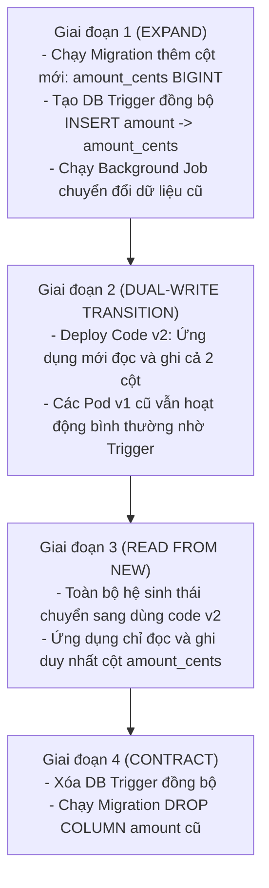

# Bài 07: Triển Khai Hạ Tầng & Containerization (Docker, Kubernetes & Zero-Downtime Deployments)

> **Tóm tắt bài viết**: Phân tích kiến trúc triển khai hệ thống thanh toán `qPayFlow` trên nền tảng **Docker** và **Kubernetes (K8s)**, tối ưu hóa Container Image với **Distroless Multi-Stage Build**, quy trình **Zero-Downtime Deployment** (Rolling Update, Canary), cơ chế **Graceful Shutdown**, và chiến lược nâng cấp cơ sở dữ liệu **Expand-and-Contract Pattern**.

---

## 1. Yêu Cầu Về Triển Khai Hạ Tầng Trong Ngành Fintech

Trong các hệ thống tài chính - ngân hàng, việc dừng hệ thống để bảo trì (Maintenance Downtime) vào ban đêm đang dần trở thành dĩ vãng. Mọi hoạt động cập nhật phần mềm phải đạt được các chuẩn mực khắt khe:

1. **Zero Downtime (Không gián đoạn dịch vụ)**: Không làm rớt bất kỳ một kết nối thanh toán nào đang chạy (In-flight Transactions) trong quá trình nâng cấp phiên bản mới.
2. **Instant Rollback (Khôi phục tức thì)**: Nếu phiên bản mới phát sinh lỗi, hệ thống phải có khả năng tự động hoàn nguyên về phiên bản ổn định trước đó trong vòng vài giây mà không cần can thiệp thủ công.
3. **Container Hardening (Bảo mật container tối đa)**: Container image chỉ chứa duy nhất file binary thực thi, loại bỏ hoàn toàn các tiện ích shell (`/bin/sh`, `curl`, `apt`) để giảm bề mặt tấn công của mã độc.
4. **Elastic Scaling**: Khả năng tự động mở rộng (Autoscaling) tức thời khi lưu lượng giao dịch tăng đột biến.

---

## 2. Kiến Trúc Triển Khai Trên Kubernetes (K8s Topology)


| Thành Phần K8s | Loại Đối Tượng | Chức Năng Cốt Lõi |
| :--- | :--- | :--- |
| **Ingress / Envoy** | Ingress / Service | TLS Termination, Routing, Rate Limiting tại tầng Edge |
| **Payment / Account Services** | Deployments (ReplicaSets) | Microservices Stateless, tự động scale theo HPA |
| **Kafka & Postgres** | StatefulSets / Managed Services | Dữ liệu có trạng thái, gắn Persistent Volume (SSD NVMe) |
| **Secret Management** | HashiCorp Vault / K8s Secrets | Quản lý API keys, Certificate, tự động Rotate mật khẩu DB |

---

## 3. Tối Ưu Hóa Container Với Multi-Stage Build & Distroless

Trong dự án `qPayFlow`, chúng ta áp dụng kỹ thuật **Multi-Stage Dockerfile** kết hợp base image **Google Distroless**:

```dockerfile
# ==========================================
# GIAI ĐOẠN 1: BUILD BINARY VỚI GOLANG SDK
# ==========================================
FROM golang:1.22-alpine AS builder

WORKDIR /build

# Tận dụng Docker Layer Caching cho dependencies
COPY go.mod go.sum ./
RUN go mod download

# Sao chép toàn bộ mã nguồn
COPY . .

# Biên dịch tĩnh (Static Binary), tắt CGO, strip debug symbols (-w -s)
RUN CGO_ENABLED=0 GOOS=linux GOARCH=amd64 \
    go build -ldflags="-w -s -extldflags '-static'" \
    -o /build/payment-service ./cmd/payment-service

# ==========================================
# GIAI ĐOẠN 2: RUNTIME IMAGE SIÊU TINH GỌN (DISTROLESS)
# ==========================================
FROM gcr.io/distroless/static-debian12:nonroot

WORKDIR /app

# Copy binary từ stage builder
COPY --from=builder /build/payment-service /app/payment-service

# Khởi chạy bằng user phi đặc quyền (Non-root UID 65532)
USER nonroot:nonroot

EXPOSE 8080 50051

ENTRYPOINT ["/app/payment-service"]
```

> **Hiệu quả đạt được**: Dung lượng image giảm từ $850\text{MB}$ xuống còn **$\sim 18\text{MB}$**. Không có trình thông dịch lệnh `/bin/sh` giúp ngăn chặn triệt để kỹ thuật chiếm quyền điều khiển bằng Remote Code Execution (RCE).

---

## 4. Các Chiến Lược Triển Khai Không Gián Đoạn (Zero-Downtime Deployment)

### 4.1. Rolling Update (Cập nhật cuốn chiếu)
Kubernetes dần dần thay thế các Pod cũ bằng Pod mới theo từng đợt, đảm bảo luôn có đủ số lượng Pod sẵn sàng phục vụ lưu lượng:

```yaml
spec:
  strategy:
    type: RollingUpdate
    rollingUpdate:
      maxSurge: 25%        # Cho phép tạo thêm tối đa 25% Pod mới vượt quá replicas
      maxUnavailable: 0    # Luôn duy trì 100% số lượng Pod khả dụng trong suốt quá trình deploy
```

### 4.2. Canary Deployment (Triển khai chim hoàng yến)
- Triển khai phiên bản mới (Version 2.0) phục vụ trước cho **$5\%$** lượng khách hàng thử nghiệm.
- Theo dõi các chỉ số đo lường (Error Rate, $p99$ Latency) qua Prometheus.
- Nếu các chỉ số ổn định, tự động tăng dần tỷ lệ điều hướng lưu lượng lên $25\% \rightarrow 50\% \rightarrow 100\%$.
- Nếu tỷ lệ lỗi tăng vọt, lập tức hạ lưu lượng về $0\%$ và kích hoạt Rollback tự động.

---

## 5. Góc Chuyên Sâu: Phân Tích Kỹ Thuật & Tình Huống Thực Tế

### Case 1: Chiến lược nâng cấp Database không gián đoạn (Expand-and-Contract Pattern)

**Bối cảnh:** Bảng `payments` đang có 50 triệu dòng. Cột số tiền `amount` đang lưu dưới dạng số thực `FLOAT`. Nhóm kỹ thuật cần đổi tên và chuyển kiểu dữ liệu sang `amount_cents BIGINT` (lưu số tiền theo đơn vị xu để tránh lỗi làm tròn dấu phẩy động).

**Rủi ro nghiêm trọng:** Nếu chạy lệnh `ALTER TABLE payments RENAME COLUMN amount TO amount_cents;`, các Pod code phiên bản cũ (v1) đang chạy sẽ lập tức bị sập (lỗi cột `amount` không tồn tại) trước khi Pod code mới (v2) kịp khởi động xong.

**Quy trình 4 giai đoạn Expand-and-Contract:**



---

### Case 2: Quy trình Graceful Shutdown cho Go Pod để không làm gián đoạn giao dịch đang xử lý

**Bối cảnh:** Khi Kubernetes ra lệnh xóa một Pod để cập nhật phiên bản mới, nếu Pod bị tắt đột ngột (`SIGKILL`), các giao dịch thanh toán đang gọi dở sang ngân hàng sẽ bị đứt kết nối, gây thất thoát dữ liệu.

**Quy trình tắt êm ái (Graceful Shutdown) trong qPayFlow:**

```go
func main() {
    srv := &http.Server{Addr: ":8080", Handler: router}

    // 1. Khởi chạy HTTP Server trong một Goroutine riêng
    go func() {
        if err := srv.ListenAndServe(); err != nil && !errors.Is(err, http.ErrServerClosed) {
            log.Fatalf("listen error: %v", err)
        }
    }()

    // 2. Lắng nghe tín hiệu chấm dứt từ hệ điều hành / K8s
    quit := make(chan os.Signal, 1)
    signal.Notify(quit, syscall.SIGINT, syscall.SIGTERM)
    <-quit // Block tại đây cho tới khi K8s gửi tín hiệu SIGTERM
    slog.Info("SIGTERM received, initiating graceful shutdown...")

    // 3. Tạo context với thời gian timeout chờ dọn dẹp (Grace Period)
    ctx, cancel := context.WithTimeout(context.Background(), 25*time.Second)
    defer cancel()

    // 4. Ngừng nhận request mới và đợi các request đang chạy hoàn tất
    if err := srv.Shutdown(ctx); err != nil {
        slog.Error("server forced to shutdown", "error", err)
    }

    // 5. Đóng an toàn các kết nối Database Pool và Kafka Producer Flush
    db.Close()
    kafkaProducer.Flush(5000)
    slog.Info("all connections drained, process exited safely.")
}
```

**Cấu hình bắt buộc trên Kubernetes Deployment:**
```yaml
spec:
  terminationGracePeriodSeconds: 30
  containers:
  - name: payment-service
    lifecycle:
      preStop:
        exec:
          # Ngủ 5 giây để Ingress Controller kịp gỡ Pod ra khỏi danh sách Endpoint trước khi tắt app
          command: ["/bin/sleep", "5"]
```

---

### Case 3: Tự động hóa Canary Deployment với Prometheus Metric & Automated Rollback

**Bối cảnh:** Thiết lập luồng tự động hóa CI/CD với Flagger hoặc Argo Rollouts trên Kubernetes để triển khai an toàn các phiên bản mới của `payment-service`.

**Cơ chế phân tích tự động (Automated Metric Analysis):**
1. Flagger triển khai Pod Canary và điều hướng $10\%$ lưu lượng vào bản mới.
2. Mỗi 1 phút, hệ thống chạy câu truy vấn Prometheus để đo tỷ lệ thành công của HTTP Requests:
   ```promql
   sum(rate(http_requests_total{status=~"2..", app="payment-service-canary"}[1m])) 
   / 
   sum(rate(http_requests_total{app="payment-service-canary"}[1m])) * 100
   ```
3. **Điều kiện thành công**: Nếu tỷ lệ thành công $\ge 99.5\%$ và độ trễ $p99 < 150\text{ms}$ trong 5 chu kỳ liên tiếp $\rightarrow$ Tăng lưu lượng lên $50\% \rightarrow 100\%$.
4. **Điều kiện thất bại**: Nếu phát hiện tỷ lệ lỗi $> 0.5\%$ $\rightarrow$ Ngay lập tức điều hướng $100\%$ lưu lượng về phiên bản cũ và gửi thông báo khẩn cấp tới kênh Incident của đội SRE. Toàn bộ quá trình diễn ra hoàn toàn tự động trong chưa đầy 60 giây mà không cần con người can thiệp.

---

## 6. Tài Liệu Tham Khảo (Reputable References)

1. **Kubernetes Official Documentation**: [Deployments & Pod Lifecycle Management](https://kubernetes.io/docs/concepts/workloads/controllers/deployment/)
2. **Google Cloud Architecture**: [Distroless Container Images Guide](https://cloud.google.com/blog/products/containers-kubernetes/distroless-docker-images)
3. **Martin Fowler**: [Evolutionary Database Design & Expand-Contract Pattern](https://martinfowler.com/articles/evodb.html)
4. **Argo Rollouts**: [Canary Deployments and Automated Analysis](https://argoproj.github.io/argo-rollouts/)
5. **Brendan Burns**: *Designing Distributed Systems: Patterns and Paradigms for Scalable, Reliable Services*.
