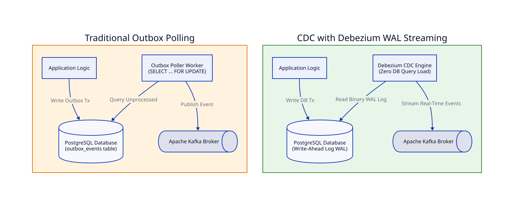

# Bài 08: Change Data Capture (CDC Debezium) vs Outbox Polling Worker

> **Tóm tắt bài viết**: So sánh kiến trúc phát sự kiện bất đồng bộ giữa hai giải pháp: **Outbox Polling Worker** truyền thống và **CDC (Change Data Capture)** dựa trên Debezium đọc trực tiếp PostgreSQL WAL (Write-Ahead Log), phân tích hiệu năng, độ trễ và chi phí hạ tầng.

---

## 1. Đặt Vấn Đề

Trong Bài 03, chúng ta đã tìm hiểu về **Transactional Outbox Pattern** giúp đảm bảo tính nguyên tố (Atomicity) giữa việc lưu giao dịch vào DB và đẩy Event ra Kafka. 

Tuy nhiên, có 2 cách khác nhau để đưa Event từ bảng `outbox_events` sang Kafka:
1. **Outbox Polling Worker**: Chạy một Background Worker định kỳ query DB (`SELECT ... FOR UPDATE`).
2. **Change Data Capture (CDC) với Debezium**: Đọc trực tiếp nhật ký thay đổi **Write-Ahead Log (WAL)** của PostgreSQL.

---

## 2. So Sánh Kiến Trúc Kỹ Thuật



### Bảng so sánh chuyên sâu:

| Tiêu chí | Outbox Polling Worker | CDC (Debezium + Postgres WAL) |
| :--- | :--- | :--- |
| **Cơ chế đọc** | Chạy câu lệnh SQL `SELECT * FROM outbox_events WHERE processed = false LIMIT 100` định kỳ (100ms - 1s). | Đọc luồng binary log **WAL (Write-Ahead Log)** của Postgres thông qua Logical Replication Slot. |
| **Tải lên Database (DB Load)** | **Cao**. Gây tải I/O CPU và khóa dòng (Locking) trên bảng Outbox khi tần suất polling nhanh. | **Cực thấp**. Không thực thi bất kỳ câu lệnh SQL query nào trên DB. |
| **Độ trễ Event (Latency)** | Phụ thuộc vào Polling Interval ($100\text{ms} - 1000\text{ms}$). | **Gần như Real-time** ($< 10\text{ms}$ ngay khi Transaction vừa Commit). |
| **Độ phức tạp Vận hành** | Đơn giản. Chỉ cần viết thêm vài dòng code worker trong Go/Java. | Cần dựng thêm Kafka Connect Cluster + Debezium Connector, quản lý WAL disk storage. |
| **Khả năng Schema Evolution** | Cần code DTO thủ công để map các thay đổi dữ liệu. | Tự động bắt sự kiện DDL và sync Schema sang Schema Registry (Avro/Protobuf). |

---

## 3. Cấu hình Debezium PostgreSQL Connector

Để theo dõi các biến động trên bảng `outbox_events` trong `qPayFlow`:

```json
{
  "name": "qpayflow-postgres-cdc",
  "config": {
    "connector.class": "io.debezium.connector.postgresql.PostgresConnector",
    "tasks.max": "1",
    "database.hostname": "postgres",
    "database.port": "5432",
    "database.user": "debezium",
    "database.password": "dbz_pass",
    "database.dbname": "qpayflow_db",
    "database.server.name": "pg-cdc",
    "table.include.list": "public.outbox_events",
    "plugin.name": "pgoutput",
    "tombstones.on.delete": "false"
  }
}
```

---

## 4. Lựa Chọn Chiến Lược Cho qPayFlow

- **Giai đoạn MVP / Quy mô vừa**: Dùng **Outbox Polling Worker (Go Background Worker)** để tối giản hóa độ phức tạp của hạ tầng, giảm chi phí duy trì Kafka Connect cluster.
- **Giai đoạn Scale / Quy mô Ngân hàng**: Chuyển sang **Debezium CDC** để đạt độ trễ siêu thấp ($< 10\text{ms}$) và giải phóng hoàn toàn DB khỏi tải polling SQL.

---

## 5. Tài Liệu Tham Khảo (Reputable References)

1. **Debezium Official Documentation**: [PostgreSQL Connector & WAL Streaming](https://debezium.io/documentation/reference/stable/connectors/postgresql.html)
2. **Red Hat Developer**: [Reliable Microservices Data Exchange With the Outbox Pattern](https://developers.redhat.com/blog/2019/01/14/from-monolith-to-event-driven-microservices-with-cdc-and-debezium)
3. **Stripe Engineering**: [Streaming Database Changes With Change Data Capture](https://stripe.com/blog/)
4. **Martin Kleppmann**: *Turning the Database Inside Out with Event Sourcing & Change Data Capture*.

