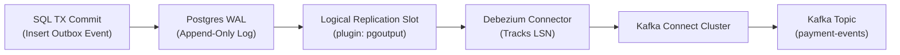

# Bài 08: Change Data Capture (CDC Debezium) vs Outbox Polling Worker

> **Tóm tắt bài viết**: So sánh kiến trúc kỹ thuật giữa hai giải pháp phát sự kiện bất đồng bộ trong **Transactional Outbox Pattern**: Phương pháp **Outbox Polling Worker** truyền thống và phương pháp **Change Data Capture (CDC)** sử dụng Debezium đọc trực tiếp **PostgreSQL Write-Ahead Log (WAL)**, phân tích hiệu năng, độ trễ và quản trị rủi ro hạ tầng dữ liệu.

---

## 1. Bài Toán Đưa Sự Kiện Ra Ngoài Sau Khi Commit Giao Dịch

Trong Bài 03, chúng ta đã khẳng định: Để tránh lỗi mất đồng bộ dữ liệu (Dual-Write Problem), mọi sự kiện nghiệp vụ phải được `INSERT` vào bảng `outbox_events` trong cùng một Database Transaction với lệnh ghi số dư.

Tuy nhiên, câu hỏi đặt ra là: **Làm thế nào để đưa các bản ghi từ bảng `outbox_events` sang Apache Kafka một cách nhanh nhất và an toàn nhất?**

Có hai trường phái kiến trúc chính:
1. **Outbox Polling Worker**: Sử dụng tiến trình ứng dụng (Go Worker) định kỳ truy vấn SQL vào cơ sở dữ liệu (`SELECT ... FOR UPDATE`).
2. **Change Data Capture (CDC) với Debezium**: Sử dụng tính năng **Logical Decoding** của PostgreSQL để đọc trực tiếp luồng nhật ký nhị phân **Write-Ahead Log (WAL)**.

---

## 2. So Sánh Kiến Trúc Kỹ Thuật


### Bảng so sánh chi tiết giữa hai giải pháp:

| Tiêu Chí Đánh Giá | Outbox Polling Worker (Go Service) | CDC (Debezium + Postgres WAL) |
| :--- | :--- | :--- |
| **Cơ chế hoạt động** | Chạy câu lệnh SQL `SELECT ... WHERE status = 'PENDING' LIMIT 100` định kỳ mỗi $100\text{ms} - 500\text{ms}$. | Đọc trực tiếp luồng nhị phân WAL của PostgreSQL thông qua plugin `pgoutput` / Logical Replication Slot. |
| **Tải lên Database (DB Overhead)** | **Rất cao**. Gây áp lực lớn lên CPU, RAM buffer pool, và tạo ra khóa dòng (Row Locks) trên bảng outbox. | **Gần như bằng 0**. Không thực thi bất kỳ câu lệnh truy vấn SQL nào lên database engine. |
| **Độ trễ truyền tin (Latency)** | Phụ thuộc vào chu kỳ Polling Interval ($100\text{ms} - 1000\text{ms}$). | **Siêu thấp / Real-time** ($< 10\text{ms}$ ngay khi Transaction vừa Commit). |
| **Phân mảnh đĩa (Table Bloat)** | **Nghiêm trọng**. Liên tục `UPDATE status = 'PROCESSED'` tạo ra hàng triệu Dead Tuples trong Postgres. | **Không có**. Bảng Outbox chỉ nhận lệnh `INSERT` thuần túy (Append-only). |
| **Độ phức tạp vận hành** | Đơn giản. Chỉ cần viết thêm một goroutine worker trong ứng dụng Go hiện có. | Cần dựng thêm Kafka Connect Cluster, Debezium Connectors, và giám sát dung lượng ổ đĩa WAL. |
| **Giai đoạn phù hợp** | Giai đoạn MVP / Hệ thống quy mô vừa ($< 500\text{ TPS}$). | Hệ thống quy mô lớn / Ngân hàng ($> 2,000\text{ TPS}$). |

---

## 3. Cơ Chế Hoạt Động Của PostgreSQL Logical Decoding

Khi một Transaction trong PostgreSQL thực thi lệnh `COMMIT`:
1. Mọi thay đổi dữ liệu (Insert, Update, Delete) được ghi tuần tự vào tệp **Write-Ahead Log (WAL)** trên đĩa cứng trước khi ghi vào Data Files để đảm bảo độ bền vững (Durability).
2. Plugin **`pgoutput`** giải mã các bản ghi WAL nhị phân thành các sự kiện logic (Row-level change events).
3. **Debezium Connector** kết nối qua một **Logical Replication Slot**, liên tục tiêu thụ các sự kiện này, theo dõi số thứ tự nhật ký **LSN (Log Sequence Number)**, và stream dữ liệu trực tiếp sang Apache Kafka.



### Cấu hình Debezium PostgreSQL Connector cho qPayFlow:

```json
{
  "name": "qpayflow-outbox-connector",
  "config": {
    "connector.class": "io.debezium.connector.postgresql.PostgresConnector",
    "tasks.max": "1",
    "plugin.name": "pgoutput",
    "database.hostname": "postgres-primary.internal",
    "database.port": "5432",
    "database.user": "debezium_cdc",
    "database.password": "${file:/secrets/db:debezium_pwd}",
    "database.dbname": "qpayflow_core",
    "database.server.name": "qpayflow_pg",
    "table.include.list": "public.outbox_events",
    "tombstones.on.delete": "false",
    "decimal.handling.mode": "double",
    "transforms": "outbox",
    "transforms.outbox.type": "io.debezium.transforms.outbox.EventRouter",
    "transforms.outbox.route.topic.replacement": "${routedByValue}",
    "transforms.outbox.route.by.field": "aggregate_type"
  }
}
```

---

## 4. Triển Khai Outbox Polling Worker Trong Go

Đối với môi trường thử nghiệm hoặc quy mô tải vừa, việc triển khai một Go Background Worker sử dụng kỹ thuật `SELECT FOR UPDATE SKIP LOCKED` mang lại sự đơn giản và độ ổn định cao:

```go
// Worker định kỳ quét bảng outbox trong qPayFlow
func (w *OutboxWorker) Start(ctx context.Context) {
	ticker := time.NewTicker(100 * time.Millisecond)
	defer ticker.Stop()

	for {
		select {
		case <-ctx.Done():
			return
		case <-ticker.C:
			if err := w.processPendingEvents(ctx); err != nil {
				slog.Error("failed to process outbox events", "error", err)
			}
		}
	}
}

func (w *OutboxWorker) processPendingEvents(ctx context.Context) error {
	tx, err := w.db.BeginTx(ctx, nil)
	if err != nil {
		return err
	}
	defer tx.Rollback()

	// 🔑 Sử dụng SKIP LOCKED để nhiều worker có thể chạy song song mà không tranh chấp
	query := `
		SELECT id, event_type, aggregate_id, payload
		FROM outbox_events
		WHERE status = 'PENDING'
		ORDER BY created_at ASC
		LIMIT 50
		FOR UPDATE SKIP LOCKED
	`
	rows, err := tx.QueryContext(ctx, query)
	if err != nil {
		return err
	}
	defer rows.Close()

	var events []*OutboxEvent
	for rows.Next() {
		var e OutboxEvent
		if err := rows.Scan(&e.ID, &e.EventType, &e.AggregateID, &e.Payload); err != nil {
			return err
		}
		events = append(events, &e)
	}

	for _, event := range events {
		// Publish sang Kafka
		if err := w.kafkaProducer.Send(event.EventType, event.AggregateID, event.Payload); err != nil {
			return fmt.Errorf("failed to publish to kafka: %w", err)
		}
		// Cập nhật trạng thái thành công
		_, err := tx.ExecContext(ctx, "UPDATE outbox_events SET status = 'PROCESSED', processed_at = NOW() WHERE id = $1", event.ID)
		if err != nil {
			return err
		}
	}

	return tx.Commit()
}
```

---

## 5. Góc Chuyên Sâu: Phân Tích Kỹ Thuật & Tình Huống Thực Tế

### Case 1: Sự cố tràn ổ đĩa (Disk Full Outage) do Replication Slot bị kẹt khi Kafka bị sập

**Bối cảnh sự cố nghiêm trọng:** Cụm Apache Kafka gặp sự cố mất điện và ngừng hoạt động trong 4 giờ. Trong thời gian này, ứng dụng thanh toán qPayFlow vẫn tiếp tục nhận giao dịch và ghi dữ liệu vào PostgreSQL bình thường.

**Diễn biến sự cố:**
1. Debezium không thể gửi event sang Kafka, do đó nó **không xác nhận (ACK) vị trí LSN đã đọc** về cho PostgreSQL Replication Slot.
2. PostgreSQL có quy tắc bảo vệ: Nó **không bao giờ được xóa bất kỳ tệp WAL nào** chưa được tất cả các Replication Slot xác nhận.
3. Khi lưu lượng giao dịch tiếp tục diễn ra, hàng nghìn tệp WAL mới được sinh ra và dồn ứ lại.
4. Dung lượng ổ đĩa SSD của PostgreSQL tăng vọt từ $60\% \rightarrow 100\%$ chỉ sau 3 giờ $\rightarrow$ Database bị Crash vì cạn kiệt ổ đĩa, toàn bộ hệ thống ngân hàng bị tê liệt!

**Giải pháp phòng vệ bắt buộc trong Production:**
- Thiết lập tham số giới hạn dung lượng lưu giữ WAL tối đa trên PostgreSQL:
  ```sql
  -- Giới hạn tối đa 50GB WAL được giữ lại cho replication slot
  ALTER SYSTEM SET max_slot_wal_keep_size = '50GB';
  SELECT pg_reload_conf();
  ```
- **Ý nghĩa**: Nếu Kafka bị sập quá lâu và dung lượng WAL vượt quá $50\text{GB}$, PostgreSQL sẽ chấp nhận vô hiệu hóa Replication Slot đó để tự bảo vệ sự sống còn của Database chính. Khi Kafka hồi phục, Debezium sẽ thực hiện Snapshot lại dữ liệu từ đầu.
- Cài đặt Prometheus Alert khi `pg_replication_slots.wal_status == 'extended'` hoặc dung lượng WAL tăng bất thường.

---

### Case 2: Quản lý tiến hóa cấu trúc dữ liệu (Schema Evolution & DDL Changes) trong luồng CDC

**Bối cảnh:** Nhóm phát triển thêm cột mới `tax_code VARCHAR(30)` vào bảng cơ sở dữ liệu. Làm thế nào để Debezium CDC và các Kafka Consumer hạ tầng không bị lỗi Serialization/Deserialization?

**Quy trình quản trị Schema chuẩn:**
1. Sử dụng **Schema Registry (Confluent / Apicurio)** với định dạng **Apache Avro** hoặc **Protobuf**.
2. Thiết lập quy tắc tương thích **Backward Compatibility** trên Schema Registry:
   - Khi thêm trường mới, bắt buộc phải có giá trị mặc định (`default = null`).
   - Tuyệt đối không được xóa hoặc đổi tên các trường đang tồn tại.
3. Debezium tự động phát hiện câu lệnh DDL `ALTER TABLE`, đăng ký Schema version mới lên Schema Registry, và đóng gói message kèm `schema_id`. Các Consumer phiên bản cũ vẫn giải mã được bản tin mà không bị panic.

---

### Case 3: Chiến lược dọn dẹp dữ liệu bảng Outbox (Data Retention & Cleanup)

**Bối cảnh:** Nếu sử dụng phương pháp Polling Worker hoặc CDC, bảng `outbox_events` sau vài tháng sẽ tích lũy hàng chục triệu dòng dữ liệu đã xử lý (`status = 'PROCESSED'`).

**Chiến lược dọn dẹp không làm khóa bảng:**
- **Giải pháp tồi**: Chạy lệnh `DELETE FROM outbox_events WHERE status = 'PROCESSED';` $\rightarrow$ Gây khóa bảng trong thời gian dài và tạo ra phân mảnh ổ đĩa nghiêm trọng.
- **Giải pháp tối ưu**:
  1. Phân vùng bảng `outbox_events` theo ngày (Daily Partitioning).
  2. Mỗi đêm, chạy một cron job thực thi lệnh `DROP TABLE outbox_events_2026_08_01;` cho các bảng con đã cũ hơn 7 ngày. Lệnh `DROP TABLE` trong Postgres diễn ra gần như tức thì ($< 1\text{ms}$), giải phóng 100% dung lượng đĩa vật lý mà không tốn tài nguyên CPU quét từng dòng.

---

## 6. Tài Liệu Tham Khảo (Reputable References)

1. **Debezium Official Documentation**: [PostgreSQL Connector Architecture & WAL Streaming](https://debezium.io/documentation/reference/stable/connectors/postgresql.html)
2. **PostgreSQL Documentation**: [Logical Replication & Logical Decoding Internals](https://www.postgresql.org/docs/current/logicaldecoding.html)
3. **Red Hat Developer**: [Reliable Microservices Data Exchange With the Outbox Pattern](https://developers.redhat.com/blog/2019/01/14/from-monolith-to-event-driven-microservices-with-cdc-and-debezium)
4. **Stripe Engineering**: [Streaming Database Changes with Change Data Capture](https://stripe.com/blog/)
5. **Martin Kleppmann**: *Turning the Database Inside Out with Change Data Capture*.
