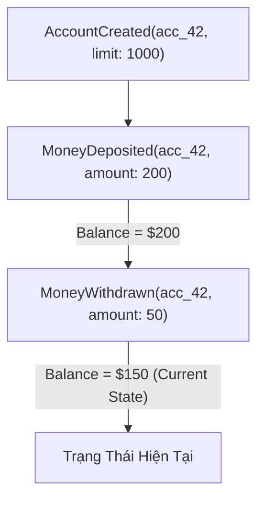
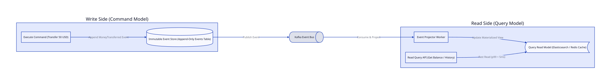

# Bài 09: Event Sourcing & CQRS Trong Hệ Thống Thanh Toán (Command Query Responsibility Segregation)

> **Tóm tắt bài viết**: Đi sâu vào hai mẫu kiến trúc hướng sự kiện cao cấp **Event Sourcing** và **CQRS**, cách lưu trữ trạng thái tài khoản dưới dạng chuỗi các sự kiện bất biến (**Append-Only Event Store**), cơ chế tái tạo trạng thái theo thời gian (**Time Travel & State Replay**), kỹ thuật tối ưu **Snapshotting**, và giải quyết bài toán độ trễ mô hình đọc (**Read Model Lag**).

---

## 1. Khái Niệm Cốt Lõi: CRUD vs Event Sourcing

Trong kiến trúc CRUD (Create, Read, Update, Delete) truyền thống, cơ sở dữ liệu chỉ lưu trữ **trạng thái hiện tại duy nhất** của tài khoản:

$$\text{Account} = \{\text{id}: 42, \;\text{balance}: 150.00, \;\text{updated\_at}: \text{"2026-08-16"}\}$$

Khi có giao dịch mới, ta chạy câu lệnh `UPDATE` để đè dữ liệu mới lên dữ liệu cũ. **Hậu quả**: Toàn bộ ngữ cảnh lịch sử (Tại sao số dư là 150? Do ai nạp? Vào thời điểm nào?) bị biến mất hoàn toàn khỏi bảng chính.

### Triết lý Event Sourcing:
Hệ thống **không bao giờ thực thi lệnh `UPDATE` hoặc `DELETE`**. Thay vào đó, mọi biến động được lưu trữ dưới dạng một chuỗi các **Sự kiện Miền bất biến (Immutable Domain Events)** được thêm nối tiếp (Append-only).

Trạng thái hiện tại của tài khoản là tổng tích lũy hàm số của toàn bộ các sự kiện từ quá khứ:

$$\text{Current Account State} = \text{FoldLeft}\left(\text{InitialState}, \; [\text{Event}_1, \text{Event}_2, \dots, \text{Event}_n]\right)$$



---

## 2. Kiến Trúc CQRS (Command Query Responsibility Segregation)

Để giải quyết bài toán hiệu năng khi phân tách giữa việc xử lý nghiệp vụ phức tạp (Ghi) và tra cứu siêu tốc (Đọc):



| Tiêu Chí | Command Side (Luồng Ghi) | Query Side (Luồng Đọc) |
| :--- | :--- | :--- |
| **Trách nhiệm chính** | Nhận lệnh `CreatePayment`, `HoldBalance`, thực thi Business Rules & Locking | Nhận truy vấn `GetBalance`, `ListTransactions` |
| **Cơ sở dữ liệu** | Chỉ ghi `INSERT` vào Event Store (PostgreSQL / EventStoreDB) | Đọc từ Read-Optimized Storage (Redis Cache / Elasticsearch) |
| **Mục tiêu tối ưu** | Tối ưu cho Tính toàn vẹn dữ liệu và ACID | Tối ưu cho Độ trễ siêu thấp ($p99 < 5\text{ms}$) |

### Luồng tương tác giữa hai phía:
1. Client gửi **Command** `TransferMoney` tới Command Service.
2. Command Service nạp Aggregate từ Event Store, kiểm tra tính hợp lệ về số dư, và sinh ra Event mới `TransferCompleted`.
3. Event được lưu nguyên tử vào **Event Store** và bắn sang Apache Kafka.
4. Một tiến trình nền **Event Projector** lắng nghe Kafka, tính toán trước hình chiếu (Materialized View) và cập nhật số dư mới vào **Redis / Postgres Read Replica**.

---

## 3. Kỹ Thuật Tối Ưu Snapshotting (Ảnh Chụp Trạng Thái)

Nếu một tài khoản doanh nghiệp đã thực hiện $500,000$ giao dịch, việc replay lại nửa triệu sự kiện mỗi khi có lệnh rút tiền mới sẽ làm nghẽn CPU và mất hàng giây để tính toán.

**Giải pháp: Snapshotting Pattern**
Định kỳ cứ sau mỗi $N$ sự kiện (ví dụ: 500 events) hoặc cuối mỗi ngày, hệ thống lưu lại một bản chụp trạng thái **Snapshot**:

$$\text{Current State} = \text{Snapshot at Event \#500} + \sum_{i=501}^{525} \text{Event}_i$$

```json
{
  "account_id": "ACC_42",
  "snapshot_version": 500,
  "balance": 14520.50,
  "currency": "USD",
  "status": "ACTIVE",
  "created_at": "2026-08-16T00:00:00Z"
}
```

Nhờ có Snapshot, ứng dụng chỉ cần nạp 1 bản ghi Snapshot gần nhất và replay tối đa 25 events mới, giảm thời gian nạp Aggregate từ $2,000\text{ms}$ xuống chỉ còn **$< 2\text{ms}$**.

---

## 4. Cấu Trúc Bảng Event Store Trong PostgreSQL

```sql
CREATE TABLE event_store (
    event_id VARCHAR(64) PRIMARY KEY,
    aggregate_type VARCHAR(64) NOT NULL,    -- 'Account', 'Payment'
    aggregate_id VARCHAR(64) NOT NULL,      -- 'acc_42'
    version BIGINT NOT NULL,                -- 1, 2, 3... (Tăng đơn điệu)
    event_type VARCHAR(64) NOT NULL,        -- 'MoneyDeposited', 'MoneyWithdrawn'
    payload JSONB NOT NULL,
    metadata JSONB,
    created_at TIMESTAMP WITH TIME ZONE DEFAULT CURRENT_TIMESTAMP,
    CONSTRAINT uq_aggregate_version UNIQUE (aggregate_id, version)
);

CREATE INDEX idx_event_stream ON event_store (aggregate_id, version ASC);
```

> **Ý nghĩa của `UNIQUE (aggregate_id, version)`**: Đóng vai trò như cơ chế Optimistic Concurrency Control. Nếu 2 Command cùng cố gắng sinh ra Event ở version 5 cho cùng một tài khoản, Database sẽ chặn bản ghi thứ hai vi phạm khóa chính, ngăn chặn hoàn toàn race condition.

---

## 5. Góc Chuyên Sâu: Phân Tích Kỹ Thuật & Tình Huống Thực Tế

### Case 1: Tái tạo số dư và phục hồi dữ liệu tại một thời điểm quá khứ (Point-in-Time Recovery) cho kiểm toán

**Bối cảnh:** Cơ quan Thuế và Kiểm toán Nhà nước yêu cầu ngân hàng cung cấp chính xác số dư và chi tiết danh mục tài sản của tài khoản công ty X vào đúng thời điểm `23:59:59 ngày 31/12/2025`.

**Cách thực hiện trong Event Sourcing:**
- Trong hệ thống CRUD truyền thống, việc tìm lại số dư quá khứ là cực kỳ khó khăn nếu không có hệ thống sao lưu phức tạp.
- Trong Event Sourcing, việc này trở nên vô cùng đơn giản:
  ```sql
  SELECT event_type, payload, version, created_at
  FROM event_store
  WHERE aggregate_id = 'ACC_CORP_X' 
    AND created_at <= '2025-12-31 23:59:59+00'
  ORDER BY version ASC;
  ```
- Ứng dụng chỉ việc chạy hàm `Replay` trên danh sách các sự kiện được trả về. Kết quả tính toán ra số dư đảm bảo chính xác 100% về mặt toán học và có giá trị pháp lý tuyệt đối trước kiểm toán.

---

### Case 2: Xử lý bài toán "Read Your Own Writes" khi Read Model bị trễ (Eventual Consistency Lag)

**Bối cảnh sự cố UI:** Khách hàng nạp 100 USD vào ví. Giao dịch ghi thành công tại Command Side. Khách hàng quay lại màn hình chính ngay lập tức ($50\text{ms}$ sau), nhưng ứng dụng đọc từ Redis Read Model (lúc này Kafka Projector đang bị trễ $100\text{ms}$) $\rightarrow$ Màn hình vẫn hiển thị số dư cũ! Khách hàng tưởng lỗi nên nhấn nạp tiền thêm lần nữa.

**3 giải pháp khắc phục triệt để:**
1. **Client-Side Optimistic UI Update**: Ứng dụng Mobile App tự động cộng tạm 100 USD vào giao diện ngay khi nhận được response thành công từ lệnh nạp tiền, kèm icon đồng bộ.
2. **Version Pinning / Read Consistency Token**: Command Service trả về `latest_version: 105`. Khi Mobile App gọi API xem số dư, nó gửi kèm Header `X-Min-Version: 105`. Nếu Read Model của Redis đang ở `version 104`, API Gateway sẽ tự động định tuyến truy vấn sang thẳng Database chính (Command Side) để đọc giá trị mới nhất.
3. **Short-lived Session Cache**: Sau khi thực hiện lệnh Ghi thành công, Command Service tự động set giá trị tạm vào Redis Session của riêng User đó với TTL 3 giây để phục vụ ngay các lượt đọc tiếp theo của chính User đó.

---

### Case 3: Chiến lược Snapshotting cho tài khoản siêu lưu lượng (Merchant Hot Account)

**Bối cảnh:** Tài khoản ví của một sàn thương mại điện tử lớn (Shopee/Lazada) phát sinh 2 triệu giao dịch nhận tiền mỗi ngày. Nếu snapshot sau mỗi 500 events, hệ thống sẽ phải tạo 4,000 snapshots mỗi ngày, gây áp lực ghi không cần thiết.

**Kiến trúc tối ưu hóa đa tầng:**
1. **Time-based Daily EOD Snapshot**: Tạo snapshot chính thức vào cuối mỗi ngày lúc 00:00:00.
2. **In-Memory Cache Projection (Redis Active Aggregate)**: Duy trì trạng thái Aggregate của các tài khoản Hot trực tiếp trên Redis. Mọi lệnh ghi chỉ cần so khớp trên Redis và append Event vào Postgres.
3. **Async Snapshotting Worker**: Một worker chạy nền độc lập theo dõi dung lượng event stream. Khi số lượng event phát sinh vượt quá ngưỡng mà không có hoạt động đọc tức thời, worker sẽ tiến hành tạo snapshot bất đồng bộ mà không làm chậm luồng thanh toán chính.

---

## 6. Tài Liệu Tham Khảo (Reputable References)

1. **Martin Fowler**: [Event Sourcing Pattern](https://martinfowler.com/eaaDev/EventSourcing.html) & [CQRS Pattern](https://martinfowler.com/bliki/CQRS.html)
2. **Greg Young (Creator of CQRS)**: *CQRS and Event Sourcing Documents and Video Lectures*.
3. **Microsoft Cloud Architecture Guides**: [Command and Query Responsibility Segregation (CQRS) Pattern](https://learn.microsoft.com/en-us/azure/architecture/patterns/cqrs)
4. **EventStoreDB**: [Event Sourcing Basics & Aggregate Design](https://www.eventstore.com/event-sourcing)
5. **Vaughn Vernon**: *Implementing Domain-Driven Design* — Chapter 14: Application & Event Sourcing.
