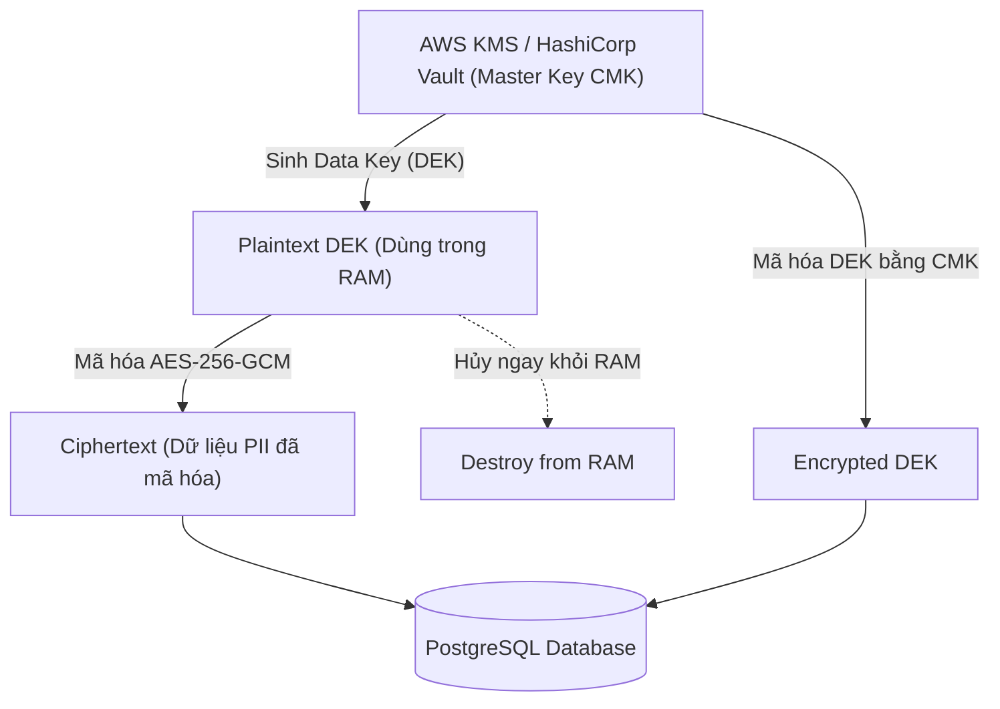

# Bài 10: Bảo Mật & Tuân Thủ PCI-DSS Trong Thanh Toán (Encryption, Tokenization & HMAC)

> **Tóm tắt bài viết**: Khám phá kiến trúc bảo mật trong hệ thống thanh toán tài chính, các yêu cầu tuân thủ tiêu chuẩn **PCI-DSS Level 1**, kỹ thuật mã hóa phong bì đa tầng (**Field-Level Envelope Encryption with KMS**), kiến trúc **Tokenization Vault**, xác thực liên dịch vụ với **mTLS**, và chữ ký số **HMAC-SHA256** chống giả mạo Webhooks.

---

## 1. Yêu Cầu Tuân Thủ Chuẩn Quốc Tế PCI-DSS

**PCI-DSS (Payment Card Industry Data Security Standard)** là tiêu chuẩn an ninh thông tin bắt buộc áp dụng cho mọi tổ chức lưu trữ, xử lý hoặc truyền tải dữ liệu thẻ thanh toán (Visa, Mastercard, JCB, Napas).

| Loại Dữ Liệu Thẻ | Quy Định Lưu Trữ & Xử Lý Theo PCI-DSS |
| :--- | :--- |
| **Số Thẻ Chính (PAN - 16 chữ số)** | Bắt buộc mã hóa mạnh (AES-256) hoặc thay thế bằng Token ngẫu nhiên (Token Vault). |
| **Mã Bảo Mật (CVV / CVC / CVC2)** | ❌ **CẤM LƯU TRỮ TUYỆT ĐỐI** sau khi đã nhận phản hồi Authorization. |
| **Mã PIN & Khối PIN đã mã hóa** | ❌ **CẤM LƯU TRỮ TUYỆT ĐỐI** |
| **Dữ liệu Dải Từ (Magnetic Stripe)** | ❌ **CẤM LƯU TRỮ TUYỆT ĐỐI** |

---

## 2. Tokenization vs Field-Level Envelope Encryption


### 2.1. Kiến Trúc Tokenization Vault
Nhằm mục đích cách ly thông tin thẻ nhạy cảm và giảm thiểu phạm vi kiểm toán PCI-DSS (Audit Scope Reduction), `qPayFlow` thiết kế phân hệ **Token Vault** độc lập:

1. Khi khách hàng nhập số thẻ `4111_2222_3333_4444` trên ứng dụng, request được gửi trực tiếp tới một **Dedicated Token Vault Service** nằm trong vùng mạng PCI Isolated Subnet.
2. Token Vault lưu số thẻ thật vào cơ sở dữ liệu mã hóa phần cứng (HSM), sinh ra một chuỗi định danh ngẫu nhiên (Surrogate Token): `tok_live_9b1deb4d3b7d`.
3. Toàn bộ các microservices xung quanh (Payment Service, Risk Service, Order Service) **chỉ lưu trữ và truyền nhận `Token` này** mà không bao giờ biết hay chạm vào số thẻ thật.

### 2.2. Field-Level Envelope Encryption (Mã Hóa Phong Bì Đa Tầng Với KMS)
Đối với các dữ liệu định danh cá nhân (PII như CCCD/Hộ chiếu, Số tài khoản ngân hàng), hệ thống áp dụng kỹ thuật mã hóa phong bì 2 tầng:



- **Customer Master Key (CMK)**: Nằm an toàn trong phần cứng bảo mật HSM (AWS KMS / Vault). Không bao giờ rời khỏi KMS.
- **Data Encryption Key (DEK)**: Được KMS sinh ra động để mã hóa từng bản ghi dữ liệu bằng thuật toán **AES-256-GCM** (Authenticated Encryption).

---

## 3. Chữ Ký Số HMAC Bảo Vệ Webhooks (HMAC-SHA256 Signatures)

Khi `qPayFlow` gửi Webhook thông báo sự kiện `payment.completed` tới máy chủ của Merchant, để Merchant xác thực rằng request này **thực sự xuất phát từ qPayFlow** và không bị can thiệp trên đường truyền:

```go
package security

import (
	"crypto/hmac"
	"crypto/sha256"
	"encoding/hex"
	"fmt"
	"time"
)

// GenerateWebhookSignature tạo chữ ký HMAC-SHA256 kèm timestamp chống Replay Attack
func GenerateWebhookSignature(payload []byte, secretKey string) (string, int64) {
	timestamp := time.Now().UTC().Unix()
	// Ghép timestamp vào trước payload để ký
	signaturePayload := fmt.Sprintf("%d.%s", timestamp, string(payload))

	mac := hmac.New(sha256.New, []byte(secretKey))
	mac.Write([]byte(signaturePayload))
	signatureHex := hex.EncodeToString(mac.Sum(nil))

	return signatureHex, timestamp
}

// VerifyWebhookSignature xác thực chữ ký và kiểm tra cửa sổ trôi dạt thời gian (Tolerance Window)
func VerifyWebhookSignature(payload []byte, signature string, timestamp int64, secretKey string, toleranceSeconds int64) bool {
	// 1. Kiểm tra chống Replay Attack: Timestamp không được quá cũ
	now := time.Now().UTC().Unix()
	if now-timestamp > toleranceSeconds || timestamp > now+60 {
		return false
	}

	// 2. Tính lại chữ ký dự kiến
	signaturePayload := fmt.Sprintf("%d.%s", timestamp, string(payload))
	mac := hmac.New(sha256.New, []byte(secretKey))
	mac.Write([]byte(signaturePayload))
	expectedSignature := hex.EncodeToString(mac.Sum(nil))

	// 3. So sánh chữ ký an toàn với Constant-Time Comparison để chống Timing Attacks
	return hmac.Equal([]byte(signature), []byte(expectedSignature))
}
```

---

## 4. Bảo Mật Nội Bộ Với Mutual TLS (mTLS)

Mọi giao tiếp gRPC và HTTP giữa các microservices nội bộ trong cụm Kubernetes của qPayFlow đều bắt buộc áp dụng **Mutual TLS (mTLS)**:
- **Server Authentication**: Client xác thực chứng chỉ số (TLS Certificate) của Server để tránh kết nối nhầm vào server giả mạo.
- **Client Authentication**: Server xác thực chứng chỉ số của Client để đảm bảo chỉ những microservice có thẩm quyền mới được phép gọi API Core Ledger.
- **Zero-Trust Network**: Dù hacker có thâm nhập được vào mạng nội bộ (Internal VPC), toàn bộ lưu lượng dữ liệu trao đổi giữa các service vẫn được mã hóa hoàn toàn và không thể bị nghe lén (Sniffing/Man-In-The-Middle).

---

## 5. Góc Chuyên Sâu: Phân Tích Kỹ Thuật & Tình Huống Thực Tế

### Case 1: Tokenization giúp giảm thiểu phạm vi kiểm toán PCI-DSS từ 300+ tiêu chuẩn xuống còn ~30 tiêu chuẩn như thế nào?

**Bối cảnh:** Một doanh nghiệp Fintech muốn đạt chứng chỉ PCI-DSS Level 1 (xử lý trên 6 triệu giao dịch thẻ/năm). Chi phí kiểm toán hàng năm và thời gian chuẩn bị có thể mất hàng triệu USD và hàng trăm nhân sự.

**Phân tích kỹ thuật Scope Reduction:**
- **Kịch bản không dùng Tokenization**:
  - Số thẻ thật được gửi qua API Gateway, đi vào Order Service, lưu vào Database, bắn qua Kafka sang Notification Service.
  - Theo quy định PCI-DSS, **toàn bộ máy chủ, database, cụm K8s, router, switch, và cả nhân sự** tiếp xúc với các hệ thống trên đều rơi vào phạm vi kiểm toán (**Cardholder Data Environment - CDE**). Hơn 300 điều khoản an ninh khắt khe phải được kiểm định định kỳ.
- **Kịch bản áp dụng Tokenization Vault (Mô hình qPayFlow)**:
  - Khách hàng nhập thẻ trực tiếp qua iframe/SDK của Token Vault.
  - Vùng CDE được cô lập tuyệt đối chỉ gồm duy nhất 2 Pods Token Vault và 1 Database Vault siêu bảo mật.
  - Toàn bộ 50 microservices còn lại chỉ lưu trữ Token `tok_123` (không có giá trị toán học). Các service này **hoàn toàn thoát khỏi phạm vi CDE (Out of Scope)**.
  - Phạm vi kiểm toán giảm trên $90\%$, tiết kiệm hàng tỷ đồng chi phí vận hành và rủi ro rò rỉ dữ liệu bị triệt tiêu gần như tuyệt đối.

---

### Case 2: Cơ chế Xoay Vòng Khóa (Key Rotation) với Envelope Encryption mà không làm gián đoạn hệ thống

**Bối cảnh:** Quy định an ninh yêu cầu xoay vòng khóa chính (Master Key Rotation) định kỳ mỗi 90 ngày một lần. Hệ thống đang lưu trữ 100 triệu bản ghi PII mã hóa trong database.

**Cách thức Envelope Encryption giải quyết bài toán:**
- Trong mã hóa truyền thống: Khi đổi Master Key, hệ thống buộc phải đọc toàn bộ 100 triệu dòng ra, giải mã bằng key cũ, rồi mã hóa lại bằng key mới $\rightarrow$ Làm tê liệt database nhiều giờ.
- **Trong Envelope Encryption**:
  1. Mỗi dòng dữ liệu được mã hóa bằng một khóa dữ liệu riêng biệt `DEK`.
  2. Khóa chính `CMK` chỉ dùng để mã hóa khóa `DEK` (kết quả là `Encrypted_DEK`).
  3. Khi xoay vòng khóa: KMS sinh ra `CMK_v2`.
  4. Các bản ghi cũ **không cần phải giải mã lại dữ liệu**. Chúng vẫn lưu trữ bình thường.
  5. KMS duy trì một bảng lưu trữ các version cũ của CMK để giải mã khi cần. Khi một bản ghi cũ được cập nhật lại, ứng dụng mới yêu cầu KMS mã hóa lại `DEK` bằng `CMK_v2`. Quá trình chuyển đổi diễn ra liên tục, êm ả mà không tốn một giây downtime.

---

### Case 3: Tấn công Replay Attack vào Webhook và kỹ thuật phòng chống bằng Timestamp Window

**Bối cảnh sự cố:** Một kẻ tấn công đứng giữa mạng (Man-in-the-Middle trên đường truyền công cộng) bắt được gói tin Webhook hợp lệ `payment.success` của đơn hàng trị giá 1,000 USD gửi cho Merchant. Sau đó kẻ này liên tục gửi lại gói tin đó 50 lần tới máy chủ của Merchant để kích hoạt giao hàng nhiều lần.

**Cơ chế phòng thủ:**
- Payload gửi đi chứa trường `timestamp: 1723500000`.
- Chữ ký HMAC được tính toán trên chuỗi: `HMAC_SHA256(timestamp + "." + body, secret_key)`.
- Kẻ tấn công không thể sửa đổi trường `timestamp` vì sửa đổi sẽ làm sai lệch chữ ký HMAC (kẻ tấn công không có `secret_key`).
- Khi Merchant nhận gói tin:
  1. Kiểm tra `|CurrentTime - timestamp| <= 300 seconds` (Cửa sổ trôi dạt tối đa 5 phút).
  2. Nếu gói tin bị gửi lại sau 5 phút $\rightarrow$ Merchant lập tức từ chối vì đã quá hạn.
  3. Kết hợp với việc Merchant lưu `event_id` vào Redis với TTL 24 giờ để loại trừ trùng lặp (Idempotent Webhook Consumer). Cuộc tấn công Replay Attack bị vô hiệu hóa hoàn toàn.

---

## 6. Tài Liệu Tham Khảo (Reputable References)

1. **PCI Security Standards Council**: [PCI-DSS Official Security Standards v4.0](https://www.pcisecuritystandards.org/)
2. **Stripe Security Guides**: [Stripe Security and Tokenization Architecture](https://stripe.com/docs/security/guide)
3. **AWS KMS Developer Guide**: [Envelope Encryption Concepts & Key Management](https://docs.aws.amazon.com/kms/latest/developerguide/concepts.html)
4. **IETF RFC 2104**: [HMAC: Keyed-Hashing for Message Authentication](https://datatracker.ietf.org/doc/html/rfc2104)
5. **NIST Special Publication 800-57**: [Recommendation for Key Management](https://csrc.nist.gov/publications/detail/sp/800-57-part-1/rev-5/final)
