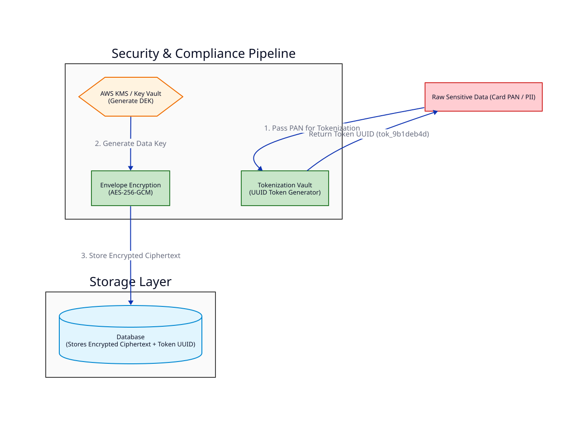

# Bài 10: Bảo Mật & Tuân Thủ PCI-DSS Trong Thanh Toán (Encryption, Tokenization & HMAC)

> **Tóm tắt bài viết**: Phân tích các tiêu chuẩn bảo mật bắt buộc trong hệ thống thanh toán tài chính (PCI-DSS Compliance), kỹ thuật **Field-Level Envelope Encryption (KMS)**, **Tokenization** mã hóa dữ liệu nhạy cảm (PAN/PII), và **Chữ ký HMAC** bảo vệ Webhooks.

---

## 1. Yêu Cầu Tuân Thủ Tiêu Chuẩn PCI-DSS

**PCI-DSS (Payment Card Industry Data Security Standard)** quy định nghiêm ngặt về việc xử lý thông tin thẻ tín dụng/ghi nợ:
- **CẤM TUYỆT ĐỐI**: Lưu trữ mã CVV/CVC, mã PIN, hoặc dữ liệu từ dải từ (Magnetic Stripe).
- **Yêu cầu Mã hóa**: Số thẻ PAN (Primary Account Number) $16$ chữ số nếu lưu trữ bắt buộc phải được mã hóa mạnh (AES-256) hoặc Tokenize.

---

## 2. Tokenization vs Field-Level Envelope Encryption



### 2.1. Tokenization (Thay thế dữ liệu bằng Token)
Nhằm tránh việc truyền hoặc lưu số thẻ thật trong toàn bộ hệ thống microservices, `qPayFlow` sử dụng **Tokenization Vault**:
- Số thẻ `4111_2222_3333_4444` được gửi vào Token Vault.
- Vault sinh một chuỗi định danh ngẫu nhiên không có tính chất toán học: `tok_9b1deb4d-3b7d-4bad-9bdd`.
- Các dịch vụ nội bộ (Order Service, Notification Service) **chỉ làm việc với `Token`** mà không bao giờ biết hay chạm vào số thẻ thật.

### 2.2. Field-Level Envelope Encryption (Mã hóa đa tầng với KMS)
Dữ liệu định danh cá nhân (PII như CCCD/CMND, Số điện thoại) được mã hóa theo mô hình 2 tầng khóa:

1. **KMS Master Key (CMK)**: Khóa chính nằm an toàn trong Hardware Security Module (HSM / AWS KMS).
2. **Data Encryption Key (DEK)**: Khóa dữ liệu được KMS sinh ra dùng để mã hóa từng dòng dữ liệu bằng thuật toán **AES-256-GCM**.

---

## 3. Chữ Ký Số HMAC Bảo Vệ Webhooks (HMAC Signatures)

Khi `qPayFlow` gửi Webhook sự kiện `payment.success` tới Merchant, để Merchant xác thực request này **thực sự đến từ qPayFlow** và không bị sửa đổi trên đường truyền:

```go
// Go Pseudocode: Tính chữ ký HMAC-SHA256 cho Webhook Payload
func GenerateWebhookSignature(payload []byte, secretKey string) string {
    h := hmac.New(sha256.New, []byte(secretKey))
    h.Write(payload)
    return hex.EncodeToString(h.Sum(nil))
}
```

- Server gửi Header: `X-qPayFlow-Signature: t=1723500000,v1=5f8d9...`
- Merchant dùng `SecretKey` đã đăng ký để tính lại HMAC và so sánh với `v1`. Nếu khớp $\rightarrow$ Request hợp lệ!

---

## 4. Tài Liệu Tham Khảo (Reputable References)

1. **PCI Security Standards Council**: [PCI-DSS Official Security Standards](https://www.pcisecuritystandards.org/)
2. **Stripe Security**: [Stripe Tokenization & Security Infrastructure](https://stripe.com/docs/security/guide)
3. **AWS KMS Developer Guide**: [Envelope Encryption & Data Keys](https://docs.aws.amazon.com/kms/latest/developerguide/concepts.html)
4. **RFC 2104**: [HMAC: Keyed-Hashing for Message Authentication](https://datatracker.ietf.org/doc/html/rfc2104)

