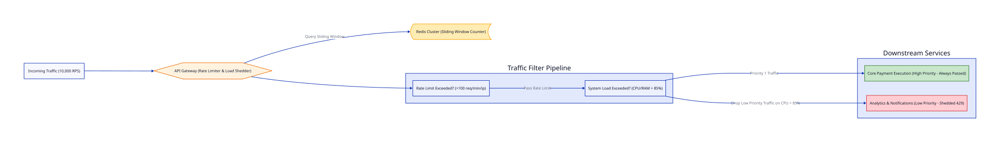

# Bài 11: Distributed Rate Limiting & Automated Load Shedding

> **Tóm tắt bài viết**: Phân tích kỹ thuật kiểm soát lưu lượng truy cập phân tán (**Distributed Rate Limiting**) sử dụng Redis Cluster, so sánh các thuật toán (Sliding Window, Token Bucket), và cơ chế **Automated Load Shedding** chủ động cắt giảm tải để bảo vệ các dịch vụ thanh toán cốt lõi.

---

## 1. Mối Nguy Quá Tải Trong Hệ Thống Thanh Toán (Cascading Failures)

Khi diễn ra sự kiện bùng nổ lưu lượng (Flash Sale, Tết), lượng request gửi tới API Gateway có thể tăng đột biến gấp $10 - 100$ lần bình thường.
- Nếu hệ thống cố gắng xử lý **tất cả** request: CPU & RAM bị kiệt huệ, DB Connection Pool bị cạn kiệt $\rightarrow$ Toàn bộ hệ thống bị sụp đổ dây chuyền (**Cascading Failure**).
- **Mục tiêu**: Thà từ chối $20\%$ lưu lượng vượt ngưỡng (trả về `429 Too Many Requests`) còn hơn để $100\%$ khách hàng chịu lỗi ngắt kết nối.

---

## 2. Các Thuật Toán Distributed Rate Limiting



### So sánh các thuật toán:

1. **Fixed Window Counter**: Đếm số request trong mỗi cửa sổ thời gian cố định (ví dụ: 1 phút).
   - *Khuyết điểm*: Dễ bị hiện tượng bùng nổ tải gấp đôi ở ranh giới giữa 2 cửa sổ (Boundary Burst).
2. **Sliding Window Log / Counter (Khuyên dùng trong qPayFlow)**:
   Sử dụng **Redis Sorted Set (ZSET)** để lưu timestamp từng request và loại bỏ các phần tử nằm ngoài cửa sổ sliding.
3. **Token Bucket**: Cung cấp khả năng cho phép bùng nổ tải nhẹ (Burstiness Support).

---

## 3. Lua Script Cấu Hình Sliding Window Trên Redis

Để đảm bảo tính nguyên tố (Atomic) khi kiểm tra và tăng biến đếm Rate Limit trên Redis Cluster:

```lua
-- Redis Lua Script: Sliding Window Rate Limiter
local key = KEYS[1]
local now = tonumber(ARGV[1])
local window = tonumber(ARGV[2])
local limit = tonumber(ARGV[3])
local clearBefore = now - window

-- 1. Xóa các request cũ hơn cửa sổ thời gian
redis.call('ZREMRANGEBYSCORE', key, 0, clearBefore)

-- 2. Đếm số request hiện tại trong window
local currentRequests = redis.call('ZCARD', key)

if currentRequests < limit then
    -- 3. Thêm request mới vào ZSET
    redis.call('ZADD', key, now, now)
    redis.call('EXPIRE', key, window)
    return 1 -- Allowed
else
    return 0 -- Rejected (Rate Limited)
end
```

---

## 4. Automated Load Shedding (Phân Loại Ưu Tiên Lưu Lượng)

Khi tài nguyên hệ thống (CPU hoặc Memory trên Pods) vượt quá ngưỡng nguy hiểm **$85\%$**:
- **Critical Flow (Ưu tiên số 1 - Chuyển tiền/Thanh toán)**: Luôn được ưu tiên xử lý.
- **Non-Essential Flow (Ưu tiên thấp - Báo cáo, Lịch sử, Notification)**: Tự động bị ngắt kết nối nhanh (**Load Shedding**) trả về `429 Too Many Requests` ngay từ API Gateway để giải phóng CPU cho luồng Thanh toán Core.

---

## 5. Tài Liệu Tham Khảo (Reputable References)

1. **Stripe Engineering**: [Scaling Your API with Rate Limiters and Load Shedders](https://stripe.com/blog/rate-limiters)
2. **Uber Engineering**: [Reliable Load Shedding at Uber Scale](https://www.uber.com/en-VN/blog/microservice-architecture-load-shedding/)
3. **AWS Builders' Library**: [Using Load Shedding to Avoid Overload](https://aws.amazon.com/builders-library/using-load-shedding-to-avoid-overload/)
4. **Redis Documentation**: [Programmability & Lua Scripting Best Practices](https://redis.io/docs/manual/programmability/)

