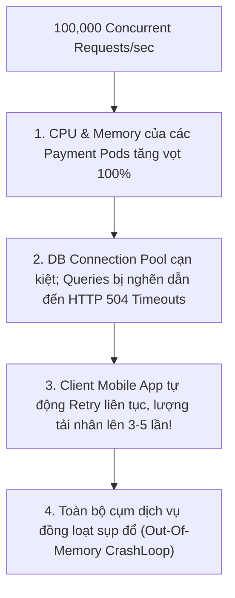

# Bài 11: Distributed Rate Limiting & Automated Load Shedding

> **Tóm tắt bài viết**: Phân tích kỹ thuật kiểm soát lưu lượng truy cập phân tán (**Distributed Rate Limiting**) sử dụng Redis Cluster, so sánh chi tiết các thuật toán (Token Bucket, Leaky Bucket, Sliding Window Counter), tối ưu hóa tính nguyên tử với **Redis Lua Scripting**, và cơ chế tự vệ **Automated Priority Load Shedding** nhằm ngăn chặn sự sụp đổ dây chuyền (**Cascading Failures**) trong các đợt Flash Sale.

---

## 1. Mối Nguy Quá Tải Trong Hệ Thống Thanh Toán (Cascading Failures)

Khi diễn ra các sự kiện bùng nổ lưu lượng giao dịch (Flash Sale 11/11, Đêm Giao Thừa, Mở bán vé Concert), số lượng request gửi tới API Gateway có thể tăng đột biến gấp $20 - 100$ lần so với ngày thường:



> **Triết lý SRE cốt lõi**: Thà chủ động từ chối $30\%$ lưu lượng vượt ngưỡng (trả về `HTTP 429 Too Many Requests`) để $70\%$ giao dịch còn lại hoàn tất trơn tru trong $50\text{ms}$, còn hơn cố chấp tiếp nhận tất cả để rồi **$100\%$ khách hàng đều bị sập và mất tiền**.

---

## 2. So Sánh Các Thuật Toán Rate Limiting


### Bảng phân tích 4 thuật toán phổ biến:

| Thuật Toán | Cơ Chế Hoạt Động | Ưu Điểm | Nhược Điểm | Sử Dụng Trong qPayFlow |
| :--- | :--- | :--- | :--- | :--- |
| **Fixed Window Counter** | Đếm số request trong một khung giờ cố định (ví dụ: 10:00 - 10:01). | Cực kỳ tiết kiệm bộ nhớ RAM trên Redis. | Bị hiện tượng **Boundary Burst** (lưu lượng tăng gấp đôi tại điểm giao thoa giữa 2 phút). | Chặn spam IP thô sơ ở tầng ngoài cùng |
| **Sliding Window Log** | Lưu timestamp của từng request vào Redis Sorted Set (ZSET). | Chính xác tuyệt đối 100%, không bị boundary burst. | Tốn nhiều RAM nếu lượng request quá lớn ($O(N)$ phần tử). | Giới hạn theo từng Merchant API Key |
| **Sliding Window Counter** | Kết hợp trọng số giữa cửa sổ trước và cửa sổ hiện tại. | Cân bằng hoàn hảo giữa độ chính xác và mức tiêu thụ RAM. | Độ chính xác xấp xỉ ($\sim 99\%$). | **Rate Limiting mặc định cho toàn bộ Public APIs** |
| **Token Bucket** | Đổ Token vào xô với tốc độ cố định $r$; tiêu thụ 1 token mỗi request. | Cho phép bùng nổ tải ngắn hạn (Traffic Burst) rất linh hoạt. | Cần lưu trạng thái token và timestamp nạp. | Quản lý hạn mức API cho đối tác Doanh nghiệp |

---

## 3. Lua Script Cấu Hình Sliding Window Atomic Trên Redis Cluster

Khi có hàng trăm Pod API Gateway cùng truy cập Redis đồng thời, việc chạy các lệnh Redis riêng lẻ (`ZREMRANGEBYSCORE`, `ZCARD`, `ZADD`) sẽ bị **Race Condition**. Giải pháp bắt buộc là đóng gói toàn bộ logic vào một **Redis Lua Script** để thực thi nguyên tử:

```lua
-- Redis Lua Script: Sliding Window Rate Limiter
-- KEYS[1]: Identifier Key (e.g., "ratelimit:user_123:endpoint_transfer")
-- ARGV[1]: Current Timestamp in Milliseconds
-- ARGV[2]: Window Size in Milliseconds (e.g., 60000 for 1 minute)
-- ARGV[3]: Max Limit allowed in window (e.g., 100 requests)

local key = KEYS[1]
local now = tonumber(ARGV[1])
local window = tonumber(ARGV[2])
local limit = tonumber(ARGV[3])
local clearBefore = now - window

-- 1. Loại bỏ các request đã nằm ngoài cửa sổ trượt
redis.call('ZREMRANGEBYSCORE', key, 0, clearBefore)

-- 2. Đếm số lượng request hợp lệ hiện tại trong cửa sổ
local currentRequests = redis.call('ZCARD', key)

-- 3. Kiểm tra xem có vượt quá hạn mức cho phép không
if currentRequests < limit then
    -- Thêm request hiện tại vào Sorted Set (Score = Timestamp)
    redis.call('ZADD', key, now, now)
    -- Thiết lập TTL tự động dọn dẹp bộ nhớ sau khi hết window
    redis.call('PEXPIRE', key, window)
    return {1, limit - currentRequests - 1} -- [Allowed: True, Remaining Tokens]
else
    return {0, 0} -- [Allowed: False, Rate Limited]
end
```

### Triển khai Middleware trong Go (`api-gateway`):

```go
func RateLimitMiddleware(redisClient *redis.Client, limit int, window time.Duration) gin.HandlerFunc {
	return func(c *gin.Context) {
		clientID := c.ClientIP()
		if apiKey := c.GetHeader("X-API-Key"); apiKey != "" {
			clientID = apiKey
		}

		key := fmt.Sprintf("ratelimit:%s:%s", clientID, c.FullPath())
		now := time.Now().UnixMilli()
		windowMs := window.Milliseconds()

		// Thực thi Lua script nguyên tử
		res, err := slidingWindowScript.Run(c.Request.Context(), redisClient, []string{key}, now, windowMs, limit).Slice()
		if err != nil {
			slog.Error("rate limiter redis error", "error", err)
			// Chiến lược Fail-Open để không chặn nhầm khách hàng khi Redis có sự cố
			c.Next()
			return
		}

		allowed := res[0].(int64) == 1
		remaining := res[1].(int64)

		c.Header("X-RateLimit-Limit", strconv.Itoa(limit))
		c.Header("X-RateLimit-Remaining", strconv.FormatInt(remaining, 10))

		if !allowed {
			c.AbortWithStatusJSON(http.StatusTooManyRequests, gin.H{
				"error":   "RATE_LIMIT_EXCEEDED",
				"message": "Too many requests. Please retry after some time.",
			})
			return
		}

		c.Next()
	}
}
```

---

## 4. Automated Load Shedding (Cắt Giảm Tải Chủ Động Theo Mức Độ Ưu Tiên)

Khác với Rate Limiting (giới hạn theo từng Client), **Load Shedding** là hành động tự vệ của hệ thống khi nhận thấy các chỉ số sinh tồn nội tại (CPU, Memory, In-flight Requests, GC Pauses) chạm ngưỡng nguy hiểm:

| Phân Cấp | Danh Mục API | Hành Vi Khi Tải Cao / Quá Tải |
| :--- | :--- | :--- |
| **Tier 1 (Critical)** | Xác nhận Thanh toán, Chuyển tiền Core Ledger | **KHÔNG BAO GIỜ DROP** (Luôn ưu tiên phục vụ 100%) |
| **Tier 2 (Standard)** | Tra cứu số dư, Xem danh sách đơn hàng | Cho phép xếp hàng chờ hoặc Drop khi CPU Pod $> 85\%$ |
| **Tier 3 (Background)** | Xuất báo cáo Excel, Gửi Push Notification | **DROP NGAY LẬP TỨC** khi CPU chớm $> 75\%$ |

---

## 5. Góc Chuyên Sâu: Phân Tích Kỹ Thuật & Tình Huống Thực Tế

### Case 1: Xử lý sự cố cụm Redis Rate Limiter bị sập hoặc nghẽn độ trễ (Fail-Open vs Fail-Closed)

**Bối cảnh sự cố:** Cụm Redis phân tán phục vụ Rate Limiting bị quá tải hoặc rớt mạng kết nối trong 2 phút.

**Phân tích sự đánh đổi kiến trúc (Fail-Open vs Fail-Closed):**
- **Nếu chọn Fail-Closed (Thất bại là Chặn)**:
  - Khi không kết nối được tới Redis, API Gateway từ chối toàn bộ request $\rightarrow$ Hệ thống thanh toán lập tức bị sập 100%, gây tổn thất doanh thu khổng lồ dù database PostgreSQL và các microservice backend bên dưới vẫn hoàn toàn khỏe mạnh!
- **Lựa chọn đúng đắn của qPayFlow: Fail-Open kết hợp Local In-Memory Fallback**:
  - Khi lệnh gọi Redis bị timeout quá $10\text{ms}$ hoặc trả về lỗi kết nối, API Gateway ghi log Warning và tự động chuyển sang chế độ **Fail-Open** (cho phép request đi tiếp).
  - Đồng thời kích hoạt bộ đệm Rate Limiter cục bộ trong bộ nhớ RAM của chính Pod Gateway (sử dụng Token Bucket in-memory dựa trên `sync.Map` hoặc `uber-go/ratelimit`) để duy trì mức bảo vệ cơ bản.

---

### Case 2: Kỹ thuật CoDel (Controlled Delay) và Phân tích Hàng Đợi Chống Lãng Phí CPU

**Bối cảnh:** Khi máy chủ bị quá tải, hàng nghìn request xếp hàng trong hàng đợi (Queue). Nhiều request đã nằm chờ trong hàng đợi suốt 15 giây (trong khi Client Mobile App đã timeout và đóng kết nối từ giây thứ 5).

**Lãng phí thảm họa:**
- Khi CPU rảnh, server lấy request từ hàng đợi ra xử lý, thực thi câu lệnh SQL tốn $200\text{ms}$, rồi trả response về một TCP Socket đã đóng!
- Server đang phí phạm $100\%$ năng lực tính toán quý giá để phục vụ các **"Request thây ma" (Zombie Requests)**.

**Giải pháp với CoDel Algorithm & Deadline Propagation:**
- Mỗi request khi đi vào Gateway được gắn một **Context Deadline** (ví dụ: Timeout 3 giây).
- Khi request được lấy ra khỏi Queue để chuẩn bị thực thi, việc đầu tiên là kiểm tra `ctx.Err() == context.DeadlineExceeded` hoặc đo thời gian đã nằm trong Queue (**Queue Delay**).
- Nếu thời gian chờ trong Queue đã vượt quá $2\text{s}$, service lập tức hủy (Drop) request đó trong $0.01\text{ms}$ mà không tốn công gọi vào Database, dành trọn vẹn tài nguyên cho các request mới còn cơ hội thành công.

---

### Case 3: Chống gian lận bằng IP Spoofing trong Distributed Rate Limiting

**Bối cảnh:** Kẻ tấn công gửi hàng triệu request spam và liên tục thay đổi header `X-Forwarded-For: <fake_ip>` để vượt qua cơ chế Rate Limit theo IP của Gateway.

**Cơ chế phòng thủ:**
- **Không bao giờ tin tưởng mù quáng `X-Forwarded-For` đầu tiên**: Kẻ tấn công có thể chèn chuỗi IP giả mạo vào đầu danh sách header.
- **Quy tắc xác định Client IP chuẩn xác**:
  - Chỉ lấy IP do chính Reverse Proxy / Cloudflare gắn vào tại ranh giới ngoài cùng (ví dụ: `CF-Connecting-IP` hoặc trích xuất IP từ phần tử cuối cùng của chuỗi `X-Forwarded-For` tương ứng với IP của Proxy tin cậy).
  - Kết hợp định danh đa yếu tố: `RateLimitKey = SHA256(Trusted_IP + ":" + User_Agent_Hash + ":" + UserID)`.

---

## 6. Tài Liệu Tham Khảo (Reputable References)

1. **Stripe Engineering**: [Scaling Your API with Rate Limiters and Load Shedders](https://stripe.com/blog/rate-limiters)
2. **Uber Engineering**: [Reliable Load Shedding at Uber Scale](https://www.uber.com/en-VN/blog/microservice-architecture-load-shedding/)
3. **AWS Builders' Library**: [Using Load Shedding to Avoid Overload (Marc Brooker)](https://aws.amazon.com/builders-library/using-load-shedding-to-avoid-overload/)
4. **Redis Documentation**: [Programmability & Lua Scripting Best Practices](https://redis.io/docs/manual/programmability/)
5. **Kathleen Nichols & Van Jacobson**: [Controlling Queue Delay (CoDel Algorithm - ACM Queue)](https://queue.acm.org/detail.cfm?id=2209336)
