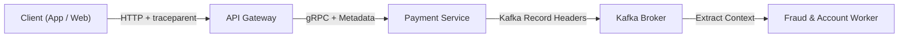

# Bài 12: Distributed Context Propagation qua Asynchronous Boundaries (OpenTelemetry & W3C Trace Context)

> **Tóm tắt bài viết**: Khám phá kỹ thuật truyền ngữ cảnh phân tán (**Distributed Context Propagation**) vượt qua các ranh giới giao tiếp bất đồng bộ (Apache Kafka / RabbitMQ) bằng tiêu chuẩn **W3C Trace Context**, cấu hình thu thập Spans với **OpenTelemetry Go SDK**, chiến lược lấy mẫu thích ứng (**Tail-Based Sampling**), và phân tích tắc nghẽn hiệu năng trên **Jaeger / Grafana Tempo**.

---

## 1. Thách Thức Distributed Tracing Vượt Ranh Giới Asynchronous

Trong kiến trúc Microservices phân tán, một yêu cầu thanh toán không chỉ đi qua các lệnh gọi HTTP/gRPC đồng bộ mà còn kích hoạt hàng loạt tác vụ chạy ngầm bất đồng bộ qua Message Brokers:



### Điểm gãy ngữ cảnh (The Broken Trace Problem):
- Nếu chỉ truyền `Trace ID` qua HTTP/gRPC Headers: Luồng vết sẽ bị **đứt gãy hoàn toàn** ngay khi Payment Service phát Event vào Kafka Broker.
- Khi Worker tiêu thụ message từ Kafka vài giây (hoặc vài phút) sau đó, Worker sẽ sinh ra một `Trace ID` mới tinh.
- **Hậu quả**: Kỹ sư không thể liên kết được giữa lỗi trừ tiền trong Worker với cú click thanh toán ban đầu của khách hàng trên giao diện App.

---

## 2. Chuẩn W3C Trace Context & Kafka Record Headers


### Cấu trúc chuỗi tiêu chuẩn W3C `traceparent`:
$$\underbrace{\text{00}}_{\text{Version}} - \underbrace{\text{4bf92f3577b34da6a3ce929d0e0e4736}}_{\text{Trace ID (16 bytes / 32 hex)}} - \underbrace{\text{00f067aa0ba902b7}}_{\text{Parent Span ID (8 bytes / 16 hex)}} - \underbrace{\text{01}}_{\text{Trace Flags (Sampled)}}$$

### Triển khai Inject & Extract trong Go với OpenTelemetry:

```go
package tracing

import (
	"context"
	"github.com/segmentio/kafka-go"
	"go.opentelemetry.io/otel"
	"go.opentelemetry.io/otel/propagation"
	"go.opentelemetry.io/otel/trace"
)

// KafkaHeaderCarrier cài đặt interface TextMapCarrier của OpenTelemetry
type KafkaHeaderCarrier []kafka.Header

func (c *KafkaHeaderCarrier) Get(key string) string {
	for _, h := range *c {
		if h.Key == key {
			return string(h.Value)
		}
	}
	return ""
}

func (c *KafkaHeaderCarrier) Set(key string, val string) {
	*c = append(*c, kafka.Header{Key: key, Value: []byte(val)})
}

func (c *KafkaHeaderCarrier) Keys() []string {
	keys := make([]string, len(*c))
	for i, h := range *c {
		keys[i] = h.Key
	}
	return keys
}

// InjectContextToKafka gắn TraceContext hiện tại vào Message Headers của Kafka
func InjectContextToKafka(ctx context.Context, msg *kafka.Message) {
	carrier := (*KafkaHeaderCarrier)(&msg.Headers)
	otel.GetTextMapPropagator().Inject(ctx, carrier)
}

// ExtractContextFromKafka trích xuất TraceContext từ Message Headers của Kafka
func ExtractContextFromKafka(ctx context.Context, msg *kafka.Message) (context.Context, trace.Span) {
	carrier := (*KafkaHeaderCarrier)(&msg.Headers)
	extractedCtx := otel.GetTextMapPropagator().Extract(ctx, carrier)

	tracer := otel.GetTracerProvider().Tracer("qpayflow-consumer")
	return tracer.Start(extractedCtx, "kafka.consume."+msg.Topic, trace.WithSpanKind(trace.SpanKindConsumer))
}
```

---

## 3. Chiến Lược Lấy Mẫu Tracing: Head-Based vs Tail-Based Sampling

Khi hệ thống xử lý $50,000\text{ TPS}$, việc thu thập $100\%$ Spans sẽ tạo ra hàng chục Terabyte dữ liệu mỗi ngày, làm nghẽn hạ tầng lưu trữ OpenSearch/Tempo và tiêu tốn hàng chục nghìn USD chi phí cloud.

| Tiêu Chí So Sánh | Head-Based Sampling | Tail-Based Sampling (Khuyên Dùng Trong qPayFlow) |
| :--- | :--- | :--- |
| **Thời điểm quyết định lưu vết** | Ngay tại API Gateway (khi request vừa tới) | Tại OpenTelemetry Collector sau khi request đã hoàn tất |
| **Cơ chế chọn lọc mẫu** | Random ngẫu nhiên theo tỷ lệ (ví dụ: lấy cố định 1%) | Dựa trên kết quả thực tế (Status Code $\ge 400$, Latency $p99$) |
| **Nguy cơ mất vết khi có sự cố** | Rất cao (dễ bỏ lỡ đúng request bị lỗi) | **0% bỏ lỡ** (luôn giữ lại 100% giao dịch lỗi và giao dịch chậm) |
| **Chi phí lưu trữ & Tính hiệu quả** | Cố định thấp nhưng lãng phí | Cực thấp & Tối đa hóa giá trị debug lỗi tài chính |

### Cấu hình Tail-Based Sampling trên OpenTelemetry Collector:

```yaml
processors:
  tail_sampling:
    decision_wait: 5s
    num_traces: 50000
    expected_new_traces_per_sec: 2000
    policies:
      # Quy tắc 1: Luôn giữ lại 100% các trace bị lỗi (HTTP 5xx / gRPC Error)
      - name: drop-errors-never
        type: status_code
        status_code: { status_codes: [ ERROR ] }
      # Quy tắc 2: Luôn giữ lại các trace có độ trễ bất thường p99 > 1500ms
      - name: slow-traces-policy
        type: latency
        latency: { threshold_ms: 1500 }
      # Quy tắc 3: Với các request thành công thông thường, chỉ lấy 0.5% để đo lường
      - name: normal-probabilistic
        type: probabilistic
        probabilistic: { sampling_percentage: 0.5 }
```

---

## 4. Góc Chuyên Sâu: Phân Tích Kỹ Thuật & Tình Huống Thực Tế

### Case 1: Điều tra một giao dịch thanh toán bị chậm 3.5 giây bằng Flame Graph

**Bối cảnh sự cố:** Một giao dịch thanh toán thẻ mất tới $3.5\text{s}$ (trong khi SLA yêu cầu $< 300\text{ms}$). Khách hàng khiếu nại nhưng log từng service riêng lẻ không chỉ ra lỗi.

**Quy trình phân tích Trace trên Jaeger/Tempo:**
1. Tra cứu `TraceID` trên Jaeger UI, hệ thống hiển thị biểu đồ phân rã (Waterfall / Flame Graph):
   - `api-gateway`: Tổng thời gian $3510\text{ms}$
   - `payment-service` (gRPC): $3480\text{ms}$
   - `account-service.ReserveBalance` (gRPC): $3420\text{ms}$
   - `postgres.query (SELECT ... FOR UPDATE)`: **$3400\text{ms}$**!
2. **Tìm ra nguyên nhân gốc rễ (Root Cause)**:
   - Span chi tiết của Postgres hiển thị câu lệnh đang chờ khóa tài khoản số `42`.
   - Một giao dịch nạp tiền thẻ cào chạy trước đó đang bị treo (Uncommitted Transaction) giữ chặt Row Lock của tài khoản 42.
   - Nhờ có Tracing Spans, kỹ sư định vị chính xác nguyên nhân nghẽn là do Database Row Contention tại một dòng cụ thể chỉ trong vòng 3 phút mà không phải đoán mò.

---

### Case 2: Truyền Trace Context qua các kiến trúc Event Sourcing và CDC Debezium

**Bối cảnh:** Khi áp dụng Transactional Outbox với CDC Debezium, sự kiện được ghi vào Postgres WAL, Debezium đọc WAL và đẩy sang Kafka. Làm thế nào để giữ được `TraceID` xuyên suốt chuỗi này?

**Giải pháp kỹ thuật:**
- Bảng `outbox_events` được thiết kế có thêm cột `metadata JSONB` lưu trữ `{"traceparent": "00-4bf9...-01"}`.
- Khi Payment Service thực thi, Go OTel SDK trích xuất context hiện tại thành chuỗi và lưu vào cột `metadata`.
- Khi Debezium đọc bảng này và đẩy sang Kafka, ta cấu hình Debezium SMT (Single Message Transform) hoặc Kafka Header Router để trích xuất trường `traceparent` trong payload và đưa ngược lên Kafka Record Headers.
- Consumer hạ tầng đọc Kafka Headers và tiếp tục chuỗi Trace một cách liền mạch $100\%$.

---

### Case 3: Chống rò rỉ dữ liệu nhạy cảm (PII Leakage) trong Tracing Attributes

**Bối cảnh:** Lập trình viên vô tình gắn số thẻ tín dụng hoặc mật khẩu vào Span Attributes: `span.SetAttributes(attribute.String("card.number", pan))`.

**Hậu quả & Quy chuẩn làm sạch dữ liệu (Data Sanitization):**
- Toàn bộ dữ liệu nhạy cảm bị lưu vào máy chủ Jaeger/Tempo không mã hóa, vi phạm nghiêm trọng chuẩn **PCI-DSS** và có nguy cơ bị phạt hàng triệu USD.
- **Quy tắc bảo vệ trong qPayFlow**:
  1. Sử dụng **OpenTelemetry Collector Redaction Processor** để quét Regex và tự động che giấu (Masking) các trường nhạy cảm (`card_number`, `cvv`, `password`, `ssn`) thành `****`.
  2. Bổ sung Linter kiểm tra code Go (`golangci-lint` custom rule) cấm gọi `SetAttributes` với các biến chứa định danh thẻ.

---

## 5. Tài Liệu Tham Khảo (Reputable References)

1. **W3C Recommendation**: [W3C Trace Context Specification](https://www.w3.org/TR/trace-context/)
2. **OpenTelemetry Official Documentation**: [Context Propagation & Go SDK Guide](https://opentelemetry.io/docs/specs/otel/trace/api/#propagators)
3. **Grafana Labs**: [Distributed Tracing with Grafana Tempo & OpenTelemetry](https://grafana.com/docs/tempo/latest/)
4. **Uber Engineering**: [Jaeger Distributed Tracing Platform Architecture](https://www.jaegertracing.io/docs/)
5. **Ted Young & Yuri Shkuro**: *Mastering Distributed Tracing: Analyzing performance in microservices*.
