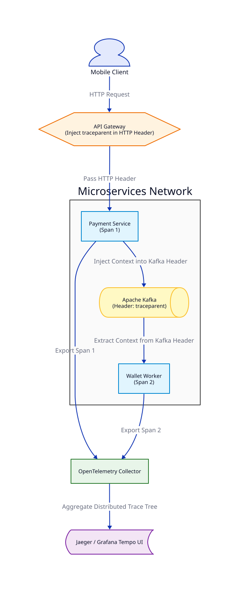

# Bài 12: Distributed Context Propagation qua Asynchronous Boundaries (OpenTelemetry & W3C Trace Context)

> **Tóm tắt bài viết**: Phân tích kỹ thuật truyền ngữ cảnh phân tán (**Distributed Context Propagation**) vượt qua ranh giới giao tiếp bất đồng bộ (Kafka/RabbitMQ) bằng tiêu chuẩn **W3C Trace Context**, thu thập Spans với **OpenTelemetry Collector** và trực quan hóa luồng giao dịch trên **Jaeger / Grafana Tempo**.

---

## 1. Thách Thức Tracing Trong Hệ Thống Asynchronous

Khi một request giao dịch đi qua 5-10 Microservices qua cả gRPC/HTTP lẫn Kafka Events:
- Nếu chỉ truyền `Trace ID` qua HTTP Header: Luồng vết sẽ bị **đứt gãy** ngay khi Payment Service ghi Event vào Kafka Broker.
- Khi Consumer đọc Event từ Kafka vài giây/vài phút sau, Consumer không thể biết Event này bắt nguồn từ Request HTTP nào của người dùng.

---

## 2. Chuẩn W3C Trace Context & Kafka Record Headers



### Cấu trúc chuỗi W3C `traceparent`:
$$\text{version} - \text{trace\_id} - \text{parent\_span\_id} - \text{trace\_flags}$$
$$\text{Ví dụ: } \texttt{00-4bf92f3577b34da6a3ce929d0e0e4736-00f067aa0ba902b7-01}$$

### Cơ chế lan truyền (Propagation Flow):
1. **API Gateway**: Tạo mới `Trace ID` và `Span ID`.
2. **HTTP/gRPC Call**: Gán `traceparent` vào HTTP Headers.
3. **Kafka Producer**: Đóng gói `traceparent` vào **Kafka Record Headers**:

```go
// Go Pseudocode: Inject OpenTelemetry Context vào Kafka Record Headers
func PublishKafkaEvent(ctx context.Context, msg *kafka.Message) {
    headers := make([]kafka.Header, 0)
    // Inject otel traceparent into headers
    otel.GetTextMapPropagator().Inject(ctx, propagation.MapCarrier(headersMap))
    
    for k, v := range headersMap {
        headers = append(headers, kafka.Header{Key: k, Value: []byte(v)})
    }
    msg.Headers = headers
    producer.Produce(msg)
}
```

4. **Kafka Consumer**: Trích xuất (Extract) `traceparent` từ Record Headers để khôi phục lại Parent Trace ID $\rightarrow$ **Giữ liên tục luồng vết end-to-end!**

---

## 3. Kiến Trúc OpenTelemetry Collector & Jaeger UI

- **OpenTelemetry SDK**: Được nhúng trong từng Microservice Go/Java để thu thập thông số thời gian thực thi (Spans, Durations, Errors).
- **OTel Collector**: Thu gom toàn bộ Tracing data từ các service qua giao thức OTLP (OpenTelemetry Protocol - gRPC/HTTP).
- **Jaeger / Grafana Tempo**: Hiển thị sơ đồ Flame Graph giúp kỹ sư phát hiện ngay Microservice nào đang bị nghẽn (Bottleneck).

---

## 4. Tài Liệu Tham Khảo (Reputable References)

1. **OpenTelemetry Specification**: [Context Propagation & OpenTelemetry Go SDK](https://opentelemetry.io/docs/specs/otel/trace/api/#propagators)
2. **W3C Recommendation**: [W3C Trace Context Specification](https://www.w3.org/TR/trace-context/)
3. **Uber Jaeger**: [Distributed Tracing in Microservices Architecture](https://www.jaegertracing.io/docs/)
4. **Grafana Labs**: [Trace-to-Logs and Trace-to-Metrics Integration](https://grafana.com/docs/tempo/latest/)

