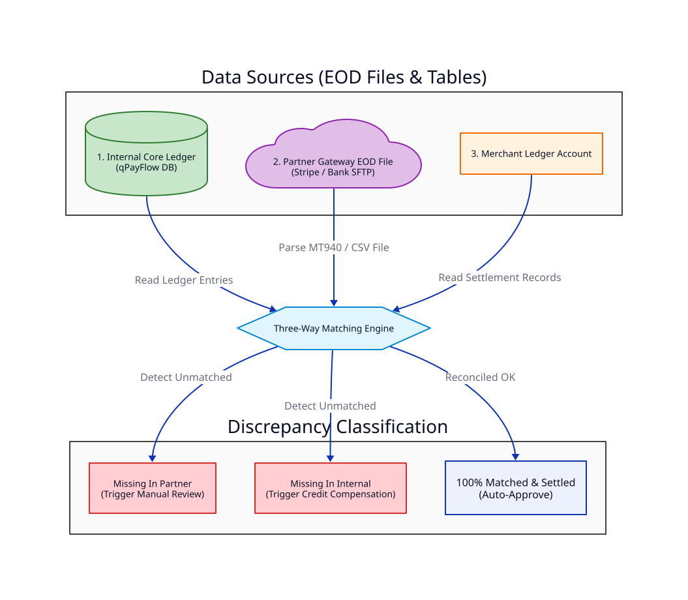
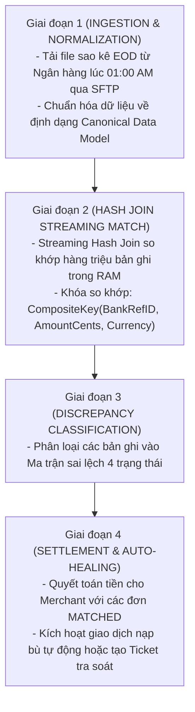

# Bài 13: Thuật Toán Đối Soát 3 Chiều (Three-Way Reconciliation Engine)

> **Tóm tắt bài viết**: Phân tích chi tiết kiến trúc thuật toán đối soát 3 chiều (**Three-Way Reconciliation Engine**), đối chiếu dữ liệu giữa **Sổ cái nội bộ (Internal Ledger)**, **Cổng thanh toán đối tác (Bank EOD Statement)** và **Tài khoản quyết toán Merchant**, phân loại ma trận sai lệch tài chính và quy trình tự động bồi hoàn (**Automated Compensation Workflows**).

---

## 1. Bản Chất Của Đối Soát Trong Hệ Thống Tài Chính

Trong thế giới thanh toán, không bao giờ có sự tin tưởng tuyệt đối giữa các hệ thống phần mềm phân tán qua mạng. Một giao dịch chỉ được coi là hoàn tất về mặt tài chính và kế toán khi nó được xác nhận nhất quán từ **3 nguồn dữ liệu độc lập**:



| Nguồn Dữ Liệu | Định Dạng Lưu Trữ | Ý Nghĩa Nghiệp Vụ Kế Toán |
| :--- | :--- | :--- |
| **1. qPayFlow Gateway Log** | PostgreSQL OLTP Records | Ghi nhận trạng thái giao dịch từ lúc nhận request của Client |
| **2. Core Ledger Entries** | Immutable Double-Entry Records | Bút toán ghi nợ/ghi có thực tế trong số dư tài khoản người dùng |
| **3. Bank EOD File Statement** | CSV / MT940 / CAMT.053 qua SFTP | Sao kê chính thức từ ngân hàng ghi nhận dòng tiền thực tế chạy |

---

## 2. Quy Trình 4 Giai Đoạn Của Reconciliation Engine



---

## 3. Ma Trận Phân Loại Sai Lệch Tài Chính (Discrepancy Matrix)

| Trạng Thái Sai Lệch | Cổng qPayFlow | Core Ledger | Bank Statement | Nguyên Nhân Kỹ Thuật Gốc | Hành Động Xử Lý Tự Động (Resolution) |
| :--- | :---: | :---: | :---: | :--- | :--- |
| **MATCHED** | `SUCCESS` | `SUCCESS` | `SUCCESS` | Giao dịch hoàn hảo ở cả 3 bên. | ✅ Tự động duyệt giải ngân tiền cho Merchant (Auto-Payout). |
| **MISSING_IN_INTERNAL** | ❌ Không có | ❌ Không có | `SUCCESS` | Khách bị trừ tiền ở Bank nhưng qPayFlow bị sập mạng khi nhận webhook. | ⚠️ **Auto-Credit Compensation**: Tự động tạo bút toán nạp tiền bù vào ví khách hàng. |
| **MISSING_IN_BANK** | `SUCCESS` | `SUCCESS` | ❌ Không có | Hệ thống ghi nhận thành công nhưng ngân hàng chưa thực sự trừ tiền. | ❌ Đóng băng khoản tiền, thu hồi đơn hàng, mở Ticket khẩn cấp với Bank. |
| **AMOUNT_MISMATCH** | $100.00 | $100.00 | $95.00 | Sai lệch phí giao dịch (MDR) hoặc tỷ giá ngoại tệ làm tròn. | 🔍 Chuyển sang hàng đợi Tra soát Thủ công (Manual Review Queue). |
| **STATUS_MISMATCH** | `FAILED` | `FAILED` | `SUCCESS` | Giao dịch timeout ở Gateway nhưng sau đó ngân hàng lại xử lý thành công. | ⚠️ Hoàn tiền tự động (Auto-Refund) về tài khoản thẻ của khách hàng. |

---

## 4. Triển Khai Thuật Toán Streaming Matching Bằng Go

Để đối soát 10 triệu giao dịch mỗi đêm mà không làm tràn bộ nhớ RAM (OOM):

```go
package recon

import (
	"context"
	"fmt"
)

type CanonicalTx struct {
	TxID        string
	BankRef     string
	AmountCents int64
	Currency    string
	Status      string
}

type Discrepancy struct {
	Type        string // MATCHED, MISSING_IN_BANK, MISSING_IN_INTERNAL, AMOUNT_MISMATCH
	TxID        string
	BankRef     string
	DiffAmount  int64
	Description string
}

// StreamMatchEngine thực hiện so khớp 3 chiều với thuật toán Hash Map tối ưu bộ nhớ
func StreamMatchEngine(ctx context.Context, internalLedger map[string]CanonicalTx, bankStatements map[string]CanonicalTx) []Discrepancy {
	var discrepancies []Discrepancy
	matchedBankRefs := make(map[string]bool)

	// 1. Quét toàn bộ dữ liệu nội bộ và so sánh với Bank
	for txID, intTx := range internalLedger {
		bankTx, existsInBank := bankStatements[intTx.BankRef]

		if !existsInBank {
			discrepancies = append(discrepancies, Discrepancy{
				Type:        "MISSING_IN_BANK",
				TxID:        txID,
				BankRef:     intTx.BankRef,
				Description: "Transaction recorded internally but absent from bank EOD statement",
			})
			continue
		}

		matchedBankRefs[intTx.BankRef] = true

		// Kiểm tra khớp số tiền
		if intTx.AmountCents != bankTx.AmountCents {
			discrepancies = append(discrepancies, Discrepancy{
				Type:        "AMOUNT_MISMATCH",
				TxID:        txID,
				BankRef:     intTx.BankRef,
				DiffAmount:  intTx.AmountCents - bankTx.AmountCents,
				Description: fmt.Sprintf("Amount mismatch: Internal=%d vs Bank=%d", intTx.AmountCents, bankTx.AmountCents),
			})
			continue
		}

		// Giao dịch khớp hoàn hảo
		discrepancies = append(discrepancies, Discrepancy{
			Type:    "MATCHED",
			TxID:    txID,
			BankRef: intTx.BankRef,
		})
	}

	// 2. Quét các giao dịch có trong Bank nhưng thiếu ở dữ liệu nội bộ
	for bankRef, bankTx := range bankStatements {
		if !matchedBankRefs[bankRef] {
			discrepancies = append(discrepancies, Discrepancy{
				Type:        "MISSING_IN_INTERNAL",
				BankRef:     bankRef,
				DiffAmount:  bankTx.AmountCents,
				Description: "Money debited at bank but missing in internal ledger (Network Drop)",
			})
		}
	}

	return discrepancies
}
```

---

## 5. Góc Chuyên Sâu: Phân Tích Kỹ Thuật & Tình Huống Thực Tế

### Case 1: Lệch giờ chốt sổ (Cut-off Time Window Offset) giữa Cổng thanh toán và Ngân hàng đối tác

**Bối cảnh:** Ngân hàng đối tác thực hiện chốt sổ ngày (Cut-off time) vào lúc **23:00:00 (GMT+7)**, trong khi qPayFlow tính một ngày kế toán từ **00:00:00 đến 23:59:59 (GMT+7)**.

**Hậu quả sai lệch giả tạo (False Positive Discrepancies):**
- Một giao dịch diễn ra lúc `23:15:00 ngày 15/8`:
  - Trong qPayFlow: Thuộc ngày `15/8`.
  - Trong File EOD của Ngân hàng: Bị đẩy sang ngày `16/8`.
- Nếu so khớp máy móc theo từng ngày riêng biệt, giao dịch này sẽ bị báo lỗi `MISSING_IN_BANK` vào ngày 15/8 và bị báo lỗi `MISSING_IN_INTERNAL` vào ngày 16/8!

**Giải pháp: Kỹ thuật Sliding Window Reconciliation (Cửa sổ trượt $\pm T$):**
- Công cụ đối soát không chỉ so sánh dữ liệu của ngày $D$, mà luôn nạp thêm vùng đệm (Buffer Window) $\pm 2$ giờ của ngày $D-1$ và ngày $D+1$.
- Bất kỳ giao dịch nào phát sinh quanh khung giờ cut-off ($22:30 - 00:30$) được gắn cờ `CUT_OFF_TRANSIT` và tự động tìm kiếm đối ứng trong phạm vi cửa sổ trượt trước khi đưa ra kết luận sai lệch.

---

### Case 2: Tự động hóa quy trình bồi hoàn tiền (Automated Compensation) cho khách hàng bị trừ tiền oan

**Bối cảnh:** Khách hàng thanh toán 50 USD tại cửa hàng tiện lợi. Cổng qPayFlow bị timeout, hiển thị trên App *"Giao dịch thất bại"*. Nhưng thực tế tài khoản ngân hàng của khách đã bị trừ 50 USD. Khách hàng buộc phải trả tiền mặt và bức xúc khiếu nại.

**Quy trình xử lý tự động trong đợt đối soát đêm:**
1. Đợt đối soát 01:00 AM phát hiện giao dịch `BankRef_9981` có trạng thái `MISSING_IN_INTERNAL` (hoặc `STATUS_MISMATCH`).
2. Reconciliation Service tự động kích hoạt **Compensating Workflow**:
   - Khởi tạo giao dịch hoàn tiền tự động (Auto-Refund) qua API ngân hàng trả lại 50 USD vào thẻ cho khách hàng.
   - Nếu hoàn tiền qua ngân hàng không khả dụng, tự động nạp 50 USD vào số dư Ví qPayFlow của khách hàng kèm một khoản Voucher đền bù 2 USD và gửi tin nhắn xin lỗi.
3. Toàn bộ quy trình hoàn tất tự động trước 06:00 AM sáng hôm sau, biến một trải nghiệm tồi tệ của khách hàng thành sự hài lòng mà không tốn một phút nhân công hỗ trợ.

---

### Case 3: Xử lý bài toán sai lệch tỷ giá và làm tròn số thập phân (FX Rounding Errors) trong thanh toán quốc tế

**Bối cảnh:** Khách hàng mua hàng từ Merchant nước ngoài bằng VND quy đổi ra USD. Số tiền là $10.33333...$ USD.

**Rủi ro sai lệch:** Nếu hệ thống làm tròn không đồng nhất (một bên dùng Round-Half-Up, một bên dùng Bankers' Rounding), hai hệ thống sẽ lệch nhau 1 cent ($0.01$).

**Quy chuẩn kế toán trong qPayFlow:**
- Tuyệt đối không dùng kiểu dữ liệu dấu phẩy động (`FLOAT / DOUBLE`) trong code hay cơ sở dữ liệu.
- Lưu trữ mọi giá trị tiền tệ dưới dạng số nguyên nhỏ nhất (**Minor Currency Units / Cents** - ví dụ 100 USD = `10000` cents, 100,000 VND = `100000` đơn vị đồng).
- Áp dụng chuẩn làm tròn ngân hàng quốc tế **Half-Even Rounding (Bankers' Rounding)** trên tất cả các microservices và thiết lập ngưỡng dung sai đối soát (Reconciliation Tolerance Threshold) là $\le 1\text{ cent}$ kèm theo tài khoản hạch toán riêng `4090-FX-ROUNDING-DIFFERENCE` để cân bằng sổ cái.

---

## 6. Tài Liệu Tham Khảo (Reputable References)

1. **Stripe Engineering**: [Reconciliation and Settlement Reports Architecture](https://stripe.com/docs/reports/reconciliation)
2. **Gergely Orosz (The Pragmatic Engineer)**: [Designing Financial Reconciliation Systems](https://newsletter.pragmaticengineer.com/)
3. **SWIFT International Standards**: [MT940 Customer Statement Message & CAMT.053 XML Guidelines](https://www.swift.com/)
4. **Adyen Docs**: [Financial Reporting and Automated Payout Reconciliation](https://docs.adyen.com/reporting/reconciliation)
5. **Martin Fowler**: *Accounting Patterns: Money and Currency Representation*.
