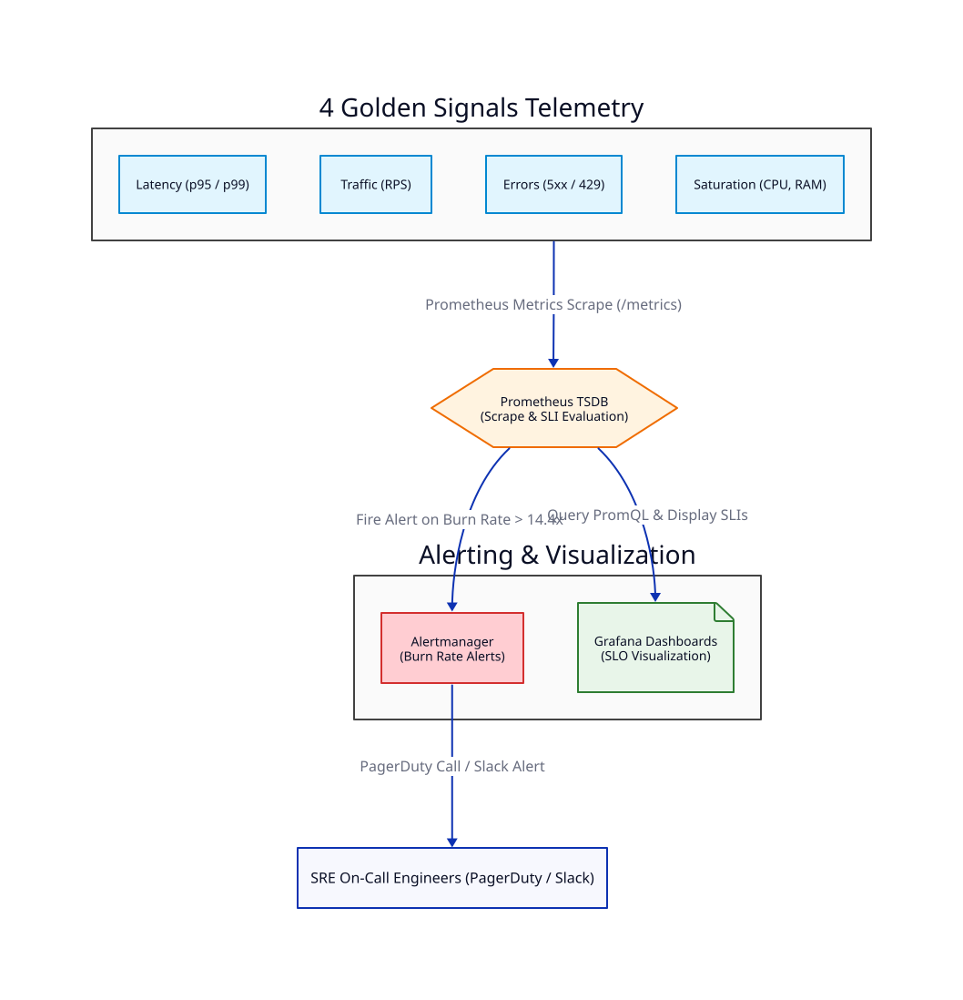

# Bài 14: SRE Principles Trong Fintech (SLI/SLO, Error Budgets & 4 Golden Signals)

> **Tóm tắt bài viết**: Phân tích việc áp dụng các nguyên lý Kỹ thuật Tin cậy Hệ thống (**Site Reliability Engineering - SRE**) trong nền tảng thanh toán tài chính, định nghĩa **SLI/SLO/SLA**, quản lý ngân sách lỗi (**Error Budget & Burn Rate Tracking**), và giám sát **4 Golden Signals** với Prometheus, Grafana & Alertmanager.

---

## 1. Các Khái Niệm Cốt Lõi Trong SRE

Trong ngành Tài chính - Ngân hàng, việc đảm bảo khả năng sẵn sàng (Availability) và độ tin cậy được đo lường thông qua 3 chỉ số cốt lõi:

1. **SLI (Service Level Indicator)**: Chỉ số đo lường thực tế hiệu năng hệ thống.
   - *Ví dụ*: Tỷ lệ giao dịch thanh toán thành công trong 5 phút qua là $99.95\%$.
2. **SLO (Service Level Objective)**: Mục tiêu cam kết nội bộ của đội ngũ kỹ thuật.
   - *Ví dụ*: Tỷ lệ thành công phải $\ge 99.9\%$, độ trễ $p99 < 500\text{ms}$ trong khoảng thời gian 30 ngày.
3. **SLA (Service Level Agreement)**: Cam kết pháp lý với khách hàng/đối tác (kèm chế tài bồi thường tài chính nếu vi phạm).

---

## 2. Quản Lý Ngân Sách Lỗi (Error Budget & Burn Rate)

### 2.1. Error Budget là gì?
Ngân sách lỗi là khoảng cho phép hệ thống mắc lỗi mà **không làm vi phạm SLO**:
$$\text{Error Budget} = 100\% - \text{SLO}$$

- Nếu SLO Availability $= 99.9\% \rightarrow$ Error Budget $= 0.1\%$ ($43.2$ phút downtime cho phép mỗi tháng).
- **Quy tắc SRE**: Nếu hệ thống còn Error Budget $\rightarrow$ Cho phép Deploy tính năng mới. Nếu Error Budget bị cạn kiệt ($0\%$) $\rightarrow$ Dừng mọi tính năng mới, tập trung 100% nguồn lực để nâng cao độ tin cậy hệ thống!

### 2.2. Burn Rate Tracking
Đo lường tốc độ "tiêu tốn" Error Budget:
- **Burn Rate = 1**: Tiêu tốn vừa đủ Error Budget trong đúng 30 ngày.
- **Burn Rate = 14.4**: Tiêu tốn $2% Error Budget chỉ trong 1 giờ $\rightarrow$ **Cần gửi Cảnh báo khẩn cấp (Page On-Call Engine)** lập tức!

---

## 3. Giám Sát 4 Golden Signals (Prometheus & Grafana)



Theo Google SRE Book, 4 chỉ số vàng bắt buộc phải theo dõi cho mọi Microservice:

1. **Latency (Độ trễ)**: Đo lường theo Percentile ($p50, p90, p99$). Phân tách độ trễ của Request thành công vs Request thất bại.
2. **Traffic (Lưu lượng tải)**: Nhu cầu gửi tới hệ thống (RPS - Requests Per Second).
3. **Errors (Tỷ lệ lỗi)**: Tỷ lệ các request bị lỗi (HTTP 5xx, SQL Deadlocks, Timeout).
4. **Saturation (Mức độ bão hòa tài nguyên)**: Mức độ sử dụng CPU, RAM, Disk I/O, và DB Connection Pool.

---

## 4. Cấu Hình Prometheus Alert Rule Cho qPayFlow

```yaml
groups:
- name: qpayflow-slo-alerts
  rules:
  - alert: HighErrorBudgetBurnRate
    expr: |
      (
        sum(rate(http_requests_total{status=~"5.."}[1h])) 
        / 
        sum(rate(http_requests_total[1h]))
      ) > (1 - 0.999) * 14.4
    for: 2m
    labels:
      severity: critical
      tier: financial-core
    annotations:
      summary: "CRITICAL: Fast Error Budget Burn Rate detected on Payment Gateway!"
      description: "Payment Service error budget is burning 14.4x faster than normal. Immediate On-Call response required."
```

---

## 5. Tài Liệu Tham Khảo (Reputable References)

1. **Google SRE Book**: [The 4 Golden Signals & Service Level Objectives](https://sre.google/sre-book/table-of-contents/)
2. **Prometheus Documentation**: [ALERTMANAGER Configuration & PromQL Best Practices](https://prometheus.io/docs/alerting/latest/overview/)
3. **Grafana Labs**: [SRE & SLO Dashboards Best Practices](https://grafana.com/docs/grafana/latest/dashboards/)
4. **Datadog Engineering**: [Slis, Slos, and Error Budgets Architecture](https://www.datadoghq.com/blog/sre-metrics-slo-sli-error-budget/)

