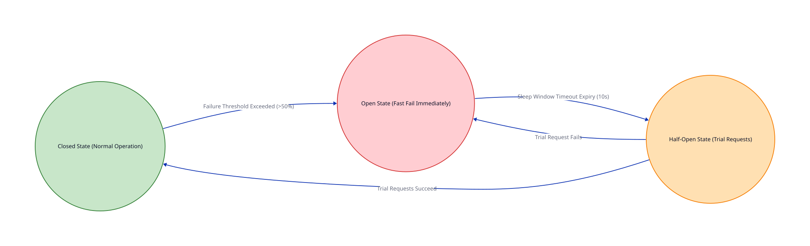
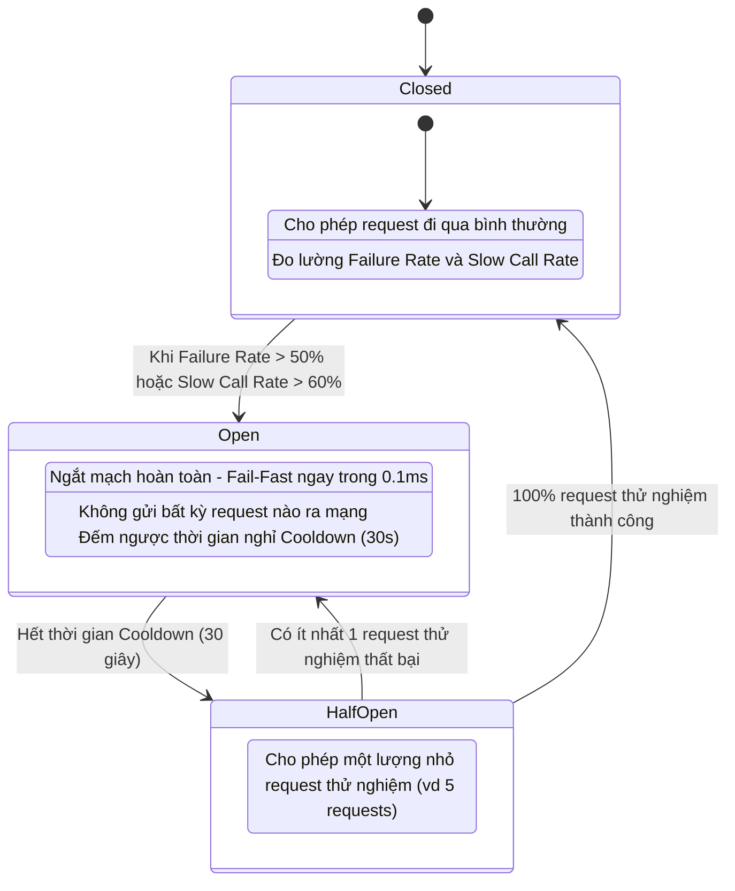

# Bài 15: Mẫu Thiết Kế Circuit Breaker & Retry với Jitter

> **Tóm tắt bài viết**: Hướng dẫn xây dựng cơ chế tự vệ toàn diện cho hệ thống thanh toán trước sự chậm trễ hoặc sụp đổ của các cổng ngân hàng bên thứ ba (Partner Bank Gateways) thông qua mẫu thiết kế **Circuit Breaker** (Cầu dao phân tán) và thuật toán **Retry với Exponential Backoff + Jitter** nhằm triệt tiêu hiện tượng sập nguồn dây chuyền (**Cascading Failures**).

---

## 1. Mối Nguy: Tại Sao Phản Hồi Chậm Lại Nguy Hiểm Gấp 10 Lần Báo Lỗi Ngay?

Khi tích hợp với các hệ thống Core Banking hoặc Cổng thanh toán quốc tế (Visa/Mastercard), chúng ta hoàn toàn phụ thuộc vào hạ tầng mạng của đối tác:

| Tiêu Chí Phân Tích | Kịch Bản A: Lỗi Nhanh (Fast Error) | Kịch Bản B: Phản Hồi Chậm (Slow Latency) |
| :--- | :--- | :--- |
| **Hành vi phía Ngân hàng** | Ngân hàng trả về HTTP 500 ngay lập tức trong $5\text{ms}$. | Ngân hàng bị quá tải, phản hồi kéo dài từ $50\text{ms}$ lên $10$ giây mới timeout. |
| **Tác động tới qPayFlow** | Goroutine / Thread được giải phóng tức thì. Hệ thống qPayFlow vẫn hoàn toàn khỏe mạnh. | Toàn bộ Connection Pool bị chiếm giữ, Goroutines treo hàng loạt $\rightarrow$ **SẬP TOÀN BỘ HỆ THỐNG!** |

> **Hiệu ứng sụp đổ dây chuyền (Cascading Failure)**: Khi các Goroutine bị giữ lại chờ phản hồi chậm, hàng đợi request tại API Gateway bị đầy ứ, bộ nhớ RAM cạn kiệt, CPU tăng vọt 100% để quản lý context-switching $\rightarrow$ Toàn bộ hệ thống thanh toán của chúng ta bị tê liệt hoàn toàn.

---

## 2. Mẫu Thiết Kế Circuit Breaker (Cầu Dao Phân Tán)

Circuit Breaker hoạt động tương tự như chiếc Aptomat điện trong gia đình: Khi phát hiện dòng điện quá tải hoặc chập cháy ở một thiết bị ngoại vi, cầu dao lập tức nhảy (ngắt mạch) để bảo vệ toàn bộ mạng lưới điện trong nhà.



### 3 Trạng Thái Vận Hành Chuẩn Của Circuit Breaker:



---

## 3. Toán Học Đằng Sau Jitter: Triệt Tiêu "Thundering Herd Storm"

Khi gọi API gặp lỗi mạng tạm thời, ta bắt buộc phải thử lại (Retry). Nhưng nếu áp dụng công thức Exponential Backoff cố định ($1\text{s}, 2\text{s}, 4\text{s}, 8\text{s}$), hàng nghìn request retry sẽ **trùng khớp tần số và cùng bắn vào server đối tác đúng tại một mili-giây** $\rightarrow$ Hiện tượng bầy đàn **Thundering Herd**.

### So sánh 3 thuật toán Jitter theo nghiên cứu của Amazon Web Services (AWS Architecture):

$$\text{1. No Jitter (Nguy hiểm): } t = \text{base} \times 2^{\text{attempt}}$$

$$\text{2. Full Jitter (Khuyên dùng): } t = \text{Random}\left(0, \; \min(\text{cap}, \; \text{base} \times 2^{\text{attempt}})\right)$$

$$\text{3. Equal Jitter: } t = \frac{\text{temp}}{2} + \text{Random}\left(0, \; \frac{\text{temp}}{2}\right) \quad \text{với } \text{temp} = \min(\text{cap}, \; \text{base} \times 2^{\text{attempt}})$$


> **Kết luận nghiên cứu**: **Full Jitter** phân tán tải retry mượt mà và đồng đều nhất theo thời gian, giảm thiểu 90% nguy cơ gây nghẽn lại hệ thống đối tác khi họ vừa mới phục hồi.

---

## 4. Triển Khai Thực Tế Circuit Breaker Trong Go Với `gobreaker`

```go
package resilience

import (
	"context"
	"errors"
	"fmt"
	"math/rand"
	"net/http"
	"time"

	"github.com/sony/gobreaker"
)

type BankClient struct {
	cb         *gobreaker.CircuitBreaker
	httpClient *http.Client
}

func NewBankClient() *BankClient {
	st := gobreaker.Settings{
		Name:        "PartnerBankGateway",
		MaxRequests: 5,                // Số request cho phép thử nghiệm trong Half-Open
		Interval:    10 * time.Second, // Chu kỳ rolling window để tính tỷ lệ lỗi
		Timeout:     30 * time.Second, // Thời gian ở trạng thái Open trước khi chuyển sang Half-Open
		ReadyToTrip: func(counts gobreaker.Counts) bool {
			failureRatio := float64(counts.TotalFailures) / float64(counts.Requests)
			// Kích hoạt ngắt mạch khi có ít nhất 10 requests và tỷ lệ lỗi > 50%
			return counts.Requests >= 10 && failureRatio >= 0.5
		},
	}

	return &BankClient{
		cb: gobreaker.NewCircuitBreaker(st),
		httpClient: &http.Client{
			Timeout: 3 * time.Second, // Timeout chặt chẽ chống treo connection
		},
	}
}

// ExecuteWithResilience kết hợp Circuit Breaker và Retry Full Jitter
func (c *BankClient) ExecuteWithResilience(ctx context.Context, reqURL string) (*http.Response, error) {
	var resp *http.Response
	var err error

	baseDelay := 100 * time.Millisecond
	maxDelay := 3 * time.Second
	maxRetries := 3

	for attempt := 0; attempt < maxRetries; attempt++ {
		// 1. Thực thi qua Circuit Breaker
		result, cbErr := c.cb.Execute(func() (interface{}, error) {
			req, _ := http.NewRequestWithContext(ctx, http.MethodPost, reqURL, nil)
			r, httpErr := c.httpClient.Do(req)
			if httpErr != nil {
				return nil, httpErr
			}
			if r.StatusCode >= 500 {
				return nil, fmt.Errorf("bank server error: status %d", r.StatusCode)
			}
			return r, nil
		})

		if cbErr == nil {
			return result.(*http.Response), nil
		}

		err = cbErr

		// Nếu Circuit Breaker đang OPEN -> Fast Fail, không retry vô ích
		if errors.Is(cbErr, gobreaker.ErrOpenState) {
			return nil, errors.New("circuit breaker is OPEN: fast failing payment request")
		}

		// 2. Tính toán Full Jitter Backoff
		expDelay := baseDelay * time.Duration(1<<attempt)
		if expDelay > maxDelay {
			expDelay = maxDelay
		}
		jitter := time.Duration(rand.Int63n(int64(expDelay)))

		select {
		case <-time.After(jitter):
		case <-ctx.Done():
			return nil, ctx.Err()
		}
	}

	return resp, fmt.Errorf("failed after %d retries: %w", maxRetries, err)
}
```

---

## 5. Góc Chuyên Sâu: Phân Tích Kỹ Thuật & Tình Huống Thực Tế

### Case 1: Xử lý bài toán chập chờn (Flapping / Flaky API) của Ngân Hàng Đối Tác

**Bối cảnh:** Cổng ngân hàng đối tác bị chập chờn: Cứ 1 phút chạy tốt, 1 phút sau lại lỗi. Circuit Breaker liên tục nhảy qua lại giữa **CLOSED $\rightarrow$ OPEN $\rightarrow$ HALF-OPEN $\rightarrow$ CLOSED** (Hiện tượng **Flapping**).

**Hậu quả:** Hệ thống thiếu ổn định, một nửa khách hàng bị lỗi, một nửa thành công ngẫu nhiên.

**Cơ chế tinh chỉnh nâng cao (Advanced Stabilization):**
1. **Exponential Cooldown Timeout**: Nếu Circuit Breaker vừa đóng lại mà bị nhảy mạch tiếp trong vòng 5 phút, thời gian ngắt `Timeout` sẽ tự động nhân đôi: $30\text{s} \rightarrow 60\text{s} \rightarrow 120\text{s} \rightarrow 300\text{s}$.
2. **Slow Call Rate Threshold**: Không chỉ đo lỗi 5xx, mà tính cả các request có phản hồi $> 1.5\text{s}$. Nếu số request chậm $> 60\% \rightarrow$ Coi như đối tác không đạt tiêu chuẩn và chủ động kích hoạt cầu dao để bảo vệ chính mình.

---

### Case 2: Đảm bảo tính Idempotency khi kết hợp Retry với API trừ tiền ngân hàng

**Bối cảnh sự cố:** Microservice gửi lệnh trừ tiền sang Ngân hàng. Ngân hàng bị nghẽn mạng, socket bị ngắt kết nối. Microservice kích hoạt cơ chế Retry gửi lại lần 2.

**Rủi ro nghiêm trọng:** Nếu lệnh đầu tiên ngân hàng đã trừ tiền thành công trên tài khoản thẻ của khách hàng nhưng response bị rớt mạng, lệnh Retry thứ hai sẽ **trừ tiền lần thứ 2 của khách hàng!**

**Quy tắc an toàn bất di bất dịch:**
- **Tuyệt đối không bao giờ retry các Non-Idempotent Financial Requests**:
  - Mọi lệnh gửi sang ngân hàng bắt buộc phải kèm theo trường `MerchantTransactionID` hoặc `Idempotency-Key` duy nhất.
  - Ngân hàng có trách nhiệm kiểm tra nếu `MerchantTransactionID` đã tồn tại thì chỉ trả về kết quả cũ mà không trừ tiền lần 2.
  - Nếu API đối tác không hỗ trợ Idempotency Key $\rightarrow$ **CẤM RETRY TỰ ĐỘNG!** Phải chuyển sang trạng thái `PENDING_INQUIRY` và gọi API Tra cứu trạng thái giao dịch (`QueryTransactionStatus`) trước khi quyết định xử lý tiếp.

---

### Case 3: Chiến lược Fallback khi Circuit Breaker ở trạng thái OPEN

**Bối cảnh:** Toàn bộ cổng thanh toán qua Ngân hàng VCB bị sập hoàn toàn và Circuit Breaker chuyển sang trạng thái `OPEN`.

**Trải nghiệm người dùng thông minh (Graceful Degradation):**
- Thay vì trả về một trang lỗi 500 vô cảm *"Hệ thống bị sập"*.
- **Smart Fallback Routing**:
  1. API Gateway tự động ẩn phương thức thanh toán qua VCB trên giao diện ứng dụng của người dùng.
  2. Gợi ý người dùng chuyển sang thanh toán bằng các phương thức thay thế đang hoạt động tốt (Ví dụ: Thẻ Visa/Mastercard, Ví MoMo, hoặc Cổng VietinBank).
  3. Khi Circuit Breaker chuyển sang `CLOSED` $\rightarrow$ Tự động kích hoạt hiển thị lại nút thanh toán VCB trên ứng dụng mà không cần deploy lại code.

---

## 6. Tài Liệu Tham Khảo (Reputable References)

1. **Martin Fowler**: [Circuit Breaker Pattern](https://martinfowler.com/bliki/CircuitBreaker.html)
2. **Marc Brooker (AWS Principal Engineer)**: [Timeouts, Retries, and Backoff with Jitter (AWS Builders' Library)](https://aws.amazon.com/builders-library/timeouts-retries-and-backoff-with-jitter/)
3. **Netflix TechBlog**: [Fault Tolerance in a High Volume Distributed Architecture (Hystrix Principles)](https://netflixtechblog.com/)
4. **Sony Open Source**: [gobreaker: Circuit Breaker implementation in Go](https://github.com/sony/gobreaker)
5. **Michael T. Nygard**: *Release It!: Design and Deploy Production-Ready Software* — Chapter 4: Stability Patterns.
