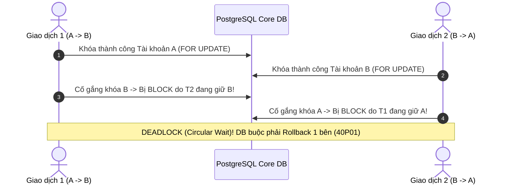

# Bài 16: Phòng Chống Deadlock Trong Hạch Toán Sổ Cái Kép

> **Tóm tắt bài viết**: Giải mã nguyên nhân gốc rễ gây ra lỗi tranh chấp khóa chéo (**Database Deadlock**) khi thực hiện hàng nghìn giao dịch chuyển tiền song song hai chiều trong hệ thống Core Ledger, chứng minh toán học thuật toán **Sắp xếp thứ tự khóa (Deterministic Lock Ordering)**, và kỹ thuật tiêu thụ hàng đợi hiệu năng cao với **`SKIP LOCKED`**.

---

## 1. Hiện Tượng Chéo Khóa (Database Deadlock) Là Gì?

Trong kế toán hạch toán sổ cái kép (Double-Entry Bookkeeping), một giao dịch chuyển tiền từ tài khoản $A$ sang tài khoản $B$ bắt buộc phải khóa cả hai tài khoản này để bảo vệ tính nhất quán dữ liệu, chống tình trạng chi tiêu kép (Double-Spending).

Nếu có hai luồng giao dịch độc lập diễn ra gần như cùng một mili-giây:
- **Giao dịch 1**: Khách hàng $A$ chuyển $50\text{ USD}$ cho khách hàng $B$.
- **Giao dịch 2**: Khách hàng $B$ chuyển $30\text{ USD}$ cho khách hàng $A$.



> **Hệ quả**: Cả hai giao dịch rơi vào chu kỳ chờ đợi lẫn nhau (Circular Wait). Sau khi hết thời gian `deadlock_timeout` (thường là 1 giây trong PostgreSQL), Database Engine buộc phải can thiệp bằng cách **giết chết (Abort / Rollback)** một trong hai giao dịch và ném ra mã lỗi: `ERROR: deadlock detected (SQLSTATE 40P01)`.

---

## 2. Giải Pháp Toàn Diện: Sắp Xếp Thứ Tự Khóa Định Sẵn (Deterministic Lock Ordering)

Theo 4 điều kiện Coffman về Deadlock, để triệt tiêu hoàn toàn khả năng xảy ra deadlock, chúng ta chỉ cần phá vỡ điều kiện **Chờ đợi vòng tròn (Circular Wait)**.

### Thuật toán:
Bất kể tiền được chuyển từ $A \rightarrow B$ hay từ $B \rightarrow A$, mã nguồn tầng backend **luôn luôn sắp xếp thứ tự tài khoản theo thứ tự từ điển (Lexicographical Order) của ID** và thực hiện khóa tài khoản có ID nhỏ hơn trước, tài khoản có ID lớn hơn sau.

```go
package ledger

import (
	"context"
	"database/sql"
	"fmt"
)

// TransferFunds thực hiện chuyển tiền an toàn, triệt tiêu 100% rủi ro Deadlock
func (r *PostgresLedgerRepo) TransferFunds(ctx context.Context, tx *sql.Tx, fromAccID string, toAccID string, amount float64) error {
	// 1. Xác định thứ tự khóa tăng dần dựa trên chuỗi ID
	firstLockID, secondLockID := fromAccID, toAccID
	if fromAccID > toAccID {
		firstLockID, secondLockID = toAccID, fromAccID
	}

	// 2. Khóa tài khoản có ID nhỏ hơn trước
	_, err := tx.ExecContext(ctx, "SELECT id, balance FROM accounts WHERE id = $1 FOR UPDATE", firstLockID)
	if err != nil {
		return fmt.Errorf("failed to lock first account %s: %w", firstLockID, err)
	}

	// 3. Khóa tài khoản có ID lớn hơn sau
	_, err = tx.ExecContext(ctx, "SELECT id, balance FROM accounts WHERE id = $2 FOR UPDATE", secondLockID)
	if err != nil {
		return fmt.Errorf("failed to lock second account %s: %w", secondLockID, err)
	}

	// 4. Lúc này cả 2 tài khoản đã được bảo vệ an toàn tuyệt đối mà không bao giờ bị Deadlock!
	// Tiếp tục thực hiện trừ tiền bên gửi và cộng tiền bên nhận...
	return nil
}
```

### Chứng minh toán học triệt tiêu Deadlock:
- Khi cả Giao dịch 1 ($A \rightarrow B$) và Giao dịch 2 ($B \rightarrow A$) cùng chạy:
- Cả hai đều bắt buộc phải xin khóa tài khoản $A$ trước (vì $A < B$).
- Giao dịch nào nhanh hơn (ví dụ Giao dịch 1) sẽ chiếm được khóa $A$, rồi tiến tới chiếm tiếp khóa $B$.
- Giao dịch 2 xin khóa $A$ sẽ bị block ngay từ bước 1. Nó **chưa hề nắm giữ khóa của $B$**, do đó không tồn tại chu kỳ chờ chéo! Giao dịch 2 chỉ đơn thuần xếp hàng chờ Giao dịch 1 commit xong rồi mới chạy tiếp.

---

## 3. Kỹ Thuật `SELECT ... FOR UPDATE SKIP LOCKED`

Trong các bài toán xử lý hàng đợi công việc (Job Processing / Outbox Polling / Batch Recon), khi nhiều worker cùng quét bảng `tasks` để tìm việc:

```sql
-- ❌ CÁCH LÀM TỒI: Các worker cùng tranh chấp các dòng đầu tiên, gây nghẽn và Deadlock
SELECT * FROM outbox_events WHERE status = 'PENDING' LIMIT 10 FOR UPDATE;

-- ✅ CÁCH LÀM TỐI ƯU: SKIP LOCKED
SELECT * FROM outbox_events 
WHERE status = 'PENDING' 
ORDER BY created_at ASC 
LIMIT 10 
FOR UPDATE SKIP LOCKED;
```

> **Cơ chế `SKIP LOCKED`**: Nếu một dòng dữ liệu đang bị Worker 1 khóa để xử lý, Worker 2 chạy câu query trên sẽ **tự động bỏ qua dòng bị khóa đó** và lấy ngay 10 dòng tiếp theo còn rảnh rỗi. Các worker hoàn toàn không phải chờ đợi nhau, thông lượng xử lý tăng gấp 10 lần và loại trừ hoàn toàn nguy cơ tranh chấp khóa.

---

## 4. Góc Chuyên Sâu: Phân Tích Kỹ Thuật & Tình Huống Thực Tế

### Case 1: Xử lý giao dịch đa tài khoản (Multi-Account Settlement Transfer)

**Bối cảnh:** Trong các giao dịch thương mại điện tử phức tạp, một đơn hàng thanh toán liên quan tới 4 tài khoản cùng lúc: Tài khoản người mua, Tài khoản người bán, Tài khoản chiết khấu voucher sàn, và Tài khoản thuế VAT.

**Thuật toán mở rộng cho $N$ tài khoản:**
```go
// Danh sách tất cả các tài khoản cần khóa trong giao dịch
accountIDs := []string{buyerID, merchantID, voucherPoolID, taxID}

// Sắp xếp toàn bộ mảng ID theo thứ tự alphabet tăng dần
sort.Strings(accountIDs)

// Loại bỏ các ID trùng lặp (nếu có)
accountIDs = uniqueStrings(accountIDs)

// Khóa tuần tự từng tài khoản theo đúng thứ tự đã sắp xếp
for _, accID := range accountIDs {
    _, err := tx.ExecContext(ctx, "SELECT id FROM accounts WHERE id = $1 FOR UPDATE", accID)
    if err != nil {
        return err
    }
}
```
Nhờ quy tắc sắp xếp mảng ID tăng dần này, dù có hàng nghìn giao dịch chuyển tiền đa bên phức tạp diễn ra đồng thời, hệ thống vẫn duy trì tính đơn điệu của đồ thị khóa (Directed Acyclic Graph - DAG), ngăn chặn triệt để mọi chu kỳ Deadlock.

---

## 5. Tài Liệu Tham Khảo (Reputable References)

1. **PostgreSQL Official Documentation**: [Explicit Locking and Deadlock Detection](https://www.postgresql.org/docs/current/explicit-locking.html#LOCKING-DEADLOCKS)
2. **Martin Kleppmann**: *Designing Data-Intensive Applications* — Chapter 7: Transactions & Deadlock Prevention.
3. **Stripe Engineering**: [Operating Financial Systems on Eventual Consistency and Relational Databases](https://stripe.com/blog/operating-financial-systems-on-eventual-consistency)
4. **Edward G. Coffman Jr.**: [System Deadlocks (Computing Surveys Paper)](https://dl.acm.org/doi/10.1145/356586.356588)
5. **Brandur Leach**: [Postgres Job Queues with SKIP LOCKED](https://brandur.org/postgres-queues)
