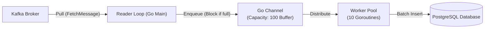

# Bài 17: Quản Lý Kafka Consumer Lag, Backpressure & Scaling

> **Tóm tắt bài viết**: Phân tích chuyên sâu bài toán dồn ứ hàng đợi (**Consumer Lag**) trong hệ thống thanh toán hướng sự kiện, giải mã cơ chế **Cooperative Sticky Rebalance Protocol**, thiết kế kiến trúc điều tiết áp suất ngược (**Backpressure**), và mô hình **In-Memory Worker Pool** mở rộng năng lực xử lý mà vẫn bảo toàn thứ tự giao dịch.

---

## 1. Khái Niệm Consumer Lag & Tác Động Tiêu Cực Trong Fintech

Trong kiến trúc Event-Driven sử dụng Apache Kafka, **Consumer Lag** là độ trễ đo lường khoảng cách giữa tin nhắn mới nhất được ghi vào partition và tin nhắn cuối cùng được consumer xử lý thành công:

$$\text{Consumer Lag} = \text{Log End Offset (LEO)} - \text{Current Consumer Offset}$$

| Phân Vùng (Partition 0) | Offset 91-94 | Offset 95 | Offset 96-99 | Offset 100 (LEO) |
| :--- | :--- | :--- | :--- | :--- |
| **Trạng Thái Xử Lý** | Đã xử lý & Đã Commit | **Current Consumer Offset (95)** | Đang chờ tiêu thụ | **Log End Offset (100)** |

$$\text{Consumer Lag} = 100 (\text{LEO}) - 95 (\text{Current Offset}) = 5 \text{ messages}$$

### Các tác động tiêu cực trong hệ thống thanh toán:
1. **Trễ nải thông báo & biến động số dư**: Khách hàng đã quẹt thẻ bị trừ tiền ở POS nhưng 10 phút sau vẫn chưa thấy tiền vào ví trên App.
2. **Kẹt tiền trong luồng Saga**: Các bước giao dịch bù trừ (Compensating Transactions) bị dồn ứ làm số dư của khách hàng bị phong tỏa (Hold) kéo dài.
3. **Nguy cơ cạn kiệt bộ nhớ đệm (OOM)**: Khi Consumer cố đọc nhanh để đuổi kịp offset nhưng database bên dưới xử lý chậm.

---

## 2. Cơ Chế Tự Vệ Backpressure (Áp Suất Ngược)

Nếu Consumer chỉ đơn thuần đọc dữ liệu từ Kafka với tốc độ tối đa ($10,000\text{ msgs/s}$) trong khi cơ sở dữ liệu PostgreSQL chỉ có thể ghi $2,000\text{ tx/s}$, hàng triệu message sẽ chất đống trong bộ nhớ RAM của Go Container $\rightarrow$ Container bị K8s tiêu diệt vì **OOMKilled (Out-Of-Memory)**.

**Backpressure (Áp suất ngược)** là cơ chế điều tiết chủ động: Tốc độ kéo (Pull) dữ liệu từ Kafka được kiểm soát trực tiếp bởi khả năng giải phóng công việc của Worker Pool nội bộ.



### Triển khai Backpressure trong Go:
```go
func (c *PaymentConsumer) Start(ctx context.Context) {
    // Channel có dung lượng giới hạn đóng vai trò như van điều áp (Backpressure Buffer)
    workQueue := make(chan *kafka.Message, 100)

    // Khởi tạo nhóm Worker xử lý song song
    for i := 0; i < 10; i++ {
        go c.worker(ctx, workQueue)
    }

    for {
        msg, err := c.reader.FetchMessage(ctx)
        if err != nil {
            return
        }

        // Nếu workQueue bị đầy (100 msgs), lệnh gửi vào channel dưới đây sẽ BLOCK
        // Reader Loop sẽ tạm dừng kéo tin nhắn mới từ Kafka cho đến khi Worker giải phóng bớt việc!
        select {
        case workQueue <- &msg:
        case <-ctx.Done():
            return
        }
    }
}
```

---

## 3. Cooperative Sticky Rebalancing vs Eager Rebalancing

Trước phiên bản Kafka 2.4, mỗi khi có một Consumer Pod mới gia nhập hoặc bị restart, Kafka áp dụng giao thức **Eager Rebalance**:
- Mọi Consumer trong Group **đồng loạt dừng tiêu thụ toàn bộ các partition** (hiện tượng Stop-The-World kéo dài từ vài giây đến cả phút).
- Sau đó Group Coordinator phân bổ lại toàn bộ partition từ đầu.

Từ Kafka 2.4+, chuyển sang **Cooperative Sticky Rebalance Protocol**:
- Các Consumer chỉ nhả (Revoke) duy nhất các Partition cần phải chuyển giao cho Pod mới.
- **Tất cả các Partition còn lại vẫn tiếp tục được đọc và xử lý bình thường mà không hề bị gián đoạn!**

| Tiêu Chí So Sánh | Eager Rebalance Protocol (Cũ) | Cooperative Sticky Rebalance Protocol (Mới) |
| :--- | :--- | :--- |
| **Mức độ gián đoạn** | Dừng 100% tất cả Consumers trong nhóm (Stop-the-world) | Chỉ tạm dừng duy nhất Partition cần chuyển giao chủ mới |
| **Phạm vi thu hồi** | Thu hồi toàn bộ Partitions của mọi Consumer | Giữ nguyên các Partition không thay đổi sở hữu |
| **Thời gian downtime** | Giao dịch tài chính bị đóng băng $10 - 60\text{s}$ | Thời gian gián đoạn chuyển giao $< 100\text{ms}$ |

---

## 4. Góc Chuyên Sâu: Phân Tích Kỹ Thuật & Tình Huống Thực Tế

### Case 1: Điều tra và xử lý khẩn cấp khi Consumer Lag tăng vọt lên 5 triệu tin nhắn trong Flash Sale

**Bối cảnh sự cố:** Trong đêm hội mua sắm 11/11, Consumer Lag của topic `payment-events` tăng vọt từ $100 \rightarrow 5,000,000$ tin nhắn. Các giao dịch bị trễ 20 phút.

**Quy trình 3 bước điều tra & khắc phục của SRE:**
1. **Bước 1 - Phân tích điểm nghẽn (Bottleneck Detection)**:
   - Kiểm tra Grafana Dashboard: CPU của Consumer Pods chỉ đạt $25\%$, nhưng thời gian thực thi câu lệnh SQL `UPDATE ledger` trong Postgres tăng từ $2\text{ms} \rightarrow 350\text{ms}$.
   - Phát hiện Database thiếu Index trên cột `reference_id`, khiến mỗi câu lệnh cập nhật phải quét toàn bộ bảng (Seq Scan).
2. **Bước 2 - Sửa lỗi tức thời**:
   - Chạy lệnh `CREATE INDEX CONCURRENTLY idx_ledger_ref ON ledger_entries(reference_id);` trực tiếp trên Postgres (không khóa bảng). Thời gian query lập tức tụt về $1\text{ms}$.
3. **Bước 3 - Mở rộng quy mô giải tỏa lag (Scale-Out Catchup)**:
   - Topic đang có 32 Partitions nhưng chỉ có 8 Consumer Pods (mỗi Pod gánh 4 Partitions).
   - Tiến hành tăng số Pods lên **32 Replicas** trên Kubernetes để đạt tỷ lệ tối ưu $1 \text{ Pod} : 1 \text{ Partition}$. Tốc độ tiêu thụ tăng gấp 4 lần, giải tỏa toàn bộ 5 triệu tin nhắn lag chỉ trong vòng 8 phút.

---

### Case 2: Mô hình Worker Pool bảo toàn thứ tự theo `AccountID` (Keyed In-Memory Worker Pool)

**Bối cảnh:** Một Partition Kafka chứa sự kiện của nhiều tài khoản khác nhau. Nếu dùng một Worker Pool thông thường đọc từ một Channel chung, Event 1 (Khóa tiền Account A) và Event 2 (Trừ tiền Account A) có thể bị 2 Worker khác nhau xử lý song song và chạy ngược thứ tự!

**Giải pháp Sharded In-Memory Channels:**
```go
// Tạo một mảng 16 Channels độc lập trong bộ nhớ
numWorkers := 16
workerChannels := make([]chan *kafka.Message, numWorkers)
for i := 0; i < numWorkers; i++ {
    workerChannels[i] = make(chan *kafka.Message, 50)
    go runKeyedWorker(workerChannels[i])
}

// Khi đọc message từ Kafka: Băm AccountID để chọn đúng Channel cố định!
func routeMessage(msg *kafka.Message) {
    accountID := string(msg.Key)
    // Thuật toán Murmur3 hoặc FNV-1a Hash
    shardIndex := fnvHash(accountID) % uint32(numWorkers)
    
    // Mọi sự kiện của Account A luôn luôn đi vào workerChannels[shardIndex]!
    workerChannels[shardIndex] <- msg
}
```
Mô hình này giúp xử lý song song $16$ luồng độc lập trên cùng 1 CPU Node nhưng vẫn **đảm bảo tuần tự hóa tuyệt đối $100\%$ các sự kiện của cùng một tài khoản**.

---

## 5. Tài Liệu Tham Khảo (Reputable References)

1. **Confluent Documentation**: [Monitoring and Tuning Kafka Consumer Lag](https://docs.confluent.io/cloud/current/monitoring/monitor-consumers.html)
2. **Apache Kafka Documentation**: [Incremental Cooperative Rebalancing Protocol](https://cwiki.apache.org/confluence/display/KAFKA/KIP-429%3A+Kafka+Consumer+Incremental+Rebalance+Protocol)
3. **Martin Kleppmann**: *Designing Data-Intensive Applications* — Chapter 11: Stream Processing & Backpressure.
4. **Uber Engineering**: [Reliable Processing of Streaming Data with Kafka](https://www.uber.com/en-VN/blog/reliable-kafka-event-driven-architecture/)
5. **Reactive Streams Specification**: [Asynchronous Stream Processing with Non-blocking Backpressure](https://www.reactive-streams.org/)
