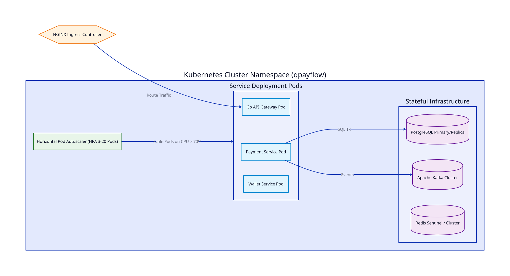

# Bài 19: Triển Khai Kubernetes (K8s) Trong Hệ Thống Thanh Toán

> **Tóm tắt bài viết**: Kiến trúc vận hành cụm **Kubernetes (K8s)** chuẩn ngân hàng cho nền tảng thanh toán `qPayFlow`, phân định tường minh **Stateless** (Deployments) vs **Stateful** (StatefulSets), cơ chế co giãn tự động theo số lượng giao dịch (**HPA với Custom Metrics**), bảo mật Zero-Trust với **Network Policies & mTLS Service Mesh**, và quản lý chứng chỉ bảo mật động với **HashiCorp Vault**.

---

## 1. Kiến Trúc Phân Tách: Stateless vs Stateful Trên Kubernetes

Trong hệ sinh thái thanh toán `qPayFlow`, chúng ta phân loại các khối ứng dụng thành hai nhóm workload riêng biệt trên Kubernetes:



| Tiêu Chí Phân Loại | Stateless Workloads | Stateful Workloads |
| :--- | :--- | :--- |
| **Các Dịch Vụ Đại Diện** | API Gateway, Payment Service, Risk Engine | PostgreSQL (Core Ledger), Apache Kafka (Brokers), Redis Cluster |
| **K8s Resource Type** | **Deployments** (ReplicaSets) | **StatefulSets** / Managed Cloud Services (AWS RDS / Aurora) |
| **Đặc Tính Vòng Đời Pod** | Pods có thể bị hủy và tạo lại tức thì trên bất kỳ Node nào | Pods có định danh mạng cố định (`db-0`, `db-1`) và gắn chặt với Persistent Volume (SSD NVMe) |
| **Khả Năng Scale-out** | Scale tức thời $< 3\text{s}$ theo tải thực tế | Scale cần quy trình đồng bộ hóa dữ liệu và quản trị dung lượng đĩa |

> **Khuyến nghị kiến trúc thực chiến**: Mặc dù StatefulSets hỗ trợ chạy Database trên K8s, đối với hệ thống thanh toán cốt lõi (Core Ledger), việc sử dụng **Managed Database Services** của Cloud Providers (như AWS Aurora PostgreSQL / GCP Cloud Spanner) hoặc Dedicated Bare-Metal Nodes sẽ mang lại độ an toàn, khả năng sao lưu tự động (Automated Snapshot) và SLA cao hơn đáng kể.

---

## 2. Tự Động Co Giãn Nhờ HPA Kết Hợp Custom Metrics

Trong các đợt Flash Sale, việc cấu hình **Horizontal Pod Autoscaler (HPA)** chỉ dựa trên CPU/RAM thông thường là **quá muộn**:
- Khi CPU tăng cao, hàng nghìn giao dịch đã bị xếp hàng chờ trong hàng đợi.
- **Giải pháp**: Sử dụng **Prometheus Adapter** để scale Pods dựa trên **Chỉ số kinh doanh thời gian thực (Custom Business Metrics)**:

```yaml
apiVersion: autoscaling/v2
kind: HorizontalPodAutoscaler
metadata:
  name: payment-consumer-hpa
  namespace: qpayflow
spec:
  scaleTargetRef:
    apiVersion: apps/v1
    kind: Deployment
    name: payment-consumer-worker
  minReplicas: 4
  maxReplicas: 32
  metrics:
  # Metric 1: Tự động scale out khi Kafka Consumer Lag vượt quá 500 tin nhắn
  - type: External
    external:
      metric:
        name: kafka_consumergroup_lag
        selector:
          matchLabels:
            topic: "payment-events"
            consumergroup: "ledger-workers"
      target:
        type: Value
        averageValue: "500"
  # Metric 2: Dự phòng theo mức độ sử dụng CPU
  - type: Resource
    resource:
      name: cpu
      target:
        type: Utilization
        averageUtilization: 70
```

---

## 3. Bảo Mật Zero-Trust: Network Policies & Dynamic Secrets

### 3.1. Cô lập phân vùng mạng với Kubernetes NetworkPolicy
Để đáp ứng chuẩn bảo mật khắt khe của ngành ngân hàng, không một Pod nào được phép kết nối tự do sang Pod khác nếu không có khai báo tường minh:

```yaml
apiVersion: networking.k8s.io/v1
kind: NetworkPolicy
metadata:
  name: core-database-access-policy
  namespace: qpayflow
spec:
  podSelector:
    matchLabels:
      app: postgres-core-db
  policyTypes:
  - Ingress
  ingress:
  # 🔒 CHỈ CHO PHÉP duy nhất Pod "account-service" và "payment-service" kết nối cổng 5432!
  # Mọi Pod khác (như notification, web-client) cố tình kết nối sẽ bị DROP gói tin ngay lập tức!
  - from:
    - podSelector:
        matchLabels:
          app: account-service
    - podSelector:
        matchLabels:
          app: payment-service
    ports:
    - protocol: TCP
      port: 5432
```

---

## 4. Góc Chuyên Sâu: Phân Tích Kỹ Thuật & Tình Huống Thực Tế

### Case 1: Loại bỏ hiện tượng rớt kết nối HTTP trong quá trình Rolling Update bằng `preStop` Hook

**Bối cảnh sự cố:** Kỹ sư deploy phiên bản mới của `payment-service` lên Kubernetes. Trong 10 giây deploy, có khoảng 50 giao dịch của khách hàng bị lỗi `Connection Refused` hoặc `502 Bad Gateway`.

**Nguyên nhân gốc rễ:**
1. K8s gửi lệnh xóa Pod cũ $\rightarrow$ K8s Service Controller bắt đầu cập nhật iptables / gỡ Endpoint của Pod cũ ra khỏi danh sách định tuyến.
2. Tuy nhiên, việc cập nhật iptables trên toàn bộ các Worker Nodes tốn mất từ **$2 - 5\text{ giây}$**.
3. Trong $2 - 5$ giây đó, Ingress Controller **vẫn tiếp tục chuyển tiếp request mới vào Pod cũ** (lúc này Pod cũ đã bị dừng nhận kết nối hoặc đã chết) $\rightarrow$ Giao dịch bị đứt kết nối!

**Giải pháp với `preStop` Sleep Hook:**

```yaml
spec:
  containers:
  - name: payment-service
    lifecycle:
      preStop:
        exec:
          # Đợi 5 giây để Ingress Controller hoàn tất việc gỡ Endpoint khỏi mạng TRƯỚC KHI gửi SIGTERM!
          command: ["/bin/sleep", "5"]
```
Nhờ có lệnh `sleep 5`, Pod cũ vẫn tiếp tục phục vụ nốt các request cuối cùng trong khi mạng K8s gỡ hoàn tất IP của nó. Sau 5 giây, tiến trình mới bắt đầu nhận tín hiệu `SIGTERM` và Graceful Shutdown an toàn, đạt chuẩn **Zero-Downtime $100\%$**.

---

### Case 2: Quản lý mật khẩu xoay vòng động (Dynamic Secrets) với HashiCorp Vault

**Bối cảnh:** Lập trình viên không được phép biết mật khẩu Database của Production và quy định PCI-DSS yêu cầu đổi mật khẩu Database tự động định kỳ mỗi 24 giờ.

**Cơ chế HashiCorp Vault Agent Sidecar:**
- Một Vault Agent Sidecar chạy cùng Pod của `payment-service`.
- Vault Agent tự động xác thực với Vault Server qua K8s ServiceAccount Token.
- Vault tự động sinh ra một User DB tạm thời (`v-k8s-payment-abc123`) với mật khẩu ngẫu nhiên có thời hạn sống (TTL) 24 giờ.
- Khi gần hết 24 giờ, Vault Agent tự động gia hạn (Renew Lease) hoặc sinh mật khẩu mới và ghi đè vào file in-memory `/vault/secrets/database.env`. Ứng dụng tự động reload connection pool mà không cần restart Pod.

---

### Case 3: Chống cạn kiệt tài nguyên Node với Resource Requests, Limits & Pod Disruption Budgets (PDB)

**Bối cảnh:** Một Pod chạy thống kê nặng bị tràn RAM ngốn hết bộ nhớ của máy chủ vật lý, khiến Node bị sập và kéo theo toàn bộ các Pod thanh toán quan trọng trên cùng Node đó bị chết lây.

**Bộ quy tắc an toàn hạ tầng:**
1. **Thiết lập Requests & Limits tường minh**:
   ```yaml
   resources:
     requests:
       cpu: "500m"
       memory: "512Mi"
     limits:
       cpu: "2000m"
       memory: "2Gi" # Cấu hình Guaranteed / Burstable QoS Class
   ```
2. **Khai báo Pod Disruption Budget (PDB)**:
   ```yaml
   apiVersion: policy/v1
   kind: PodDisruptionBudget
   metadata:
     name: payment-service-pdb
   spec:
     minAvailable: 80% # K8s không bao giờ được phép tắt quá 20% số Pod trong các đợt bảo trì Node
     selector:
       matchLabels:
         app: payment-service
   ```

---

## 5. Tài Liệu Tham Khảo (Reputable References)

1. **Kubernetes Documentation**: [Workload Management, StatefulSets and Pod Lifecycle](https://kubernetes.io/docs/concepts/workloads/)
2. **Kelsey Hightower, Brendan Burns, Joe Beda**: *Kubernetes: Up and Running (Dive into the Future of Infrastructure)*.
3. **HashiCorp Vault Guides**: [Vault Dynamic Database Secrets on Kubernetes](https://developer.hashicorp.com/vault/docs/platform/k8s)
4. **Istio Service Mesh Documentation**: [Zero-Trust Security & Mutual TLS Architecture](https://istio.io/latest/docs/concepts/security/)
5. **Google Cloud Architecture**: [Best Practices for Running Highly Available Apps on GKE](https://cloud.google.com/architecture/best-practices-for-running-cost-effective-kubernetes-applications-on-gke)
